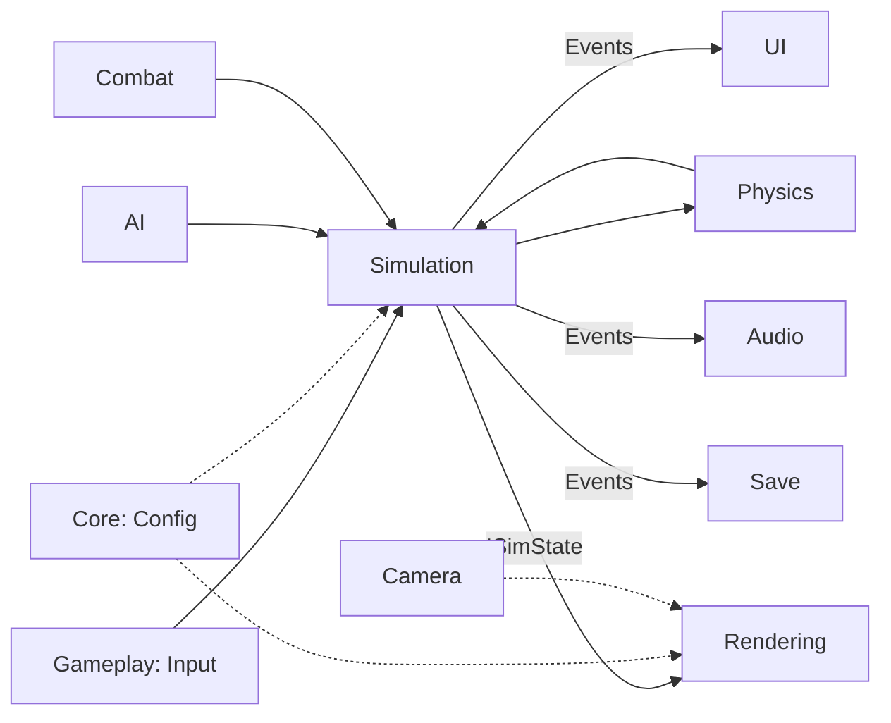

# Bounded Contexts

## Target Contexts

| Context | Responsibility | Published Interface |
|---------|----------------|---------------------|
| **Core** | Engine, loop, DI, config, events | `IEngine`, `IConfigProvider`, `IEventBus` |
| **Gameplay** | Input → intent → commands | `IGameCommand`, `IInputBuffer` |
| **Simulation** | Headless deterministic state | `ISimulation`, `ISimState` |
| **Physics** | Rapier3d world, raycasts, collisions | `IPhysicsWorld` |
| **Characters** | Player controller, stats, abilities | `ICharacterController` |
| **Camera** | Spring arm, modes, shake | `ICameraController` |
| **AI** | Enemy behavior, pathfinding | `IBehaviorTree`, `IAIAgent` |
| **Combat** | Attacks, damage, knockback | `ICombatSystem` |
| **Items** | Collectibles, inventory | `ICollectible`, `IInventory` |
| **PowerUps** | Temporary abilities | `IPowerUpEffect` |
| **World** | Level loading, streaming, themes | `ILevelLoader`, `IWorldManager` |
| **Rendering** | Three.js scene from sim state | `ISceneAdapter` |
| **UI** | HUD, menus, overlays | `IUIView` |
| **Audio** | Mixer, SFX, adaptive music | `IAudioController` |
| **Save** | Persistence, migration, cloud | `ISaveStore` |
| **Effects** | Particles, post-processing | `IParticleSystem` |

## Context Interaction

## Phase 1 Mapping

| Path | Context | Status |
|------|---------|--------|
| `domain/` | Core | ✅ |
| `infrastructure/` | Core | ✅ |
| `core/` | Core | ✅ |
| `state/` | Gameplay | ✅ |
| `rendering/` | Rendering | ✅ (bootstrap only) |
| `app/` | Composition | ✅ |
| `data/` | Core (config) | ✅ |
