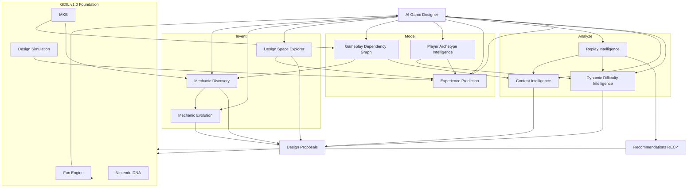

# Active Game Design Intelligence (GDIL v2.0)

**Evolution of:** [GAME-DESIGN-INTELLIGENCE-LAYER.md](./GAME-DESIGN-INTELLIGENCE-LAYER.md) v1.0  
**Shift:** Passive reviewer → **Autonomous gameplay invention engine**  
**Constraint:** No new governance layer · No new operating system · No gameplay code  
**Foundation:** POS + SOL + GDIL v1.0 remain permanent and unchanged in authority

---

## What Changed

| GDIL v1.0 (Passive) | GDIL v2.0 (Active) |
|---------------------|---------------------|
| Validates designs before ship | **Discovers and proposes** designs continuously |
| Reviews fun after playtests | **Predicts and optimizes** fun before and after |
| Catalogs mechanics | **Evolves and branches** mechanics over time |
| Flags repetition manually | **Detects sameness** and proposes pacing fixes |
| AI Design Director approves | **AI Game Designer invents, refines, rejects** |

v1.0 subsystems (Fun Engine, MKB, Simulation, DNA, etc.) become **sensors and actuators** for v2.0 active intelligence — not replaced.

```
┌────────────────────────────────────────────────────────────────────┐
│                    GDIL v2.0 — ACTIVE CORE                         │
│  AI Game Designer (orchestrator)                                   │
├──────────────┬──────────────┬──────────────┬───────────────────────┤
│ INVENT       │ MODEL        │ ANALYZE      │ IMPROVE               │
│ Discovery    │ Design Space │ Dependency   │ Content Intel         │
│ Evolution    │ Archetypes   │ Replay Intel │ Dynamic Difficulty    │
│              │              │ Experience   │                       │
│              │              │ Prediction   │                       │
├──────────────┴──────────────┴──────────────┴───────────────────────┤
│              GDIL v1.0 FOUNDATION (Fun, MKB, Matrix, DNA, Sim)     │
├────────────────────────────────────────────────────────────────────┤
│                         SOL · POS · Game                           │
└────────────────────────────────────────────────────────────────────┘
```

**Output type:** Design proposals (`PROP-*`), experiment plans (`EXP-*`), tuning recommendations (`TUN-*`) — fed into existing v1.0 lifecycle and SOL KOS. No new authorization tokens.

**Creative Platform (v2.1):** [CREATIVE-GAME-DESIGN-PLATFORM.md](./CREATIVE-GAME-DESIGN-PLATFORM.md) extends v2.0 with full content synthesis — grammar, encounters, levels, worlds, bosses, puzzles, camera, economy, council debate, and human co-design.

---

## Master Data Flow



---

# 1. MECHANIC DISCOVERY ENGINE

**Doc:** [discovery/MECHANIC-DISCOVERY-ENGINE.md](./discovery/MECHANIC-DISCOVERY-ENGINE.md)

## Purpose

Autonomously **generate candidate mechanics** from design constraints — not wait for human ideation. Detect novelty, rank by player value, and maintain a searchable catalog of ideas and shipped mechanics.

## Architecture

```
discovery/
├── ConstraintLibrary.ts      # Pillars, DNA, world identity, tech bounds
├── MechanicGenerator.ts      # Combinatorial + grammar-based synthesis
├── NoveltyDetector.ts        # Embedding distance vs MKB + catalog
├── ValueRanker.ts            # Pareto: fun potential × compatibility / cost
└── catalog/
    ├── CANDIDATES.json       # Unapproved ideas
    ├── SHIPPED.json          # Production mechanics
    └── REJECTED.json         # Archived with rationale
```

## Inputs

| Input | Source |
|-------|--------|
| Design constraints | Nintendo DNA, Game Design Bible, pillars |
| Existing mechanics | MKB, Mechanic Catalog |
| World identity gaps | World Identity System (missing verbs) |
| Dependency graph | Gameplay Dependency Graph (open slots) |
| Archetype gaps | Player Archetype Intelligence (underserved personas) |
| Fun driver deficits | Fun Engine imbalance alerts |

## Outputs

| Output | Description |
|--------|-------------|
| `CAND-{id}` | Candidate mechanic spec (verb, inputs, fantasy, pillar) |
| Novelty score | 0–1 distance from nearest existing mechanic |
| Value rank | Pareto frontier position |
| Compatibility score | Dependency graph fit |
| `PROP-{id}` | Top-N proposals to AI Game Designer |

## Algorithms (Conceptual)

**1. Constraint satisfaction generation**

```
FOR each open_slot IN dependency_graph.opportunity_nodes:
  FOR each verb_combo IN generate(pillar, world_identity, dna_rules):
    IF satisfies(tech_bounds, interaction_matrix_capacity):
      EMIT candidate
```

**2. Novelty detection**

```
novelty(c) = 1 - max_cosine_similarity(embedding(c), embedding(m) FOR m IN catalog)
```

Embedding features: player verb, input pattern, affected actors, fun drivers, grammar role.

**3. Pareto ranking**

```
player_value = Σ fun_driver_weight × predicted_driver_lift(c)
cost = implementation_complexity + dependency_risk + art_audio_cost
compatibility = graph_fit(c) × dna_compliance(c)

Rank on axes (player_value, compatibility, 1/cost) — retain non-dominated set
```

## KPIs

| KPI | Target |
|-----|--------|
| Candidates generated / week | 5–20 (quality over quantity) |
| Novelty score of accepted candidates | ≥0.4 |
| Proposal acceptance rate (→ Experiment) | 15–30% |
| Catalog search latency | <1s (design-time) |
| False novelty rate (too similar to existing) | <10% |

## Risks

| Risk | Mitigation |
|------|------------|
| Generic mechanic spam | DNA + pillar hard filters |
| Unbuildable ideas | POS tech bounds in ConstraintLibrary |
| Clone of existing mechanic | Novelty threshold + human spot-check |
| Ignores game identity | World identity + dependency graph gates |

## Validation Strategy

- **Retrospective:** Run generator on M1–M8 curriculum — should propose overlapping but not identical verbs  
- **Novelty calibration:** Known-distinct pairs score >0.5; known-similar pairs <0.3  
- **Acceptance tracking:** Accepted proposals must improve Fun driver deficit that triggered generation  

## Integration

| Layer | Integration |
|-------|-------------|
| GDIL v1 | Feeds Mechanic Lifecycle (Idea stage); extends MKB catalog |
| SOL | Proposals → KOS `experiments/`; no new WAP type |
| POS | Phase 17 Research Lab as prototype venue; Phase 18 feel params |

---

# 2. MECHANIC EVOLUTION ENGINE

**Doc:** [evolution/MECHANIC-EVOLUTION-ENGINE.md](./evolution/MECHANIC-EVOLUTION-ENGINE.md)

## Purpose

Track every mechanic as a **living lineage** — branching experiments, rollbacks, and convergence to canonical form. Visualize evolution graph like phylogenetic design history.

## Architecture

```
evolution/
├── MechanicLineage.ts        # DAG of mechanic versions
├── BranchManager.ts          # fork / merge / abandon
├── ExperimentTracker.ts      # links EXP-* to branches
├── ConvergenceDetector.ts    # identifies stable parameter sets
└── graphs/
    └── lineage-{mechanic}.json
```

## Inputs

| Input | Source |
|-------|--------|
| Mechanic versions | MKB records, tuning history |
| Experiment results | Playtest Intelligence, telemetry |
| Simulation outputs | Design Simulation, Design Space Explorer |
| Rollback events | DEC records, Fun regressions |

## Outputs

| Output | Description |
|--------|-------------|
| Lineage graph | Nodes = versions; edges = fork/iterate/rollback |
| Active branch | Current experimental variant per mechanic |
| Canonical node | Converged production version |
| Convergence report | Parameter stability + metric plateau evidence |
| Merge recommendation | When branch beats canonical on Fun with DNA pass |

## Algorithms (Conceptual)

**1. Lineage DAG**

```
Node = { id, parent, params, metrics_snapshot, stage, status }
Edge types: iterate | fork | rollback | merge | retire

fork when: hypothesis diverges (e.g. "floaty" vs "tight" jump branch)
rollback when: metric regression > threshold vs parent
merge when: branch dominates parent on Pareto (fun, recovery, success)
```

**2. Convergence detection**

```
converged if: |Δ fun_driver| < ε for 3 consecutive experiments
           AND simulation confidence > 0.7
           AND playtest n ≥ 3 stable
```

**3. Evolution graph layout**

Force-directed or hierarchical layout by generation; color by fun driver lift.

## KPIs

| KPI | Target |
|-----|--------|
| Lineage completeness (shipped mechanics) | 100% |
| Rollback time after regression | <48h |
| Convergence experiments to canonical | ≤7 per mechanic |
| Orphan branch rate | <20% abandoned without lesson |
| Graph render freshness | Updated per experiment |

## Risks

| Risk | Mitigation |
|------|------------|
| Branch explosion | Max 3 active branches per mechanic |
| Lost design rationale | Mandatory EXP record per branch |
| Premature convergence | Require playtest + sim agreement |
| Rollback without lineage | Auto-parent link on rollback |

## Validation Strategy

- Reconstruct MKB-M1 history retroactively as first lineage graph  
- Simulate fork/merge on jump preset A/B from Character Feel Lab spec  
- Verify rollback creates correct parent edge  

## Integration

| Layer | Integration |
|-------|-------------|
| GDIL v1 | Extends Mechanic Lifecycle; MKB version field |
| SOL | Tuning history in KOS mirrors lineage nodes |
| POS | Phase 18 presets map to lineage nodes |

---

# 3. DESIGN SPACE EXPLORER

**Doc:** [explorer/DESIGN-SPACE-EXPLORER.md](./explorer/DESIGN-SPACE-EXPLORER.md)

## Purpose

Model gameplay as a **multidimensional parameter space** and automatically explore combinations of movement, gravity, timing, enemies, rewards, and layout — surfacing promising clusters for human/bot playtest.

## Architecture

```
explorer/
├── ParameterSpace.ts         # dimensions + bounds + types
├── SamplingStrategy.ts       # grid, random, Bayesian, Sobol
├── ClusterAnalyzer.ts        # density + fun potential clustering
├── PlaytestQueue.ts          # ranked clusters → experiments
└── spaces/
    ├── movement.space.json
    ├── level-pacing.space.json
    └── encounter.space.json
```

## Inputs

| Input | Source |
|-------|--------|
| Parameter definitions | MKB, movement config schema, level grammar |
| Bounds | Nintendo DNA, Accessibility Bible |
| Objective function | Fun Engine composite + driver targets |
| Prior experiments | Mechanic Evolution, telemetry history |
| Simulation cheap eval | Design Simulation S1/S2 |

## Outputs

| Output | Description |
|--------|-------------|
| Parameter samples | N combinations within bounds |
| Cluster map | Promising regions in space |
| `EXP-{id}` queue | Top clusters for playtest |
| Sensitivity report | Which dimensions most affect fun drivers |
| Boundary warnings | Samples near identity-breaking edges |

## Algorithms (Conceptual)

**1. Space definition**

```
Dimensions example (movement):
  jump_force ∈ [8, 14]
  gravity ∈ [-28, -18]
  coyote_ms ∈ [0, 150]
  air_control ∈ [0.3, 1.0]
  ...

Constraints: DNA-04 joyful movement, accessibility assist bounds
```

**2. Exploration**

```
Phase A: Sobol sequence uniform exploration (cheap sim S1)
Phase B: Bayesian optimization on sim S2 surrogate
         acquisition = expected_improvement(fun_composite)
Phase C: Top-k clusters → full playtest
```

**3. Cluster identification**

```
DBSCAN or k-means on (params → fun_driver_vector)
Label clusters: "tight precision", "floaty express", "forgiving casual"
```

## KPIs

| KPI | Target |
|-----|--------|
| Samples / exploration run | 200–2000 (tiered) |
| Playtest conversion rate (cluster → approved) | ≥20% |
| Sim-to-playtest rank correlation | ρ ≥ 0.5 at S3 |
| Identity violation rate | 0% (hard constraint) |
| Dimension sensitivity stability | Reproducible across runs |

## Risks

| Risk | Mitigation |
|------|------------|
| Parameter combinatorial explosion | Constraint pruning + Bayesian focus |
| Sim surrogate lies | Always confirm top-k with playtest |
| Identity drift at bounds | Hard DNA constraints |
| Overfitting to lab not levels | Validate winners on grammar segments |

## Validation Strategy

- Movement space: reproduce known "good" preset in top cluster  
- Level pacing space: match hand-tuned TEACH→EXAM rhythm in cluster labels  
- Compare exploration with/without prior telemetry  

## Integration

| Layer | Integration |
|-------|-------------|
| GDIL v1 | Feeds Design Simulation; uses Fun Engine as objective |
| SOL | EXP queue → KOS |
| POS | Phase 17 Jump Lab, Phase 18 Feel Lab, Phase 30 bots |

---

# 4. GAMEPLAY DEPENDENCY GRAPH

**Doc:** [graph/GAMEPLAY-DEPENDENCY-GRAPH.md](./graph/GAMEPLAY-DEPENDENCY-GRAPH.md)

## Purpose

Build a **causal graph** of how every mechanic affects every other system — expose hidden coupling, balance risks, and emergent combination opportunities.

## Architecture

```
graph/
├── DependencyGraph.ts        # nodes + weighted directed edges
├── CouplingDetector.ts       # unexpected correlations
├── EmergenceScanner.ts       # beneficial combo detection
├── BalanceRiskAnalyzer.ts    # nerf/buff cascade prediction
└── exports/
    └── gameplay-graph.json
```

## Inputs

| Input | Source |
|-------|--------|
| Interaction Matrix | Static pairwise behaviours |
| MKB dependencies | Declared deps |
| Telemetry correlations | Cross-mechanic metric co-movement |
| Simulation perturbations | Single-param sweeps |
| Replay Intelligence | Co-occurrence patterns |

## Outputs

| Output | Description |
|--------|-------------|
| Graph snapshot | Nodes = mechanics/systems; edges = influence |
| Coupling alerts | Hidden edge confidence > threshold |
| Emergence opportunities | Underused high-synergy pairs |
| Balance risk report | "Buff X breaks Y" cascade chains |
| Discovery seeds | Open slots for Mechanic Discovery |

## Algorithms (Conceptual)

**1. Graph construction**

```
Nodes: { mechanic, system_actor, fun_driver, grammar_node_type }

Edge weight(i→j) = blend(
  declared_dependency(i,j),
  telemetry_correlation(Δmetric_i, Δmetric_j),
  simulation_jacobian ∂fun_j/∂param_i
)
```

**2. Hidden coupling detection**

```
IF |correlation| > 0.6 AND declared_dependency = 0:
  EMIT coupling_alert with confidence interval
```

**3. Emergence scan**

```
FOR pair (a,b) with low individual usage AND high co-occurrence in mastery routes:
  IF fun_lift(a∧b) > fun_lift(a) + fun_lift(b):
    EMIT emergence_opportunity
```

## KPIs

| KPI | Target |
|-----|--------|
| Graph node coverage | 100% shipped mechanics |
| Hidden coupling true-positive | ≥70% confirmed in playtest |
| Emergence proposal success | ≥1 shipped combo / world |
| Cascade prediction accuracy | ≥60% on tuning regressions |
| Graph update latency | <24h post-telemetry ingest |

## Risks

| Risk | Mitigation |
|------|------------|
| Spurious correlations | Require sim jacobian confirmation |
| Graph complexity unreadable | Cluster by subsystem views |
| Stale edges post-tuning | Auto-decay edge weights |
| Over-trust emergent combos | DNA + grammar validation |

## Validation Strategy

- Known coupling: jump height ↔ gap spacing — must appear  
- Known non-coupling: coin magnet ↔ boss phase — must not spuriously link  
- Perturbation test: simulate +10% gravity, predict recovery driver drop  

## Integration

| Layer | Integration |
|-------|-------------|
| GDIL v1 | Extends Interaction Matrix upward |
| SOL | Graph exports to KOS architecture-adjacent |
| POS | Informs content factory validation rules |

---

# 5. PLAYER ARCHETYPE INTELLIGENCE

**Doc:** [archetypes/PLAYER-ARCHETYPE-INTELLIGENCE.md](./archetypes/PLAYER-ARCHETYPE-INTELLIGENCE.md)

## Purpose

Model **player personas** and evaluate every mechanic, level, and world against each — ensure the game serves its intended audience mix, not just average player.

## Architecture

```
archetypes/
├── PersonaLibrary.ts         # defined personas + weight vectors
├── ArchetypeEvaluator.ts     # score content per persona
├── GapAnalyzer.ts            # underserved persona detection
└── personas/
    ├── explorer.yaml
    ├── speedrunner.yaml
    ├── completionist.yaml
    ├── casual.yaml
    ├── child.yaml
    └── expert.yaml
```

## Persona Definitions (Fun Driver Weights)

| Persona | Primary Drivers | Secondary | Tolerance |
|---------|-----------------|-----------|-----------|
| **Explorer** | discovery, novelty, surprise | reward | Low frustration |
| **Speedrunner** | mastery, expression, challenge | success | High challenge |
| **Completionist** | reward, replayability, discovery | mastery | Grind if fair |
| **Casual** | success, recovery, reward | novelty | Low challenge |
| **Child** | success, surprise, delight | recovery | Very low frustration |
| **Expert** | mastery, challenge, expression | novelty | Low hand-holding |

## Inputs

| Input | Source |
|-------|--------|
| Content specs | Levels, mechanics, worlds |
| Telemetry segmented | By play style proxies (time, deaths, secrets, route) |
| Replay Intelligence | Movement patterns per archetype proxy |
| Fun Engine | Driver measurements |

## Outputs

| Output | Description |
|--------|-------------|
| Archetype fit score | 0–100 per persona per content unit |
| Gap report | Personas below floor for milestone |
| Tuning bias recommendation | "Increase recovery for casual/child" |
| Content priority | Which world/mechanic serves most underserved persona |

## Algorithms (Conceptual)

**1. Persona fit**

```
fit(p, content) = Σ driver_weight(p,d) × normalize(driver_score(content,d))
```

**2. Play style proxy classification (telemetry)**

```
Features: completion_%, death_rate, secret_%, optimal_path_deviation, session_time
Cluster or rule-classify session → persona_proxy
Refine with survey self-selection when available
```

**3. Gap detection**

```
underserved if: fit(p, world) < milestone_floor(p) for ≥2 personas
```

## KPIs

| KPI | Target (M3 slice) |
|-----|-------------------|
| Casual + Child fit | ≥65 |
| Explorer fit | ≥60 |
| Expert fit | ≥55 (optional content) |
| Persona misclassification rate | <25% vs survey |
| Gap closure rate | 1 improvement / sprint |

## Risks

| Risk | Mitigation |
|------|------------|
| Designing for none (average) | Require per-persona report at ship |
| Persona stereotypes | Proxies not demographics; behavior-based |
| Expert skew in playtest | Weight casual/child in internal tests |
| Conflicting persona needs | Pareto content variants (assist mode) |

## Validation Strategy

- Synthetic content: TEACH-heavy level scores high casual, low expert challenge  
- Secret-rich level scores high explorer  
- Survey self-tag correlation with proxy classifier  

## Integration

| Layer | Integration |
|-------|-------------|
| GDIL v1 | Extends Emotional Engine + Fun Engine weighting |
| SOL | Playtest segments by persona proxy |
| POS | Accessibility Phase serves casual/child personas |

---

# 6. DYNAMIC DIFFICULTY INTELLIGENCE

**Doc:** [difficulty/DYNAMIC-DIFFICULTY-INTELLIGENCE.md](./difficulty/DYNAMIC-DIFFICULTY-INTELLIGENCE.md)

## Purpose

Model **skill progression** and recommend adaptive tuning that helps struggling players without breaking core identity — every recommendation explained.

## Architecture

```
difficulty/
├── SkillEstimator.ts         # per-player / per-segment skill belief
├── AdaptationRecommender.ts  # bounded tuning suggestions
├── IdentityGuard.ts          # DNA + pillar violation blocker
└── explanations/
    └── TUN-{id}-rationale.md
```

## Inputs

| Input | Source |
|-------|--------|
| Telemetry | Deaths, retries, jump success, time-on-obstacle |
| Replay Intelligence | Hesitation, repeated failures |
| Archetype | Persona classification |
| Skill history | Session-over-session competence slope |
| Identity bounds | Nintendo DNA, Game Design Bible |

## Outputs

| Output | Description |
|--------|-------------|
| Skill estimate | 0–1 per segment or session |
| `TUN-{id}` recommendation | Parameter change + magnitude |
| Explanation block | Why, who benefits, identity impact |
| Assist suggestion | When param tuning insufficient |
| Revert trigger | Conditions to undo adaptation |

## Algorithms (Conceptual)

**1. Skill estimation (Bayesian Knowledge Tracing style)**

```
P(skill | observations) updated on:
  success on EXAM segment → increase
  repeated same-spot death → decrease local skill estimate
  mastery route success → strong increase
```

**2. Adaptation recommendation**

```
IF skill_estimate < target AND frustration_index > 0.3:
  PROPOSE bounded adjustment:
    e.g. coyote +20ms, checkpoint earlier, enemy telegraph +0.1s
  IDENTITY_GUARD.check(proposal) — reject if violates DNA-02/04
  GENERATE explanation with counterfactual fun prediction
```

**3. Identity guard rules**

```
FORBIDDEN: remove challenge entirely, invisible auto-complete
ALLOWED: telegraph extension, recovery shortening, optional assist
BOUNDED: movement params within ±15% of canonical preset
```

## KPIs

| KPI | Target |
|-----|--------|
| Frustration reduction post-TUN | ≥20% on targeted segment |
| Identity violation rate | 0% |
| Expert player fun delta | ≤5% negative |
| Explanation completeness | 100% TUN records |
| Revert rate | <15% (bad recommendations) |

## Risks

| Risk | Mitigation |
|------|------------|
| Difficulty creep to trivial | Identity guard + expert monitoring |
| Split player base experience | Assist mode separate from canonical metrics |
| Over-personalization | Segment-level not per-jump |
| Hidden difficulty change | All TUN documented; no silent nerfs |

## Validation Strategy

- Simulated low-skill bot: recommendation improves completion  
- Expert replay: recommendations do not trigger  
- A/B playtest: frustration down, fun stable  

## Integration

| Layer | Integration |
|-------|-------------|
| GDIL v1 | Platform Difficulty Score, Recovery driver |
| SOL | TUN records → KOS tuning |
| POS | Phase 18 live tuning, assist mode Phase 51 |

---

# 7. CONTENT INTELLIGENCE

**Doc:** [content/CONTENT-INTELLIGENCE.md](./content/CONTENT-INTELLIGENCE.md)

## Purpose

Detect when worlds, encounters, secrets, and rewards become **repetitive** — recommend additions, removals, or pacing changes aligned with design goals.

## Architecture

```
content/
├── RepetitionDetector.ts     # sequence + feature similarity
├── PacingAnalyzer.ts         # reward/novelty/challenge timelines
├── DiversityScorer.ts        # entropy of encounter types
├── ChangeRecommender.ts      # add/remove/shuffle proposals
└── reports/
    └── CONTENT-{world}-{date}.md
```

## Inputs

| Input | Source |
|-------|--------|
| Level/encounter sequences | Level JSON, grammar tags |
| Telemetry | Reward events, death causes, exploration |
| World Identity | Intended diversity targets |
| Fun Engine | Novelty, reward, challenge drivers |
| Archetype gaps | Underserved content types |

## Outputs

| Output | Description |
|--------|-------------|
| Repetition score | 0–1 per world/level |
| Pacing diagram | Challenge/reward/novelty over time |
| `PROP-{id}` changes | Add encounter, cut duplicate, move secret |
| Diversity index | Entropy of mechanic/enemy/reward types |
| Sameness hotspots | Level segments flagged |

## Algorithms (Conceptual)

**1. Sequence similarity**

```
Encode level as token sequence: [TEACH_jump, PRACTICE_gap, ENEMY_stomp, REWARD_coin, ...]
similarity(L1,L2) = n-gram overlap + embedding distance
repetition(world) = mean pairwise similarity across levels
```

**2. Pacing analysis**

```
Sliding window over timeline:
  challenge_density, reward_density, novelty_events
FLAG desert if reward_density < threshold for >90s
FLAG fatigue if challenge_density high without RECOVER node
```

**3. Change recommendation**

```
IF repetition > 0.7 AND novelty driver low:
  PROPOSE: swap enemy type, insert TWIST grammar, relocate secret
IF reward desert:
  PROPOSE: coin trail, vista star, shortcut unlock
```

## KPIs

| KPI | Target |
|-----|--------|
| World repetition score | <0.5 at ship |
| Reward desert count | 0 per level |
| Diversity index | ≥0.6 per world |
| Recommendation acceptance | ≥40% |
| Post-change novelty lift | ≥10% |

## Risks

| Risk | Mitigation |
|------|------------|
| False sameness (thematic intentional) | World identity exception list |
| Over-diversification chaos | DNA-06 density bounds |
| Removing teaching repetition | Grammar-aware: PRACTICE may repeat |
| Content bloat from additions | Prefer swap over add |

## Validation Strategy

- Inject duplicate levels — detector flags repetition >0.8  
- Hand-crafted well-paced level — desert count 0  
- Playtest "felt samey" correlates with score  

## Integration

| Layer | Integration |
|-------|-------------|
| GDIL v1 | World Identity, Level Grammar |
| SOL | CONTENT reports → KOS |
| POS | Level Factory, World production phases |

---

# 8. REPLAY INTELLIGENCE

**Doc:** [replay/REPLAY-INTELLIGENCE.md](./replay/REPLAY-INTELLIGENCE.md)

## Purpose

Mine **deterministic replays** for behavioral signals — boredom, confusion, hesitation, mastery, exploits, sequence breaks, repeated failures — and produce actionable design recommendations.

## Architecture

```
replay-intel/
├── ReplayAnnotator.ts        # label segments from input trace
├── SignalDetector.ts         # boredom, confusion, etc.
├── PatternMiner.ts           # repeated failure clusters
├── ExploitScanner.ts         # sequence breaks, OOB
└── outputs/
    └── REC-{id}.md
```

## Inputs

| Input | Source |
|-------|--------|
| Replay files | POS Phase 22 Replay Framework |
| Telemetry enrichment | Jump, death, position events |
| Level grammar map | Segment boundaries |
| Bot replays | Phase 30 simulation |
| Level geometry | Platform positions (for hesitation zones) |

## Outputs

| Output | Signal | Design Action |
|--------|--------|---------------|
| Boredom | Low input variance + optimal path monotony | Add TWIST/secret |
| Confusion | Direction reversals, camera fight, idle | Improve readability |
| Hesitation | Input stop before obstacle >1.5s | Telegraph, camera, difficulty |
| Mastery | Clean optional route, air time spikes | Document for MASTER nodes |
| Exploit | Unintended skip, OOB, damage bypass | Fix or formalize as sequence break |
| Sequence break | Goal reached without intended grammar | Block or reward intentionally |
| Repeated failure | ≥5 deaths same bbox | Redesign segment |

## Algorithms (Conceptual)

**1. Segment annotation**

```
Align replay tick stream to grammar segments via position + level metadata
Per segment extract feature vector:
  { death_count, idle_ms, input_entropy, path_deviation, jump_fails, camera_pans }
```

**2. Signal classifiers (rule + threshold initially)**

```
hesitation: idle_ms > 1500 before hazard bbox
confusion: direction_changes > 4 in 3s without progress
boredom: input_entropy < p10 AND on_main_path
mastery: optional_route AND death=0 AND time < p25
exploit: goal_trigger without required_grammar_nodes
repeated_failure: death_count >= 5 in segment_bbox
```

**3. Recommendation synthesis**

```
Map signal → REC template with location, priority, suggested grammar change
Rank by severity × player_reach
```

## KPIs

| KPI | Target |
|-----|--------|
| Annotation accuracy vs human review | ≥75% |
| P0 REC precision (confirmed fixable) | ≥80% |
| Exploit detection before ship | 100% P0 exploits |
| Processing time / replay minute | <5s |
| Hesitation hotspot correlation with survey | ρ ≥ 0.5 |

## Risks

| Risk | Mitigation |
|------|------------|
| False hesitation (AFK player) | Session activity filter |
| Punish intentional mastery routes | Whitelist optional routes |
| Replay without grammar map | Block annotation until level tagged |
| Over-automation | Human review on P0 REC |

## Validation Strategy

- Golden replays with labeled signals  
- Compare REC output to human timestamp notes  
- Exploit injection test cases  

## Integration

| Layer | Integration |
|-------|-------------|
| GDIL v1 | Feeds Playtest Intelligence REC queue |
| SOL | Replay artifacts in KOS |
| POS | Phase 22 replays, Phase 30 bots |

---

# 9. EXPERIENCE PREDICTION ENGINE

**Doc:** [prediction/EXPERIENCE-PREDICTION-ENGINE.md](./prediction/EXPERIENCE-PREDICTION-ENGINE.md)

## Purpose

**Predict emotional and gameplay experience before implementation** — ensemble simulation, telemetry history, and dependency graph propagation with confidence intervals and explicit assumptions.

## Architecture

```
prediction/
├── EnsemblePredictor.ts      # combines model outputs
├── AssumptionRegistry.ts     # documents every assumption
├── ConfidenceEstimator.ts    # CI per prediction
├── CounterfactualEngine.ts   # "what if" proposals
└── reports/
    └── PRED-{target}-{date}.md
```

## Inputs

| Input | Source |
|-------|--------|
| Design Simulation | S1–S4 outputs |
| Mechanic Evolution | Branch metrics |
| Dependency Graph | Propagated effects |
| Archetype weights | Persona-specific predictions |
| Historical playtests | Calibration dataset |
| Fun + Emotional engines | Target vectors |

## Outputs

| Output | Field |
|--------|-------|
| Predicted Fun | point estimate + [CI low, CI high] |
| Predicted frustration | 0–1 + CI |
| Predicted emotional mix | valence/arousal timeline |
| Per-archetype fit | 6 scores + CI |
| Assumption list | explicit, challengeable |
| Confidence tier | low / medium / high |
| Proceed / caution / block | recommendation |

## Algorithms (Conceptual)

**1. Ensemble prediction**

```
pred_fun = w1·sim(S2) + w2·graph_propagate(mechanic) + w3·historical_analog(level)
weights learned from calibration; sum = 1

CI = bootstrap or analytic from component variances
confidence_tier = f(CI width, calibration_error, data_volume)
```

**2. Graph propagation**

```
Δparam_m → propagate along edges → Δfun_driver_i → recompute composite
```

**3. Assumption registry (mandatory)**

```
Every PRED report lists:
  - analog level used
  - sim tier
  - persona weighting
  - known missing data (e.g. no audio mock)
```

**4. Counterfactual**

```
"What if coyote +30ms?" → re-run sim + propagation → Δfun with CI
```

## KPIs

| KPI | Target |
|-----|--------|
| Fun prediction MAE | ≤12 pts at medium confidence |
| Frustration MAE | ≤0.15 |
| CI coverage (actual in band) | ≥80% |
| Block recommendation precision | ≥70% (actual bad if blocked) |
| Assumption completeness | 100% |

## Risks

| Risk | Mitigation |
|------|------------|
| Overconfidence | Wide CI when data sparse |
| Wrong analog | Multiple analogs + sensitivity |
| Missing audio/VFX impact | Explicit assumption flag |
| Ignored low confidence | AI Game Designer escalates |

## Validation Strategy

- Holdout playtests: predict before run, compare after  
- Track calibration curve monthly  
- Ablation: ensemble vs sim-only  

## Integration

| Layer | Integration |
|-------|-------------|
| GDIL v1 | Supersedes single-model Design Simulation for decisions |
| SOL | PRED reports → KOS |
| POS | Informs DAP evidence (v1 governance unchanged) |

---

# 10. AI GAME DESIGNER

**Doc:** [agents/AI-GAME-DESIGNER.md](./agents/AI-GAME-DESIGNER.md)

## Purpose

Single autonomous agent orchestrating all GDIL v2.0 subsystems — **proposes, refines, prioritizes, rejects** gameplay ideas while maintaining long-term coherence. Replaces passive review with active invention.

## Architecture

```
agents/
├── AIGameDesigner.ts         # orchestration loop
├── ProposalQueue.ts          # PROP-* prioritized backlog
├── CoherenceMonitor.ts       # long-term identity drift
├── ExperimentScheduler.ts    # EXP-* prioritization
└── weekly/
    └── DESIGN-INVENTION-WEEK-{date}.md
```

## Responsibilities

| Function | Subsystems Used |
|----------|-----------------|
| Propose new mechanics | Discovery, Dependency Graph, Archetypes |
| Refine existing mechanics | Evolution, Design Space Explorer, Prediction |
| Prioritize experiments | Prediction CI, Archetype gaps, Fun deficits |
| Reject low-value ideas | Value ranker, DNA, Coherence Monitor |
| Recommend world changes | Content Intelligence, World Identity |
| Maintain coherence | DNA, Dependency Graph, Evolution canonical |
| Explain decisions | All subsystems → natural language rationale |

## Orchestration Loop (Conceptual)

```
WHILE game_in_development:
  OBSERVE  ← telemetry, replays, playtests, fun radar
  DIAGNOSE ← Fun deficits, repetition, archetype gaps, coupling alerts
  INVENT   ← Discovery generates candidates IF deficit persists
  SIMULATE ← Design Space + Prediction screen candidates
  PROPOSE  ← Top PROP-* to queue with explanations
  SCHEDULE ← EXP-* for Research Lab / playtest capacity
  LEARN    ← Evolution graph + calibration update
  REJECT   ← Archive CAND-* below threshold with rationale
  REPORT   ← Weekly invention summary to SOL KOS (not new governance)
```

## Inputs / Outputs

| Inputs | Outputs |
|--------|---------|
| All v2.0 subsystem reports | `PROP-*` design proposals |
| GDIL v1.0 Fun/DNA/Emotion | `EXP-*` experiment schedules |
| SOL capacity signals (informal) | `TUN-*` tuning recommendations |
| POS lab availability (read-only) | `REJ-*` rejection records with why |
| | Coherence alerts |
| | Weekly DESIGN-INVENTION report |

## KPIs

| KPI | Target |
|-----|--------|
| Proposals → shipped mechanic conversion | 10–20% |
| Rejection accuracy (avoided bad experiments) | ≥70% |
| Fun deficit resolution time | <14 days |
| Coherence violations introduced | 0 |
| Human override rate | tracked, not penalized |

## Risks

| Risk | Mitigation |
|------|------------|
| Agent proposes unbuildable volume | Rejection pipeline + cost axis |
| Coherence drift over many proposals | Coherence Monitor weekly |
| Human disengagement | Human approves Experiment stage only |
| Duplicate AI Design Director role | Designer invents; v1 DAP path unchanged for ship |

## Validation Strategy

- 4-week dry run on M1 jump only — measure proposal quality  
- Human rating of PROP usefulness ≥6/10  
- Track rejected ideas that would have failed playtest  

## Integration

| Layer | Role |
|-------|------|
| GDIL v1 | AI Game Designer **uses** Fun Engine, MKB, DAP path for ship |
| SOL | Reports to KOS; requests playtest capacity via existing CDR |
| POS | Reads lab phases; does not modify POS |

**Relationship to AI Design Director (v1):**  
- **AI Game Designer** = invention + experimentation orchestration  
- **AI Design Director** = ship authorization + DAP (unchanged)  
Same agent persona may execute both; roles remain distinct.

---

# CROSS-SYSTEM METRICS

## Active GDIL Health Score

```
Active_GDIL = 0.25×proposal_quality + 0.20×prediction_accuracy + 0.20×replay_REC_precision
            + 0.15×catalog_novelty + 0.10×coherence + 0.10×archetype_coverage
```

## Weekly Invention Report Template

Path: `docs/gdil/reports/DESIGN-INVENTION-WEEK-{date}.md`

1. Fun driver deficits detected  
2. Candidates generated / rejected / promoted  
3. Evolution graph changes  
4. Design space clusters queued  
5. Dependency coupling alerts  
6. Archetype gaps  
7. Content repetition scores  
8. Top replay RECs  
9. Predictions vs outcomes  
10. Next week experiment schedule  

---

# INTEGRATION SUMMARY

| Subsystem | GDIL v1 | SOL | POS |
|-----------|---------|-----|-----|
| Mechanic Discovery | MKB, Lifecycle | KOS experiments | Research Lab |
| Mechanic Evolution | MKB versions | KOS tuning | Feel presets |
| Design Space Explorer | Simulation, Fun | EXP queue | Feel Lab, bots |
| Dependency Graph | Interaction Matrix | KOS | Content validators |
| Archetypes | Fun, Emotion | Playtest segments | A11y assist |
| Dynamic Difficulty | Difficulty score | KOS TUN | Live tuning |
| Content Intelligence | World Identity | KOS reports | Level factory |
| Replay Intelligence | Playtest REC | KOS replays | Replay framework |
| Experience Prediction | Simulation | KOS PRED | Gates evidence |
| AI Game Designer | All v1 + v2 | KOS reports | Read-only phases |

**No new governance layer.** Proposals enter existing Mechanic Lifecycle → existing DAP → existing SOL WAP.

---

# RISK REGISTER (Active GDIL)

| ID | Risk | Score | Mitigation |
|----|------|-------|------------|
| AG1 | Invention noise overwhelms team | 12 | Rejection pipeline; top-3 weekly PROP |
| AG2 | Prediction overtrust | 16 | CI mandatory; human Experiment gate |
| AG3 | Coherence erosion | 15 | Coherence Monitor + DNA |
| AG4 | Archetype stereotyping | 8 | Behavior proxies only |
| AG5 | Replay false signals | 10 | Human P0 confirm |
| AG6 | Graph spurious coupling | 9 | Sim jacobian confirm |
| AG7 | Identity-breaking tuning | 20 | Identity Guard hard block |

---

# SUCCESS CRITERIA

## Active GDIL Online

- [ ] Mechanic catalog seeded (M1–M8 + 5 candidates)
- [ ] M1 lineage graph initialized
- [ ] Movement design space defined
- [ ] Dependency graph v0 from Interaction Matrix
- [ ] 6 persona profiles loaded
- [ ] Replay signal taxonomy documented
- [ ] Prediction ensemble spec with calibration plan
- [ ] AI Game Designer orchestration loop documented
- [ ] First DESIGN-INVENTION weekly report (dry run)

## Active GDIL Proven (M3)

- [ ] ≥1 mechanic promoted Discovery → Experiment via agent
- [ ] Prediction MAE ≤15 pts on slice
- [ ] ≥10 replay RECs with ≥70% precision
- [ ] Content repetition score computed for vertical slice
- [ ] Archetype fit ≥ floors for 4/6 personas

---

# DOCUMENT CONTROL

| Field | Value |
|-------|-------|
| Version | GDIL v2.0 Active |
| Extends | GDIL v1.0 (passive foundation — not deprecated) |
| POS/SOL | Unchanged authority |
| Location | `docs/gdil/ACTIVE-GAME-DESIGN-INTELLIGENCE.md` |

---

*GDIL v2.0 does not manage the studio — it improves the game. Invention, evolution, exploration, and prediction run continuously while v1.0 ensures what ships remains coherent and fun.*
