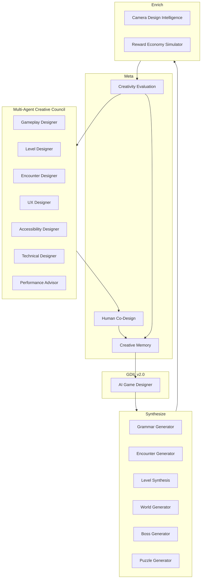
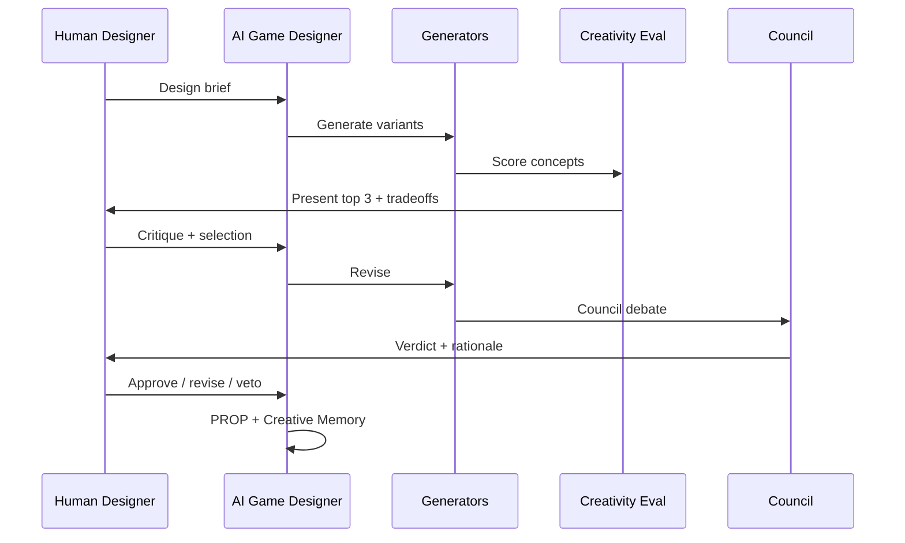

# Creative Game Design Intelligence Platform (GDIL v2.1)

**Evolution of:** [ACTIVE-GAME-DESIGN-INTELLIGENCE.md](./ACTIVE-GAME-DESIGN-INTELLIGENCE.md) v2.0  
**Shift:** Optimize existing ideas → **Generate complete, original gameplay content**  
**Constraint:** No new operating layer · POS/SOL governance unchanged · No gameplay code  
**Foundation:** POS + SOL + GDIL v1 + GDIL v2.0 remain permanent

---

## Executive Summary

GDIL v2.0 invents mechanics and tunes systems. **GDIL v2.1 (Creative Platform)** generates **complete design artifacts** — grammar sequences, encounters, levels, worlds, bosses, puzzles, camera plans, and economy models — through multi-agent debate, creativity evaluation, and human co-design.

```
┌─────────────────────────────────────────────────────────────────────────┐
│              GDIL v2.1 — CREATIVE PLATFORM                              │
│  Multi-Agent Creative Council · Creative Memory · Creativity Eval       │
│  Human–AI Co-Design Workflows                                           │
├─────────────────────────────────────────────────────────────────────────┤
│  SYNTHESIZE          │  ENRICH              │  SIMULATE                 │
│  Grammar Generator   │  Encounter Generator │  Reward Economy Sim       │
│  Level Synthesis     │  Puzzle Generator    │  Camera Design Intel      │
│  World Generator     │  Boss Generator      │                           │
├──────────────────────┴──────────────────────┴─────────────────────────┤
│              GDIL v2.0 — ACTIVE CORE (Discovery, Evolution, etc.)       │
├─────────────────────────────────────────────────────────────────────────┤
│              GDIL v1.0 — GOVERNANCE (Fun, DNA, DAP)                     │
├─────────────────────────────────────────────────────────────────────────┤
│                         SOL · POS · Game                                │
└─────────────────────────────────────────────────────────────────────────┘
```

**Output types (unchanged authority path):**

| Output | Description | Path to ship |
|--------|-------------|--------------|
| `GRAM-{id}` | Grammar sequence variant | → Level Synthesis → PROP |
| `ENC-{id}` | Encounter template | → Level Synthesis |
| `LVL-{id}` | Level layout candidate | → Human co-design → PROP |
| `WORLD-{id}` | World concept package | → Council debate → PROP |
| `BOSS-{id}` | Boss concept package | → Boss Intelligence v1 check |
| `PUZ-{id}` | Optional puzzle spec | → Level Synthesis |
| `CAM-{id}` | Camera recommendation | → Encounter/level attach |
| `ECON-{id}` | Economy simulation report | → World/progression |
| `COUNCIL-{id}` | Debate transcript + verdict | → Creative Memory |
| `CREVAL-{id}` | Creativity evaluation scorecard | → Accept/reject |

All ship through existing **Mechanic Lifecycle → DAP → SOL WAP**. No new tokens.

**Research Platform:** [GAME-DESIGN-RESEARCH-PLATFORM.md](./GAME-DESIGN-RESEARCH-PLATFORM.md) — hypothesis discovery upstream of synthesis. Architecture complete; implementation is next.

---

## Platform Architecture



---

# 1. GAMEPLAY GRAMMAR GENERATOR

## Purpose

Automatically produce **multiple Teach → Practice → Twist → Master → Exam → Reward → Recover sequences** per mechanic — not one canonical curriculum. Score variants on variety, readability, pacing, and learning efficiency.

## Architecture

```
creative/grammar/
├── SequenceGenerator.ts      # grammar node combinator
├── VariantLibrary.ts         # stored GRAM-* sequences
├── PacingScorer.ts           # temporal rhythm analysis
├── LearningEfficiencyModel.ts
└── outputs/GRAM-{mechanic}-{variant}.yaml
```

## Inputs

| Input | Source |
|-------|--------|
| Mechanic MKB | Verb, difficulty curve, tutorial strategy |
| Level Design Bible | Grammar rules, duration bands |
| Nintendo DNA | DNA-02 mechanical clarity |
| Dependency Graph | Prerequisite mechanics |
| Archetype profiles | Persona learning preferences |
| Creative Memory | Successful/failed grammar patterns |

## Outputs

| Output | Content |
|--------|---------|
| `GRAM-{id}` | Ordered node sequence with timing + segment specs |
| Variety score | 0–1 vs existing GRAM library |
| Readability score | Predicted jump success, telegraph clarity |
| Pacing score | Challenge/reward/recover rhythm |
| Learning efficiency | Time-to-competence estimate |
| Ranked variant list | Top-N for Council review |

## Algorithms (Conceptual)

**1. Sequence generation**

```
grammar_templates = [
  [TEACH, PRACTICE, PRACTICE, TWIST, EXAM, REWARD, RECOVER],
  [TEACH, REWARD, PRACTICE, TWIST, MASTER, EXAM, RECOVER],
  [TEACH, PRACTICE, TWIST, TWIST, EXAM, REWARD, RECOVER, REWARD],
  ...
]
FOR template IN grammar_templates:
  FOR mechanic IN mechanic_set:
    IF prerequisites_satisfied(mechanic):
      EMIT instantiate(template, mechanic, difficulty_curve)
```

**2. Scoring**

```
variety(g) = 1 - max_similarity(g, existing_grams)  # n-gram + node-type
readability(g) = mean(segment_readability)  # from Experience Prediction
pacing(g) = rhythm_match(g, ideal_envelope[world.emotional_arc])
learning_eff(g) = 1 / predicted_time_to_competence(g)  # normalized
composite = weighted_sum(variety, readability, pacing, learning_eff)
```

## KPIs

| KPI | Target |
|-----|--------|
| Variants per mechanic | ≥3 ranked |
| Readability score floor | ≥0.7 |
| Learning efficiency vs hand-crafted baseline | ≥90% |
| Council acceptance rate | ≥40% |
| Playtest competence time delta | ±15% of prediction |

## Validation Strategy

- Regenerate M1–M3 curriculum — compare to Level Design Bible  
- Blind playtest: AI grammar vs hand-crafted TEACH segment  
- Learning efficiency correlation with actual time-to-first-success  

## GDIL v2 Integration

| Subsystem | Link |
|-----------|------|
| Mechanic Discovery | New mechanics trigger grammar generation |
| Design Space Explorer | Parameter bounds per grammar node |
| Experience Prediction | Readability + learning scores |
| Level Synthesis | GRAM variants as level spine input |

---

# 2. ENCOUNTER GENERATOR

## Purpose

Compose **encounter templates** from mechanics, enemies, platforms, hazards, collectibles, camera states, and rewards — scored for clarity, novelty, difficulty, replayability.

## Architecture

```
creative/encounters/
├── EncounterComposer.ts      # constraint-based assembly
├── TemplateLibrary.ts        # ENC-* catalog
├── EncounterScorer.ts        # multi-axis scoring
├── CameraAttach.ts           # links CAM-* recommendations
└── templates/ENC-{id}.yaml
```

## Encounter Schema

```yaml
encounter:
  id: ENC-042
  mechanics: [MKB-M1, MKB-M4]
  enemies: [{ type: patrol_stomp, count: 2, telegraph: 0.6s }]
  platforms: [{ type: moving_horizontal, count: 3, spacing: jump_reach }]
  hazards: [{ type: pit, width: forgiving }]
  collectibles: [{ type: coin_trail, density: medium }]
  camera: CAM-042
  rewards: [{ type: star_fragment, placement: post_exam }]
  grammar_role: TWIST
  duration_target: 90s
```

## Inputs

| Input | Source |
|-------|--------|
| Approved mechanics | MKB + Mechanic Catalog |
| Enemy/boss bibles | Telegraph rules, DPS caps |
| Interaction Matrix | Valid combinations |
| World Identity | Enemy ecosystem, reward identity |
| Grammar Generator | ENC grammar_role context |
| Camera Design Intelligence | CAM recommendations |

## Outputs

| Output | Description |
|--------|-------------|
| `ENC-{id}` | Full encounter template |
| Clarity score | Readability + telegraph audit |
| Novelty score | vs encounter library |
| Difficulty score | Platform difficulty 0–1 |
| Replayability score | Route variance, mastery hooks |
| Assembly warnings | Matrix edge cases triggered |

## Algorithms (Conceptual)

**1. Constraint composition**

```
ENC = solve_constraints(
  must_include: grammar_role requirements,
  world_identity: enemy_ecosystem,
  matrix: valid actor pairs,
  budget: encounter_duration,
  reward: density_target
)
```

**2. Multi-axis scoring**

```
clarity = f(telegraph_times, visual_layers, camera_occlusion_pred)
novelty = embedding_distance(ENC, encounter_library)
difficulty = platform_difficulty_score(sim_bot_T2)
replayability = optional_routes + score_variance across archetypes
```

## KPIs

| KPI | Target |
|-----|--------|
| Encounters generated / world | 30–50 candidates → 12–15 selected |
| Clarity floor | ≥0.75 |
| Novelty mean | ≥0.4 |
| Difficulty in band | 0.4–0.7 for main path |
| Replayability (expert uptake) | ≥10% |

## Validation Strategy

- Bot T1 completability 100% main path  
- Human readability review ≥7/10 on sample  
- Compare ENC difficulty to telemetry on analog encounters  

## GDIL v2 Integration

| Subsystem | Link |
|-----------|------|
| Content Intelligence | Avoid repetitive ENC tokens |
| Player Archetypes | Score per persona |
| Replay Intelligence | Post-ship ENC refinement |
| Dependency Graph | Valid mechanic combos |

---

# 3. LEVEL SYNTHESIS ENGINE

## Purpose

Generate **complete level layouts** from world identity, mechanic set, grammar, encounter library, reward pacing, and emotional targets — producing **multiple alternative layouts** per design brief.

## Architecture

```
creative/levels/
├── LevelSynthesizer.ts       # layout graph generator
├── SegmentStitcher.ts        # GRAM + ENC assembly
├── LayoutVariantManager.ts   # LVL-A, LVL-B, LVL-C
├── PacingTimeline.ts         # reward/emotion overlay
└── layouts/LVL-{world}-{n}-{variant}.yaml
```

## Inputs

| Input | Source |
|-------|--------|
| World Identity sheet | 10 dimensions |
| Mechanic set | Approved MKB for world |
| GRAM sequences | Grammar Generator output |
| ENC library | Encounter Generator |
| Emotional targets | Emotional Experience Engine |
| Reward pacing | Reward Economy Simulator |
| Puzzle Generator | Optional PUZ attachments |

## Outputs

| Output | Description |
|--------|-------------|
| `LVL-{id}-A/B/C` | Alternative layout graphs |
| Segment map | Grammar-tagged spatial graph |
| Pacing timeline | Challenge/reward/emotion overlay |
| Soft-lock report | Bot T1 path analysis |
| Differentiation score | Layout variant diversity |
| Synthesis confidence | Experience Prediction CI |

## Algorithms (Conceptual)

**1. Spine-first synthesis**

```
spine = select_grammar_sequence(world, mechanics)
FOR segment IN spine:
  place_encounter(sample ENC matching segment.grammar_role)
  attach_collectibles(reward_timeline[segment.time])
  embed_secrets(world.secret_identity, segment)
  attach_puzzles(optional, PUZ pool)
```

**2. Layout variants**

```
variant_A = optimize_for(readability, casual archetype)
variant_B = optimize_for(mastery routes, expert)
variant_C = optimize_for(exploration, explorer)
ensure: same mechanic coverage, different spatial topology
```

**3. Validation pass**

```
IF bot_T1 fails OR reward_desert OR emotion_miss:
  mutate layout (local search) OR reject variant
```

## KPIs

| KPI | Target |
|-----|--------|
| Variants per level brief | ≥3 |
| Soft-lock rate | 0% |
| Grammar coverage | 100% intended mechanics |
| Emotional target attainment | ≥70% |
| Human co-design selection rate | ≥1 variant approved / 3 |

## Validation Strategy

- Compare synthesized grassland_01 to existing JSON where applicable  
- Playtest n≥5 on best variant vs prediction  
- Council debate transcript quality review  

## GDIL v2 Integration

| Subsystem | Link |
|-----------|------|
| Experience Prediction | Pre-playtest level scoring |
| Content Intelligence | Repetition check across LVL set |
| Camera Design Intelligence | Per-segment CAM attach |
| Human Co-Design | Variant selection workflow |

---

# 4. WORLD GENERATOR

## Purpose

Generate **coherent world concept packages** — not just levels but unified identity across gameplay, movement, visuals, enemies, boss, collectibles, music, and emotional arc.

## Architecture

```
creative/worlds/
├── WorldConceptGenerator.ts  # holistic world brief
├── IdentityCoherenceChecker.ts
├── EcosystemComposer.ts      # enemy + collectible ecology
└── concepts/WORLD-{id}.yaml
```

## World Concept Package

```yaml
world:
  id: WORLD-W2
  name: "Crystal Caverns"  # original — not copyrighted
  gameplay_identity: vertical exploration, light puzzle gates
  movement_identity: tight jumps, wall-kick emphasis
  visual_identity: bioluminescent silhouettes, high contrast
  enemy_ecosystem: [crystal_crab, bat_swoop, spore_cloud]
  boss_concept: BOSS-W2-001  # link Boss Generator
  collectibles: glow_shards, echo_stars
  music_direction: ambient pulses, crystal chimes on pickup
  emotional_arc: mystery → tension → wonder → triumph
  mechanic_set: [MKB-M1, MKB-M3, MKB-M5, MKB-M6]
  level_count_target: 5
  differentiation_from: [WORLD-W1]  # ≥4 dimension delta
```

## Inputs

| Input | Source |
|-------|--------|
| Nintendo DNA | DNA-06 dense understandable worlds |
| Existing worlds | Differentiation constraints |
| Mechanic Catalog | Available + Discovery candidates |
| Archetype gaps | Underserved personas |
| Creative Memory | Successful world patterns |
| Reward Economy Simulator | Progression slot |

## Outputs

| Output | Description |
|--------|-------------|
| `WORLD-{id}` | Full concept package |
| Coherence score | Cross-dimension alignment |
| Differentiation score | vs existing worlds |
| Production cost estimate | Content volume, art complexity |
| Level briefs | Inputs to Level Synthesis |
| Council debate packet | For major world acceptance |

## Algorithms (Conceptual)

**1. Concept generation**

```
seed = f(archetype_gap, mechanic_readiness, narrative_tone_palette)
world = expand(seed, identity_dimensions=10)
enforce(differentiation(world, existing) >= 4 dimensions)
enforce(mechanic_set ⊆ approved_or_near_approved)
```

**2. Coherence checking**

```
coherence = mean(dimension_pair_alignment)
  e.g. movement_identity vertical + enemy bat_swoop = high
       movement_identity vertical + enemy slow_ground = low → flag
```

## KPIs

| KPI | Target |
|-----|--------|
| Coherence score | ≥0.8 |
| Differentiation | ≥4/10 dimensions unique |
| Council acceptance | ≥1 world / quarter |
| Playtest world identity survey | ≥6/7 "feels distinct" |
| Mechanic integration | 100% introduced with GRAM |

## Validation Strategy

- Retrofit WORLD-W1 grassland as first generated concept exercise  
- Creative Director blind review: distinct from W1?  
- Economy sim: reward curve fits progression slot  

## GDIL v2 Integration

| Subsystem | Link |
|-----------|------|
| World Identity System v1 | Schema extended, not replaced |
| Boss Generator | boss_concept link |
| Level Synthesis | level briefs downstream |
| Mechanic Discovery | Seeds new mechanic needs per world |

---

# 5. BOSS GENERATOR

## Purpose

Create **original boss concept packages** — fantasy, mechanics, attack grammar, arena, escalation, recovery, emotional pacing, accessibility — extending Boss Intelligence v1 from framework to generator.

## Architecture

```
creative/bosses/
├── BossConceptGenerator.ts
├── AttackGrammarComposer.ts  # phase patterns
├── ArenaLayoutGenerator.ts
├── AccessibilityAdapter.ts
└── concepts/BOSS-{id}.yaml
```

## Boss Concept Package

```yaml
boss:
  id: BOSS-W2-001
  fantasy: "Crystal guardian — light refraction patterns"
  mechanics_used: [MKB-M5, MKB-M6]
  phases: 3
  attack_grammar:
    phase_1: [telegraphed_sweep, safe_platform_spawn]
    phase_2: [add_aerial_dive, crystal_rain]
    phase_3: [combo_sweep_dive, arena_shrink_soft]
  arena: { shape: circular, tiers: 2, edge_guard: soft_wall }
  escalation: hp_thresholds [0.66, 0.33]
  recovery_windows: { between_attacks: 1.8s, between_phases: 4s }
  emotional_pacing: tension → release → climax
  accessibility:
    telegraph_min: 0.6s
    pattern_complexity_cap: 3 simultaneous cues
    assist: extended_telegraph_mode
  celebration: shard_shower + shortcut_unlock
```

## Inputs

| Input | Source |
|-------|--------|
| Boss Intelligence v1 | 7-section framework rules |
| World concept | boss_concept slot, emotional arc |
| Mechanic set | Player verbs available |
| Archetype profiles | Casual/child telegraph needs |
| Experience Prediction | Frustration CI |
| Creative Memory | Boss success/failure patterns |

## Outputs

| Output | Description |
|--------|-------------|
| `BOSS-{id}` | Full concept package |
| Framework compliance | 7/7 sections |
| Predicted deaths avg | With CI |
| Accessibility audit | Pass/fail + adaptations |
| ENC integration | Boss arena as encounter set |

## Algorithms (Conceptual)

**1. Fantasy-mechanic binding**

```
fantasy_tokens → attack_visual_language
player_mechanics → required_counterplay verbs
GENERATE phase_grammar teaching each attack before combo
```

**2. Recovery enforcement**

```
FOR phase IN phases:
  ASSERT min_recovery BETWEEN attacks >= 1.5s
  ASSERT phase_transition_breather >= 3s
  IF prediction.frustration > 0.3: ADD recovery_segment
```

## KPIs

| KPI | Target |
|-----|--------|
| Framework compliance | 100% |
| Predicted avg deaths | ≤3 |
| Unfair telegraph survey | <20% |
| Accessibility pass | 100% checklist |
| Emotional triumph survey | ≥70% |

## Validation Strategy

- Boss Intelligence v1 checklist automated audit  
- Sim bot survival curve per phase  
- Child archetype fit ≥60  

## GDIL v2 Integration

| Subsystem | Link |
|-----------|------|
| Encounter Generator | Phase segments as ENC |
| Camera Design Intelligence | Arena camera profile |
| Replay Intelligence | Post-fight signal mining |
| Council | Mandatory debate for world finale bosses |

---

# 6. PUZZLE GENERATOR

## Purpose

Generate **optional puzzles** consistent with current mechanics — evaluate readability, solution diversity, and satisfaction without blocking main path.

## Architecture

```
creative/puzzles/
├── PuzzleGenerator.ts        # mechanic-consistent puzzles
├── SolutionDiversityAnalyzer.ts
├── OptionalPathEnforcer.ts   # never hard gate
└── puzzles/PUZ-{id}.yaml
```

## Inputs

| Input | Source |
|-------|--------|
| Mechanic set | Available verbs |
| Level context | Segment placement |
| World puzzle identity | Spatial vs timing vs routing |
| Archetype explorer/completionist | Target personas |
| Creative Memory | Puzzle patterns that worked |

## Outputs

| Output | Description |
|--------|-------------|
| `PUZ-{id}` | Puzzle spec (state, trigger, solution) |
| Readability score | Signpost clarity |
| Solution diversity | ≥2 valid approaches target |
| Satisfaction prediction | Explorer/completionist fit |
| Skip safety | Main path unaffected proof |

## Algorithms (Conceptual)

```
puzzle_types = [route_gate, timing_platform, enemy_bait, collect_chain]
FOR type IN puzzle_types:
  IF mechanics_support(type):
    GENERATE puzzle WITH optional_reward
    SCORE readability, diversity(count_solutions >= 2), satisfaction
REJECT if blocks_main_path OR single_obscure_solution_only
```

## KPIs

| KPI | Target |
|-----|--------|
| Optional placement | 100% |
| Solution diversity | ≥2 solutions ≥70% puzzles |
| Readability | ≥0.7 |
| Explorer satisfaction | ≥6/10 |
| Main path block rate | 0% |

## Validation Strategy

- Bot T1 main path ignore puzzle — must complete  
- Human discovery rate 25–75% (not 0%, not 100%)  

## GDIL v2 Integration

| Subsystem | Link |
|-----------|------|
| Level Synthesis | Embed PUZ in segments |
| Content Intelligence | Puzzle type diversity |
| Discovery driver | Fun Engine novelty |

---

# 7. CAMERA DESIGN INTELLIGENCE

## Purpose

Recommend **camera behaviour** per encounter and level segment — predict comfort, visibility, and control quality before build.

## Architecture

```
creative/camera/
├── CameraRecommender.ts      # profile per segment
├── ComfortPredictor.ts       # angular velocity, occlusion
├── VisibilityAnalyzer.ts     # jump line readability
└── recommendations/CAM-{id}.yaml
```

## Inputs

| Input | Source |
|-------|--------|
| ENC/LVL geometry | Platform layout, verticality |
| Encounter type | Boss vs traverse vs secret |
| Emotional target | Tension segments need stability |
| Accessibility Bible | Motion comfort bounds |
| Camera Feel Lab specs | Profile parameters (POS read) |
| Replay Intelligence | Historical occlusion/death correlation |

## Outputs

| Output | Description |
|--------|-------------|
| `CAM-{id}` | Profile: distance, pitch, FOV, smoothing, collision padding |
| Comfort prediction | Angular velocity p95, shake level |
| Visibility score | Jump goal visible % |
| Control quality | Camera fight index prediction |
| Assist variant | Reduced motion profile |

## Algorithms (Conceptual)

```
features = {verticality, corridor_width, hazard_density, boss_flag}
profile = select_base_profile(explore | tight | boss)
ADJUST distance, pitch FOR visibility(jump_targets) >= 0.85
PREDICT comfort FROM angular_path_simulation(profile, segment_path)
IF comfort FAIL: widen FOV, increase distance, reduce shake
ATTACH assist_variant for motion-sensitive archetypes
```

## KPIs

| KPI | Target |
|-----|--------|
| Visibility score | ≥0.85 |
| Comfort p95 angular velocity | Below lab threshold |
| Intervention rate prediction | <3/sec |
| Death correlation reduction vs default | ≥15% |
| Accessibility variant coverage | 100% boss + tight segments |

## Validation Strategy

- Replay camera trace on analog segments  
- Compare prediction to Camera Feel Lab metrics post-build  

## GDIL v2 Integration

| Subsystem | Link |
|-----------|------|
| Encounter Generator | Auto-attach CAM |
| Experience Prediction | Comfort in emotional model |
| Dynamic Difficulty | Camera assist as tuning lever |

---

# 8. REWARD ECONOMY SIMULATOR

## Purpose

Model **long-term progression** of coins, stars, collectibles, unlocks — predict scarcity, abundance, motivation across worlds.

## Architecture

```
creative/economy/
├── EconomyModel.ts           # sinks, sources, curves
├── ProgressionTimeline.ts    # world-by-world
├── MotivationPredictor.ts    # archetype-weighted
└── simulations/ECON-{scope}-{date}.yaml
```

## Inputs

| Input | Source |
|-------|--------|
| Level/World layouts | Collectible placement |
| Game Design Bible | Meta gating rules |
| Archetype profiles | Completionist vs casual |
| World concepts | Reward identity |
| Fun Engine | Reward driver targets |

## Outputs

| Output | Description |
|--------|-------------|
| `ECON-{id}` | Simulation report |
| Source/sink balance | Per world + cumulative |
| Scarcity index | 0–1 (0=too much, 1=too little) |
| Motivation curve | Predicted engagement over hours |
| Inflation warnings | Currency devaluation risk |
| Unlock pacing | Stars gating timeline |

## Algorithms (Conceptual)

```
state = {coins, stars, shards, unlocks}
FOR session IN simulated_sessions(archetype_mix):
  FOR level IN progression_order:
    state += collect(level)
    state -= purchases(unlock_rules)
    RECORD motivation(archetype, state, reward_density)

scarcity = deviation_from_target_band(sources - sinks)
flag IF completionist_grind > 2x casual OR casual_starved
```

## KPIs

| KPI | Target |
|-----|--------|
| Casual coin satisfaction | Never blocked on optional |
| Completionist grind ratio | <2x casual time |
| Star gate pacing | New unlock every 15–25 min |
| Inflation rate | <5% effective devaluation per world |
| Motivation curve | No >20 min reward desert |

## Validation Strategy

- Simulate World 1 coin/star counts vs design targets  
- Playtest completionist vs casual time tracking  

## GDIL v2 Integration

| Subsystem | Link |
|-----------|------|
| Level Synthesis | Reward placement feedback loop |
| World Generator | Economy slot assignment |
| Content Intelligence | Reward desert detection |

---

# 9. CREATIVE MEMORY

## Purpose

Searchable repository of **why ideas succeeded or failed** — lessons, patterns, templates — feeding all generators with institutional creative knowledge.

## Architecture

```
creative/memory/
├── INDEX.md
├── successes/                # CRE-SUC-*
├── failures/                 # CRE-FAIL-*
├── patterns/                 # PAT-* reusable templates
├── lessons/                  # LSN-CRE-*
└── templates/                # TPL-ENC, TPL-GRAM, TPL-BOSS
```

## Record Schema

```yaml
---
id: CRE-SUC-2026-grammar-sandwich
type: success
tags: [grammar, pacing, grassland]
generator: Grammar Generator
concept_ref: GRAM-M1-v2
why: "REWARD before second PRACTICE increased casual retention"
metrics: {competence_slope: 0.12, casual_fit: 72}
reusable_as: PAT-grammar-reward-breathe
---
```

## Inputs

| Input | Source |
|-------|--------|
| Playtest outcomes | Playtest Intelligence |
| Council verdicts | COUNCIL-* transcripts |
| Creativity Evaluation | CREVAL scorecards |
| Human co-design notes | HCD session logs |
| Ship/retire decisions | Mechanic Evolution |

## Outputs

| Output | Description |
|--------|-------------|
| Pattern retrieval | Top-k similar past concepts |
| Anti-pattern warnings | "Similar to CRE-FAIL-*" |
| Template suggestions | TPL-* for generators |
| Generator calibration | Success rate by pattern type |

## Algorithms (Conceptual)

```
on_concept_complete(outcome):
  WRITE structured record (why, metrics, context)
  IF success: EXTRACT pattern → PAT-*
  IF failure: EXTRACT anti_pattern → link CRE-FAIL

on_generate(concept):
  RETRIEVE similar(concept.embedding, memory)
  BOOST patterns with high success_rate
  PENALIZE anti_pattern matches
```

## KPIs

| KPI | Target |
|-----|--------|
| Record coverage (major concepts) | 100% |
| Retrieval relevance | ≥70% human rated useful |
| Repeat failure rate | <10% same anti-pattern |
| Pattern reuse success | ≥50% when applied |

## Validation Strategy

- Seed from Phase 16.5 lessons + grammar bible  
- A/B generation with/without memory retrieval  

## GDIL v2 Integration

| Subsystem | Link |
|-----------|------|
| All v2.1 generators | Retrieval on every generate |
| Mechanic Evolution | Lineage linked to CRE records |
| SOL KOS | Mirror summaries (read-only sync) |

---

# 10. MULTI-AGENT CREATIVE COUNCIL

## Purpose

**Structured debate** among specialized AI roles before major concepts accepted — transparent rationale for every accept/reject.

## Architecture

```
creative/council/
├── CouncilOrchestrator.ts
├── DebateProtocol.ts
├── VerdictRecorder.ts
└── transcripts/COUNCIL-{date}-{concept}.md
```

## Agent Roles

| Role | Evaluates | Veto Domain |
|------|-----------|-------------|
| **Gameplay Designer** | Fun, mechanics, grammar | Broken teach chain |
| **Level Designer** | Layout, pacing, secrets | Soft-lock, pacing desert |
| **Encounter Designer** | ENC clarity, telegraphs | Unfair encounter |
| **UX Designer** | Onboarding, HUD implications | Confusing goal read |
| **Accessibility Designer** | Assist, telegraph, motion | A11y fail |
| **Technical Designer** | Build feasibility, data format | Unbuildable scope |
| **Performance Advisor** | Entity count, VFX budget | Perf budget breach |

## Debate Protocol

```
1. PRESENT concept package + CREVAL scorecard
2. Each agent: {score 0-100, concerns[], supports[], vote: accept|revise|reject}
3. DIVERGE: agents respond to each other's concerns (max 2 rounds)
4. SYNTHESIZE: orchestrator drafts revised concept OR rejection rationale
5. VERDICT: accept | revise_and_resubmit | reject
6. RECORD transcript → Creative Memory
```

## Inputs

| Input | Source |
|-------|--------|
| Concept package | Any generator output |
| Creativity Evaluation | CREVAL-* |
| Experience Prediction | CI and assumptions |
| POS tech bounds | Read-only feasibility |

## Outputs

| Output | Description |
|--------|-------------|
| `COUNCIL-{id}` | Full transcript |
| Verdict | accept / revise / reject |
| Rationale | Transparent multi-agent synthesis |
| Revision checklist | If revise |
| Dissent log | Minority opinions preserved |

## KPIs

| KPI | Target |
|-----|--------|
| Transcript completeness | 100% major concepts |
| Post-ship regret rate | <15% (concept failed playtest) |
| Debate rounds | ≤2 (efficiency) |
| Dissent preserved | 100% |
| Human override tracking | Logged, not hidden |

## Validation Strategy

- Replay council on known good/bad historical concepts  
- Human designer rates rationale clarity ≥7/10  

## GDIL v2 Integration

| Subsystem | Link |
|-----------|------|
| AI Game Designer | Schedules council, implements revisions |
| Human Co-Design | Human chair may call council |
| Creative Memory | All verdicts ingested |

---

# 11. CREATIVITY EVALUATION

## Purpose

**Score every generated concept** on originality, clarity, systemic compatibility, teaching potential, replay value, production cost, long-term sustainability — gate before Council.

## Architecture

```
creative/evaluation/
├── CreativityScorer.ts
├── OriginalityEstimator.ts
├── SustainabilityModel.ts
└── scorecards/CREVAL-{concept}.yaml
```

## Evaluation Dimensions

| Dimension | Weight | Measurement |
|-----------|--------|-------------|
| **Originality** | 0.18 | Embedding novelty + Creative Memory distance |
| **Clarity** | 0.16 | Readability prediction + DNA-01 |
| **Systemic compatibility** | 0.16 | Dependency graph fit |
| **Teaching potential** | 0.14 | Grammar learning efficiency |
| **Replay value** | 0.12 | Archetype + mastery hooks |
| **Production cost** | 0.12 | Art, entities, unique assets (inverse) |
| **Long-term sustainability** | 0.12 | Meta inflation, mechanic retirement risk |

```
creativity_score = Σ weight_i × normalize(dimension_i)  → 0–100
```

## Thresholds

| Action | Score |
|--------|-------|
| Auto-forward to Council | ≥65 |
| Revise loop | 45–64 |
| Auto-reject (AI Game Designer) | <45 |
| Fast-track human review | ≥80 + high originality |

## Inputs / Outputs

**Inputs:** Any generated concept, Creative Memory, GDIL v2 predictions  
**Outputs:** `CREVAL-{id}` scorecard, dimension breakdown, pass/revise/reject

## KPIs

| KPI | Target |
|-----|--------|
| Score vs playtest fun correlation | ρ ≥ 0.55 |
| Auto-reject precision | ≥75% |
| False reject rate | <10% |
| Cost prediction accuracy | ±25% |

## Validation Strategy

- Calibrate on M1–M8 curriculum concepts  
- Track rejected concepts that would have failed playtest  

## GDIL v2 Integration

| Subsystem | Link |
|-----------|------|
| All generators | Pre-council filter |
| Mechanic Discovery | Rank candidates |
| Council | Scorecard attached to debate |

---

# 12. HUMAN–AI CO-DESIGN

## Purpose

Workflows where **human designers guide, critique, and approve** AI-generated content — augmentation, not replacement.

## Architecture

```
creative/codesign/
├── CoDesignSession.ts
├── VariantPickerUI.ts        # spec for future tool
├── CritiqueCapture.ts
├── ApprovalWorkflow.ts
└── sessions/HCD-{date}.md
```

## Session Types

| Session | Human Role | AI Role | Output |
|---------|------------|---------|--------|
| **Brief** | Set constraints, tone, references | Generate 3–5 concept seeds | Selected seed |
| **Variant pick** | Choose LVL-A vs B vs C | Present tradeoffs | `HCD-approval` |
| **Critique loop** | Mark what feels wrong | Revise specific segments | Revised ENC/LVL |
| **Polish pass** | Juice, secrets, personality | Apply within bounds | Final PROP |
| **Veto** | Kill concept | Archive + CRE-FAIL | Rejection record |

## Co-Design Principles

1. **AI proposes ≥3 variants** — human always chooses, never single option  
2. **Human edits win** over AI on taste conflicts (logged to Creative Memory)  
3. **AI explains every proposal** — no black-box layouts  
4. **Approval is explicit** — `HCD-{id}` record before PROP → Council  
5. **Junior-safe** — human can accept Council verdict without reading all agents  

## Workflow Diagram



## Inputs / Outputs

**Inputs:** Human brief, critique notes, approval/veto  
**Outputs:** `HCD-{id}` session log, approved concept refs, human override flags

## KPIs

| KPI | Target |
|-----|--------|
| Human approval rate (first pass) | 30–50% (healthy iteration) |
| Time brief → approved PROP | <5 days |
| Human satisfaction survey | ≥7/10 |
| AI override by human | tracked, influences memory |
| Concepts shipped without human touch | 0% for worlds/bosses |

## Validation Strategy

- Pilot one level co-design session (paper exercise)  
- Measure revision rounds to approval  

## GDIL v2 Integration

| Subsystem | Link |
|-----------|------|
| Level/World/Boss generators | Variant presentation |
| Council | Human may chair |
| Creative Memory | Human critique ingested |
| SOL | No WAP change — human approval satisfies Creative OS |

---

# PLATFORM ORCHESTRATION

## AI Game Designer (Extended Role)

v2.0 orchestration loop extended:

```
BRIEF (human or deficit) 
  → GENERATE (Grammar, ENC, LVL, WORLD, BOSS, PUZ)
  → ENRICH (CAM, ECON)
  → EVALUATE (Creativity Evaluation)
  → DEBATE (Council if score ≥65 or major concept)
  → CO-DESIGN (Human variant pick / critique)
  → MEMORY (Creative Memory write)
  → PROP (existing path to DAP)
```

## End-to-End: New World

```
1. World Generator → WORLD-W2
2. Boss Generator → BOSS-W2-001
3. Grammar Generator → GRAM sets for mechanic_set
4. Encounter Generator → ENC library (40 candidates)
5. Level Synthesis → 5 levels × 3 variants
6. Puzzle Generator → optional PUZ per level
7. Camera Intelligence → CAM per segment
8. Economy Simulator → ECON-W2
9. Creativity Evaluation → CREVAL each artifact
10. Council → COUNCIL-W2 verdict
11. Human Co-Design → HCD sessions, pick variants
12. Creative Memory → record outcomes
13. PROP → existing GDIL v1 DAP → SOL WAP → POS build
```

---

# CROSS-PLATFORM METRICS

| Metric | Target |
|--------|--------|
| Creative Platform health | Mean CREVAL ≥60 |
| Originality index | ≥0.5 on shipped content |
| Council accept rate | 25–40% of generated (quality filter) |
| Human co-design satisfaction | ≥7/10 |
| Creative Memory reuse lift | +10% Fun vs no memory |
| End-to-end brief → PROP | <7 days |

---

# RISK ANALYSIS

| ID | Risk | Score | Mitigation |
|----|------|-------|------------|
| CP1 | Generic procedural content | 16 | Creativity Eval + Memory + Council |
| CP2 | Human disengagement | 12 | Co-design mandatory for worlds/bosses |
| CP3 | Unbuildable generated layouts | 14 | Technical Designer veto |
| CP4 | Camera/sim ignores feel | 10 | Camera Feel Lab calibration |
| CP5 | Economy inflation | 12 | Simulator + completionist monitoring |
| CP6 | Council theater | 8 | Dissent log + human chair |
| CP7 | IP similarity to existing games | 15 | Originality scorer + Creative Memory |
| CP8 | Volume over quality | 14 | CREVAL threshold + top-3 variant rule |

---

# SUCCESS CRITERIA

## Creative Platform Online

- [ ] Grammar Generator produces 3 variants for MKB-M1  
- [ ] Encounter library seed ≥10 ENC templates  
- [ ] Level Synthesis produces 3 variants for one brief  
- [ ] WORLD-W1 retrofit concept generated  
- [ ] BOSS concept generated for W1  
- [ ] Creative Memory seeded with 5 patterns  
- [ ] Council dry-run transcript on one LVL variant  
- [ ] CREVAL calibrated on known concepts  
- [ ] HCD workflow documented + one paper session  

## Creative Platform Proven (M3)

- [ ] Vertical slice level co-designed AI + human  
- [ ] CREVAL vs playtest ρ ≥ 0.5  
- [ ] 0 soft-locks in synthesized levels  
- [ ] Council regret rate <20%  
- [ ] Originality index ≥0.5 on shipped slice  

---

# INTEGRATION SUMMARY (GDIL v2.0)

| v2.1 Subsystem | v2.0 Consumer / Provider |
|----------------|--------------------------|
| Grammar Generator | Discovery, Level Synthesis |
| Encounter Generator | Content Intelligence, Matrix |
| Level Synthesis | Experience Prediction, Replay Intel |
| World Generator | Archetypes, Economy Sim |
| Boss Generator | Boss Intelligence v1, Prediction |
| Puzzle Generator | Discovery, Explorer archetype |
| Camera Intelligence | Replay Intel, Dynamic Difficulty |
| Economy Simulator | Reward driver, Content Intel |
| Creative Memory | All generators (retrieval) |
| Creative Council | AI Game Designer |
| Creativity Evaluation | All generators (filter) |
| Human Co-Design | Council, Memory, PROP path |

**POS/SOL:** Unchanged. Generated content enters existing factories and gates as richer `PROP-*` inputs.

---

# DOCUMENT CONTROL

| Field | Value |
|-------|-------|
| Version | GDIL v2.1 Creative Platform |
| Extends | GDIL v2.0 Active Intelligence |
| Does not replace | GDIL v1.0 governance |
| Location | `docs/gdil/CREATIVE-GAME-DESIGN-PLATFORM.md` |

---

*GDIL v2.1 transforms the game design stack from optimization into collaborative creation — generating original, commercially viable 3D platformer content while humans guide taste and existing architecture governs what ships.*
