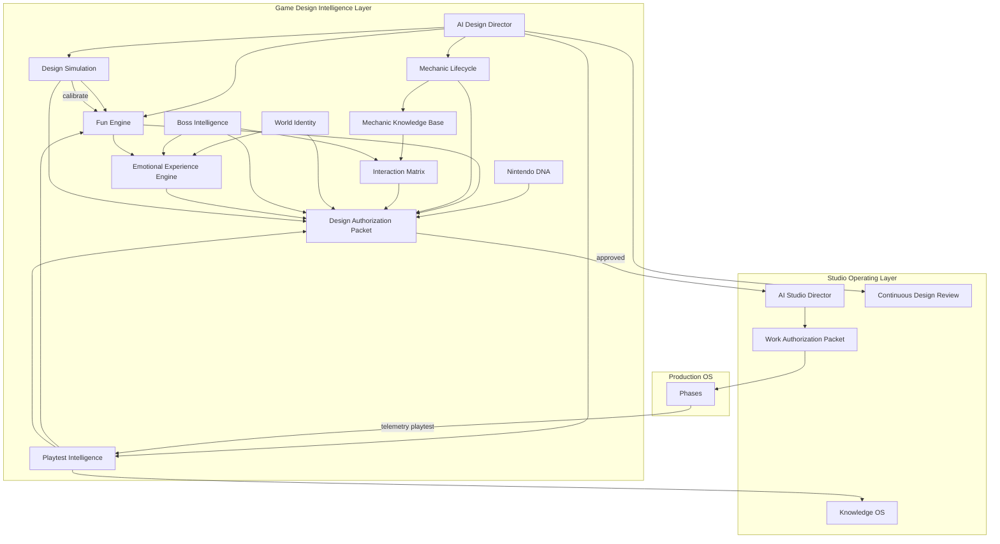
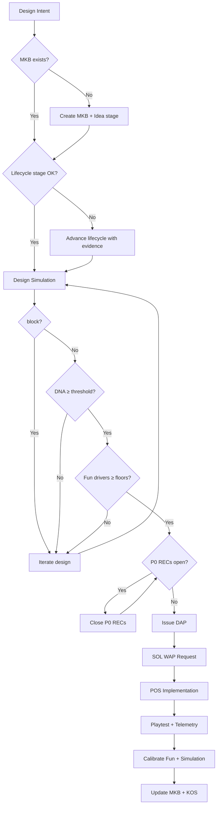
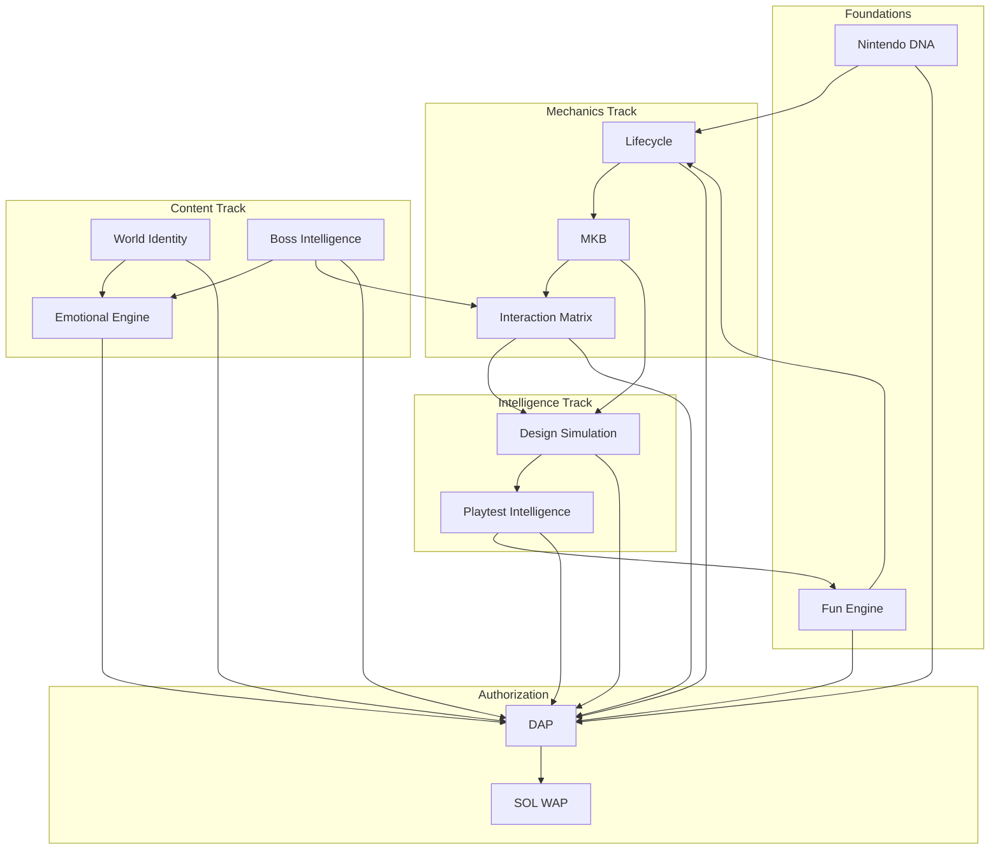

# Game Design Intelligence Layer (GDIL) v1.0

**Authority:** Governing layer above [Studio Operating Layer v1.0](../studio/STUDIO-OPERATING-LAYER.md)  
**Model:** World-class 3D platformer design intelligence — not engineering management  
**Status:** Ratified planning baseline — **no gameplay implementation authorized**  
**Current snapshot:** 28/100 production readiness · Fun score unmeasured · M0

---

## Executive Summary

| Layer | Governs |
|-------|---------|
| **GDIL** | *Why* the game is fun — design intelligence, player experience |
| **SOL** | *How* the studio operates — process, knowledge, authorization |
| **POS** | *What* to build — phases, factories, gates |

```
┌─────────────────────────────────────────────────────────────────┐
│         GAME DESIGN INTELLIGENCE LAYER (GDIL) v1.0              │
│  Fun · Mechanics · Interactions · Worlds · Bosses · Emotion   │
│  Playtest Intelligence · Design Simulation · Nintendo DNA       │
│  AI Design Director                                             │
├─────────────────────────────────────────────────────────────────┤
│              STUDIO OPERATING LAYER (SOL) v1.0                  │
│  Creative OS · Decision OS · Knowledge OS · AI Studio Director │
├─────────────────────────────────────────────────────────────────┤
│           PRODUCTION OPERATING SYSTEM (POS) v3.0                  │
│  Phases · Gates · Factories · Milestones                        │
├─────────────────────────────────────────────────────────────────┤
│                    GAME PRODUCT (3dmario)                       │
└─────────────────────────────────────────────────────────────────┘
```

**Governing rule:** No mechanic, level, encounter, or boss may receive SOL Work Authorization without GDIL **Design Authorization Packet (DAP)**.

**Active intelligence:** [GDIL v2.0](./ACTIVE-GAME-DESIGN-INTELLIGENCE.md) continuously discovers and evolves gameplay; v1.0 subsystems below are its foundation.

---

# 1. ARCHITECTURE

## 1.1 Ten Subsystems

| # | Subsystem | Document | Core Output |
|---|-----------|----------|-------------|
| 1 | **Fun Engine** | [fun/FUN-ENGINE.md](./fun/FUN-ENGINE.md) | Composite Fun score + 10 driver KPIs |
| 2 | **Mechanic Lifecycle** | [mechanics/LIFECYCLE.md](./mechanics/LIFECYCLE.md) | 12-stage governance + exit criteria |
| 3 | **Mechanic Knowledge Base** | [mechanics/KNOWLEDGE-BASE-SCHEMA.md](./mechanics/KNOWLEDGE-BASE-SCHEMA.md) | Per-mechanic design record |
| 4 | **Interaction Matrix** | [interactions/INTERACTION-MATRIX.md](./interactions/INTERACTION-MATRIX.md) | 10×10 actor behaviour model |
| 5 | **World Identity** | [worlds/WORLD-IDENTITY-SYSTEM.md](./worlds/WORLD-IDENTITY-SYSTEM.md) | 10-dimension world identity |
| 6 | **Boss Intelligence** | [bosses/BOSS-INTELLIGENCE.md](./bosses/BOSS-INTELLIGENCE.md) | 7-part boss framework |
| 7 | **Emotional Experience Engine** | [emotion/EMOTIONAL-EXPERIENCE-ENGINE.md](./emotion/EMOTIONAL-EXPERIENCE-ENGINE.md) | Emotional journey + survey mapping |
| 8 | **Playtest Intelligence** | [playtest/PLAYTEST-INTELLIGENCE-PLATFORM.md](./playtest/PLAYTEST-INTELLIGENCE-PLATFORM.md) | AI recommendations REC-* |
| 9 | **Design Simulation** | [simulation/DESIGN-SIMULATION-ENGINE.md](./simulation/DESIGN-SIMULATION-ENGINE.md) | Pre-implementation predictions |
| 10 | **Nintendo DNA** | [dna/NINTENDO-DNA-FRAMEWORK.md](./dna/NINTENDO-DNA-FRAMEWORK.md) | 10 abstract design rules |

## 1.2 System Map



## 1.3 Design Org Chart

| Virtual Role | GDIL Ownership |
|--------------|----------------|
| **AI Design Director** | Orchestration, DAP issuance, fun governance |
| Gameplay Director | Mechanic lifecycle, MKB, matrix, simulation review |
| Creative Director | World identity, emotional tone, DNA waivers |
| Level Designer | Grammar, world identity execution |
| Encounter Designer | Boss intelligence, enemy matrix cells |

---

# 2. GOVERNANCE

## 2.1 Authorization Chain

```
Design Proposal → GDIL Review → DAP → SOL WAP → POS Implementation → Evidence → GDIL Learn
```

| Gate | Layer | Token |
|------|-------|-------|
| Design ready | GDIL | **DAP** |
| Engineering ready | SOL | **WAP** |
| Phase complete | POS | **G0–G4** |

## 2.2 What Requires DAP

| Artifact | Always | Exception |
|----------|--------|-----------|
| New mechanic | Yes | — |
| Mechanic tuning | Yes (lightweight) | Coyote ±0.02 with S1 sim |
| Level / segment | Yes | Dev sandbox throwaway (no WAP path) |
| Enemy encounter | Yes | — |
| Boss | Yes | — |
| World greenlight | Yes | — |
| Pure engineering infra | No | SOL WAP only (telemetry, replay) |

## 2.3 Freeze Conditions (Design)

AI Design Director blocks DAPs when:
- Fun composite below milestone floor  
- Any fun driver below floor  
- Open P0 REC from Playtest Intelligence  
- Nintendo DNA score <60  
- Mechanic lifecycle stage insufficient  
- Design Simulation returns `block`  
- Emotional frustration >30% session (boss/world)  

## 2.4 Integration with SOL (No POS Changes)

| SOL System | GDIL Integration |
|------------|------------------|
| Work Authorization | WAP requires valid DAP for player-facing work |
| Creative OS | Pillars feed Fun Engine weights |
| Design OS Bibles | World Identity extends bibles; MKB extends Level Bible |
| Decision OS | DEC records reference Fun snapshot + DNA score |
| Knowledge OS | Playtest RECs mirrored; simulation reports ingested |
| Experience Timeline | Emotional Engine extends T0–T8 |
| AI Studio Director | Receives GDIL RED alerts; cannot WAP without DAP |
| CDR Gameplay | Fed by Playtest Intelligence RECs |

## 2.5 Integration with POS (Read-Only)

GDIL **reads** POS phase specs and gates; does not modify POS documents.

| POS Element | GDIL Use |
|-------------|----------|
| Phase 17 Research Lab | Mechanic Prototype/Experiment |
| Phase 18 Character Feel | MKB-M1 tuning, DNA-04 |
| Phase 24 Analytics | Fun Engine inputs |
| Phase 30 Bot playtesting | Interaction Matrix validation |
| Phase 36 Vertical Slice | First full DAP chain proof |
| Milestones M0–M9 | Fun floor targets |

---

# 3. SUBSYSTEM INTERACTIONS

| From | To | Data Flow |
|------|-----|-----------|
| Fun Engine | DAP | Driver scores, imbalance alerts |
| Mechanic Lifecycle | MKB | Stage gates, record requirements |
| MKB | Interaction Matrix | Actor pair definitions |
| Interaction Matrix | Design Simulation | Edge case risk input |
| World Identity | Emotional Engine | Emotional identity targets |
| Boss Intelligence | Emotional Engine | Boss arc pacing |
| Design Simulation | DAP | Predicted fun, block/proceed |
| Playtest Intelligence | Fun Engine | Calibrated driver KPIs |
| Playtest Intelligence | Mechanic Lifecycle | Iteration → Approval evidence |
| Nintendo DNA | DAP | Compliance score |
| Emotional Engine | Playtest Intelligence | Survey instrument mapping |
| All subsystems | AI Design Director | Unified design health |

---

# 4. DECISION FLOW



---

# 5. METRICS

## 5.1 Primary Design KPIs

| KPI | M3 Target | M9 Target | Source |
|-----|-----------|-----------|--------|
| Fun composite | ≥60 | ≥75 | Fun Engine |
| Jump satisfaction | ≥7/10 | ≥8/10 | Playtest |
| DNA compliance | ≥70 | ≥90 | Nintendo DNA |
| Emotional health | ≥70 | ≥80 | Emotional Engine |
| P0 REC open count | 0 | 0 | Playtest Intelligence |
| Simulation calibration error | ±15 pts | ±10 pts | Design Simulation |
| Mechanic approval rate | M1–M3 approved | M1–M8 | Lifecycle |
| Matrix P0 pass rate | 100% | 100% | Interaction Matrix |

## 5.2 Fun Driver Floors (M3)

All ten drivers ≥0.45. See [FUN-ENGINE.md](./fun/FUN-ENGINE.md).

## 5.3 Design Health Score

```
Design Health = 0.35×Fun + 0.20×DNA + 0.20×Emotional Health + 0.15×(1-P0_REC_rate) + 0.10×Sim_calibration
```

---

# 6. DASHBOARDS

Specification: [dashboards/GDIL-DASHBOARD-SPEC.md](./dashboards/GDIL-DASHBOARD-SPEC.md)

| Dashboard | Audience |
|-----------|----------|
| GDIL Design Health | AI Design Director, Gameplay Director |
| Fun Engine radar | Gameplay, Creative |
| REC queue | Gameplay, Level Design |
| SOL Executive (existing) | AI Studio Director — includes GDIL summary widget |

---

# 7. AI AGENT RESPONSIBILITIES

| Agent | Layer | Design Authority |
|-------|-------|------------------|
| **AI Design Director** | GDIL | DAP, fun governance, lifecycle, simulation, DNA |
| **AI Studio Director** | SOL | WAP (requires DAP), studio freeze, milestones |

Agent specs: [agents/AI-DESIGN-DIRECTOR.md](./agents/AI-DESIGN-DIRECTOR.md)

---

# 8. REVIEW CADENCE

| Review | Cadence | Chair | GDIL Inputs |
|--------|---------|-------|-------------|
| **Fun review** | Weekly | AI Design Director | Fun Engine, driver imbalances |
| **Mechanic council** | Bi-weekly | Gameplay Director | Lifecycle stages, MKB |
| **Interaction audit** | Per bot run | Gameplay Director | Matrix P0 status |
| **World identity** | Per world greenlight | Creative Director | Identity sheets |
| **Boss review** | Per boss | Gameplay Director | Boss Intelligence checklist |
| **Emotional audit** | Per playtest | Creative Director | Emotional Engine |
| **Playtest synthesis** | Per session | AI Design Director | REC prioritization |
| **DNA audit** | Per world + pre-ship | Creative Director | 10-rule compliance |
| **Simulation calibration** | Monthly | AI Design Director | Predict vs actual |

*Feeds SOL Continuous Design Review — does not replace it.*

---

# 9. DEPENDENCY GRAPH



**Critical design path to first shippable slice:**

```
DNA + Fun Engine → MKB-M1 lifecycle → Experiment → Playtest → Approval
→ Interaction Matrix P0 → Simulation S3 → DAP → SOL WAP → POS feel phases
→ Vertical slice → Playtest Intelligence → G1 Fun ≥60
```

---

# 10. RISK ANALYSIS

| ID | Risk | L | I | Score | Mitigation |
|----|------|---|---|-------|------------|
| DR1 | Fun score never reaches 60 | 4 | 5 | 20 | Fun Engine floors; weekly fun review |
| DR2 | Design process overhead blocks solo dev | 4 | 3 | 12 | Lightweight DAP for tuning; S1 sim |
| DR3 | Simulation mispredicts fun | 4 | 4 | 16 | Calibration loop; human playtest always |
| DR4 | DNA framework too rigid | 2 | 3 | 6 | DEC waiver path |
| DR5 | Mechanic lifecycle stall at Prototype | 4 | 4 | 16 | MKB-M1 priority; Research Lab |
| DR6 | Interaction matrix incomplete | 3 | 4 | 12 | P0 cells first; bot validation |
| DR7 | Emotional survey fatigue | 2 | 2 | 4 | Short instruments post-segment |
| DR8 | Playtest REC backlog | 3 | 4 | 12 | P0 closure SLA 7 days |
| DR9 | Boss framework ignored | 3 | 5 | 15 | DAP hard requirement |
| DR10 | GDIL/SOL authorization conflict | 2 | 4 | 8 | DAP before WAP strict ordering |

---

# 11. SUCCESS CRITERIA

## 11.1 GDIL Operational (Design Intelligence Live)

- [ ] Fun Engine computes composite from telemetry schema (on paper validated)
- [ ] MKB-M1 at Experiment stage with full record
- [ ] Interaction Matrix P0 cells documented
- [ ] First Design Simulation report generated (S1 for M1)
- [ ] Nintendo DNA audit complete for labs
- [ ] AI Design Director charter ratified
- [ ] DAP template issued at least once (dry run)
- [ ] Playtest Intelligence REC schema used

## 11.2 GDIL Proven (M3)

- [ ] Fun ≥60 with all driver floors
- [ ] MKB-M1 through M3 at Approval+
- [ ] Vertical slice DAP chain complete
- [ ] Simulation S3 calibration within ±15 pts
- [ ] DNA score ≥70 on slice
- [ ] 0 open P0 RECs
- [ ] Emotional health ≥70

## 11.3 GDIL Commercial (M9)

- [ ] Fun ≥75
- [ ] DNA ≥90
- [ ] All shipped mechanics through Retirement or Master
- [ ] World Identity sheets for all worlds
- [ ] Boss Intelligence on all bosses
- [ ] Simulation S4 ±10 pts

---

# 12. AUTONOMOUS IMPROVEMENT LOOP (Design)

Extends SOL AIL with design-specific learn stage:

```
Observe (playtest + telemetry)
→ Measure (Fun Engine + Emotional Engine)
→ Analyze (Playtest Intelligence + DNA audit)
→ Prioritize (REC queue + AI Design Director)
→ Authorize (DAP)
→ Implement (via SOL WAP → POS)
→ Test (playtest + bot + matrix)
→ Review (fun review + mechanic council)
→ Learn (MKB update, simulation calibration)
→ Re-plan (driver weights, lifecycle priorities)
```

---

# 13. IMMEDIATE ACTIONS

| Priority | Action | Owner |
|----------|--------|-------|
| P0 | Ratify GDIL v1.0 | Executive Board |
| P0 | Complete MKB-M1 full record | Gameplay Director |
| P1 | Advance MKB-M1 Idea → Prototype → Experiment (design docs only) | AI Design Director |
| P1 | Run S1 simulation for M1 jump | AI Design Director |
| P1 | Dry-run DAP for M1 tuning authorization | AI Design Director |
| P2 | Draft WORLD-W1 Identity Sheet | Creative Director |

**Not authorized:** Gameplay implementation code; POS modifications.

---

# 14. DOCUMENT CONTROL

| Field | Value |
|-------|-------|
| Version | GDIL 1.0 |
| Governs | SOL (DAP prerequisite); reads POS |
| Location | `docs/gdil/GAME-DESIGN-INTELLIGENCE-LAYER.md` |
| Index | [README.md](./README.md) |
| Next review | After first DAP issued |

---

*GDIL transforms a technically well-managed platformer into a commercially competitive 3D platform game by governing fun, mechanics, emotions, and design evidence — before a single line of player-facing code ships.*
