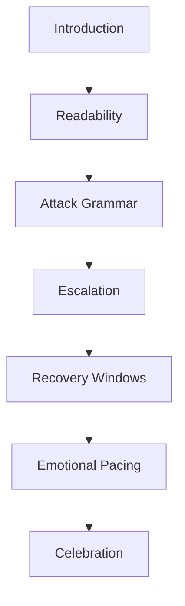

# Boss Intelligence System

**Subsystem:** GDIL §6  
**Purpose:** Structured framework for climax encounters that teach, challenge, celebrate

---

## 1. Boss Design Stack

---

## 2. Framework Sections

### 2.1 Introduction

| Element | Requirement |
|---------|-------------|
| **Foreshadowing** | Boss seen or referenced ≥1 level before |
| **Arena entry** | Clear threshold; camera establishes scale |
| **First beat** | Non-lethal intro attack or roar — player learns presence |
| **Time-to-first-action** | Player can orient <3s after entry |

**Telemetry:** `boss_intro_complete`, `time_to_first_boss_action`  
**KPI:** Survey "I understood a boss was starting" ≥90%

### 2.2 Readability

| Element | Requirement |
|---------|-------------|
| **Silhouette** | Attack origin readable at combat distance |
| **Color language** | Wind-up vs strike vs vulnerable phases distinct |
| **Audio telegraph** | Unique cue per attack type |
| **Arena clarity** | Safe zones visible; no camera occlusion during attacks |

**Telemetry:** `boss_attack_telegraph`, `boss_hit_unfair` (survey flag)  
**KPI:** Unfair hit survey <20%

### 2.3 Attack Grammar

| Element | Requirement |
|---------|-------------|
| **Pattern set** | 3–5 distinct attacks World 1; each taught once before combo |
| **Telegraph** | ≥0.5s for every damaging attack |
| **Counterplay** | Every attack has defined player response |
| **Phase grammar** | TEACH attack → PRACTICE dodge → TWIST combo |

**Telemetry:** `boss_attack_type`, `boss_dodge_success`, `boss_damage_taken`  
**KPI:** Dodge success ≥60% after first teach cycle

### 2.4 Escalation

| Element | Requirement |
|---------|-------------|
| **Phase count** | 2–3 phases World 1; +1 phase per world tier |
| **Escalation driver** | HP threshold or scripted trigger — announced |
| **New mechanic per phase** | One new attack or arena change, not full reset |
| **Difficulty ceiling** | Platform difficulty score ≤0.85 during boss |

**Telemetry:** `boss_phase_transition`, `deaths_per_phase`  
**KPI:** Deaths per phase ≤2 avg

### 2.5 Recovery Windows

| Element | Requirement |
|---------|-------------|
| **Between attacks** | ≥1.5s safe window for reposition |
| **Between phases** | ≥3s breather with visual/audio calm |
| **Post-hit** | Player i-frames ≥1s; no instant follow-up kill |
| **Post-death** | Respawn at arena checkpoint, not level start |

**Telemetry:** `boss_recovery_window`, `death_to_reengage_time`  
**KPI:** Recovery rate ≥90%; frustration index <0.3 in boss

### 2.6 Emotional Pacing

| Element | Requirement |
|---------|-------------|
| **Arc** | Tension → release → tension → triumph |
| **Music layers** | Stem intensity per phase |
| **Player agency** | Visible progress (boss damage, phase markers) |
| **No attrition** | Boss not DPS check without telegraphed safe DPS windows |

**Maps to:** Emotional Experience Engine — Boss stage  
**KPI:** Survey emotional arc "satisfying" ≥70%

### 2.7 Celebration

| Element | Requirement |
|---------|-------------|
| **Defeat beat** | Distinct animation + audio + camera |
| **Reward drop** | Star, heart, or world-key within 2s |
| **Breathing room** | 5s before exit gate or next pressure |
| **Mastery optional** | Style bonus or no-damage achievement |

**Telemetry:** `boss_defeat`, `boss_celebration_complete`, `boss_no_damage`  
**KPI:** Reward event within 2s of defeat; survey "felt rewarding" ≥75%

---

## 3. Boss Record Template

`bosses/records/BOSS-{id}.md` links to:
- World Identity (boss identity dimension)
- Interaction Matrix (INT-PLAYER-BOSS, INT-BOSS-ENV)
- Mechanic MKB-M8
- Fun drivers: challenge, mastery, surprise, recovery

## 4. Boss Review Gate

Boss cannot enter level JSON without:
- [ ] All 7 framework sections complete
- [ ] Simulation pre-check (Design Simulation Engine)
- [ ] Internal playtest n≥3
- [ ] AI Design Director approval
