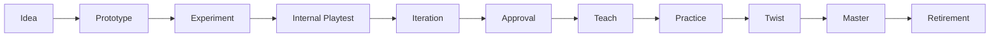

# Mechanic Lifecycle System

**Subsystem:** GDIL §2  
**Purpose:** Every gameplay mechanic follows a governed lifecycle before production implementation

---

## 1. Lifecycle Stages

| Stage | Owner | Purpose |
|-------|-------|---------|
| **Idea** | Gameplay Director | Capture intent, pillar fit |
| **Prototype** | Gameplay + Tech | Minimal playable proof |
| **Experiment** | Gameplay Director | Hypothesis-driven metric test |
| **Internal Playtest** | QA + GDIL | Human fun validation |
| **Iteration** | Gameplay Director | Tune from evidence |
| **Approval** | AI Design Director | GDIL authorization to teach in content |
| **Teach** | Level Design | Grammar TEACH nodes in levels |
| **Practice** | Level Design | Grammar PRACTICE nodes |
| **Twist** | Level Design | Grammar TWIST combinations |
| **Master** | Level Design | Grammar MASTER optional routes |
| **Retirement** | Creative Director | Deprecate or replace mechanic |

---

## 2. Exit Criteria by Stage

### Idea → Prototype

| Criterion | Evidence |
|-----------|----------|
| Pillar citation (P1–P5) | CRE brief |
| Mechanic Knowledge Base entry created | `MKB-{id}` draft |
| Interaction matrix rows identified | Matrix stub |
| Nintendo DNA rule mapping | ≥2 rules cited |
| No duplicate mechanic scope | MKB search clear |

### Prototype → Experiment

| Criterion | Evidence |
|-----------|----------|
| Playable in Research Lab or sandbox | Video or replay |
| Core interaction defined | Matrix row complete |
| Telemetry events specified | Event schema draft |
| Prototype completes without crash | Smoke log |

### Experiment → Internal Playtest

| Criterion | Evidence |
|-----------|----------|
| Hypothesis documented | `EXP-*` record |
| Success metrics defined | Fun driver KPIs |
| Experiment run complete | Metric export |
| Simulation pre-check passed | Design Simulation report |

### Internal Playtest → Iteration

| Criterion | Evidence |
|-----------|----------|
| n ≥ 3 internal playtesters | `PT-*` report |
| Survey: understand mechanic ≥70% | Survey data |
| Survey: enjoyable ≥5/10 | Survey data |
| No P0 fairness issues | QA notes |

### Iteration → Approval

| Criterion | Evidence |
|-----------|----------|
| Metric targets met or DEC waiver | Tuning history |
| Fun driver floors met | Fun Engine snapshot |
| Interaction edge cases resolved | Matrix validation |
| Playtest regression green | Before/after comparison |
| AI Design Director review | GDIL Approval token |

### Approval → Teach (Content Integration)

| Criterion | Evidence |
|-----------|----------|
| Tutorial strategy documented | MKB field complete |
| TEACH segment designed | Level grammar tag |
| TEACH: 0 deaths expected | Simulation + playtest |
| World identity alignment (if world-specific) | World Identity sheet |

### Teach → Practice

| Criterion | Evidence |
|-----------|----------|
| TEACH playtest passed | PT report |
| PRACTICE segment designed | Grammar tag |
| Jump success ≥85% in PRACTICE | Telemetry |

### Practice → Twist

| Criterion | Evidence |
|-----------|----------|
| PRACTICE metrics green | Aggregator export |
| TWIST combines ≥1 prior mechanic | Matrix interaction check |
| Flow index stable | <0.15/min in TWIST |

### Twist → Master

| Criterion | Evidence |
|-----------|----------|
| TWIST metrics green | Export |
| MASTER route optional | Level layout proof |
| Mastery uptake measurable | Telemetry hook |

### Master → Retirement

| Criterion | Evidence |
|-----------|----------|
| Mechanic superseded OR underused | Usage analytics |
| Retirement conditions met | MKB retirement section |
| DEC recorded | Deprecation decision |
| Content migrated or cut | Level audit |

**Skip rule:** Stages cannot be skipped. **Fast-track:** Idea→Prototype may merge for tuning-only changes with DEC waiver.

---

## 3. Governance

| Action | Authority |
|--------|-----------|
| Advance Idea → Prototype | Gameplay Director |
| Advance Experiment → Playtest | AI Design Director |
| Grant Approval | AI Design Director + Gameplay Director |
| Authorize Teach in level | GDIL Design Authorization Packet |
| Initiate Retirement | Creative Director + DEC |

## 4. Mechanic Registry

All mechanics indexed in `mechanics/MKB-INDEX.md` with current lifecycle stage.

**Seed mechanics (M1–M8 from Level Design Bible):**

| ID | Mechanic | Current Stage |
|----|----------|---------------|
| MKB-M1 | Basic jump | Prototype (needs Experiment) |
| MKB-M2 | Sprint | Idea |
| MKB-M3 | Double jump | Idea |
| MKB-M4 | Moving platforms | Idea |
| MKB-M5 | Wall jump | Idea |
| MKB-M6 | Ground pound | Idea |
| MKB-M7 | Enemy encounter | Idea |
| MKB-M8 | Boss pattern read | Idea |
