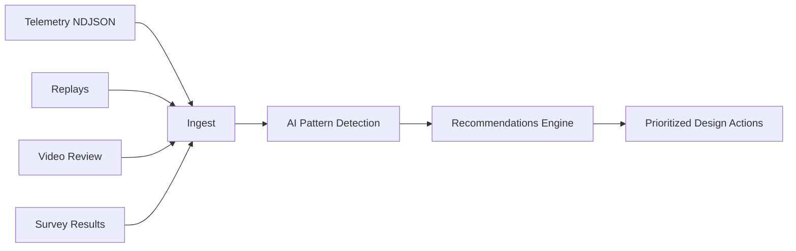

# Playtest Intelligence Platform

**Subsystem:** GDIL §8  
**Purpose:** Synthesize telemetry, replay, video, survey, and AI pattern detection into prioritized design recommendations

---

## 1. Data Integration



| Source | Provides |
|--------|----------|
| **Telemetry** | Objective KPIs, death positions, jump rates |
| **Replay** | Deterministic reproduction, ghost comparison |
| **Video review** | Readability, emotional moments, confusion points |
| **Survey** | Subjective fun, fairness, emotional states |
| **AI pattern detection** | Clusters, anomalies, correlation |

---

## 2. AI Pattern Detection

| Pattern | Detection Method | Output |
|---------|------------------|--------|
| Death cluster | Spatial clustering on heatmap | "Redesign segment X" P0 |
| Jump fail corridor | Repeated `missed_jump` along edge | Platform spacing issue P0 |
| Frustration spiral | Death → pause → death same spot | Recovery design P0 |
| Flow break | Flow index spike + pause | Camera or difficulty P1 |
| Secret miss | 0 discoveries + high proximity | Secret readability P1 |
| Boss unfair | `boss_hit_unfair` survey + telemetry | Telegraph fix P0 |
| Delight moment | Survey spike + reward event | Replicate pattern P2 (positive) |
| Competence rise | Positive competence slope | Document as pattern to preserve |

---

## 3. Recommendation Schema

```yaml
id: REC-2026-07-07-001
priority: P0 | P1 | P2
source: [telemetry, survey, video, ai_pattern]
fun_drivers_affected: [recovery, success]
emotional_states_affected: [frustration]
location: level/grassland_01/segment_03
recommendation: "Add RECOVER node after gap sequence; widen third platform 0.5m"
evidence:
  - death_cluster: {x: 12, z: 45, count: 8}
  - survey_unfair: 4/5 playtesters
confidence: 0.85
status: open | accepted | rejected | implemented
```

---

## 4. Prioritization Algorithm

```
priority_score = (severity × fun_driver_impact × player_reach) / implementation_cost

P0: score ≥ 0.7 OR safety/fairness issue
P1: score 0.4–0.7
P2: score < 0.4 or polish
```

| Factor | Weight |
|--------|--------|
| Severity (deaths, quits) | 0.35 |
| Fun driver impact | 0.30 |
| Player reach (% sessions affected) | 0.20 |
| Implementation cost (inverse) | 0.15 |

---

## 5. Playtest Session Protocol

| Step | Output |
|------|--------|
| 1. Pre-session | Hypothesis + target KPIs |
| 2. During | Telemetry + replay recording |
| 3. Post-survey | Emotional + fun instruments |
| 4. Video review | Timestamped confusion/delight notes |
| 5. AI synthesis | Recommendation list |
| 6. GDIL review | Accept/reject/defer per REC |
| 7. KOS ingest | `knowledge/playtests/` + `gdil/playtest/recommendations/` |

**Minimum sample:** n≥5 for feel gates; n≥3 for iteration cycles.

---

## 6. Dashboard Panel

| Widget | Content |
|--------|---------|
| Open recommendations | P0/P1/P2 counts |
| Recommendation velocity | Opened vs closed per week |
| Playtest Fun trend | Line chart |
| Pattern alerts | AI-detected clusters |
| Survey vs telemetry agreement | Correlation score |

**Alert:** P0 recommendation open >7 days → GDIL escalation to AI Design Director.

---

## 7. Integration

| Consumer | Use |
|----------|-----|
| AI Design Director | Backlog re-prioritization |
| Mechanic Lifecycle | Iteration → Approval evidence |
| Design Simulation | Calibrate prediction models |
| SOL CDR Gameplay | Feed weekly review |
| Fun Engine | Driver score updates |
