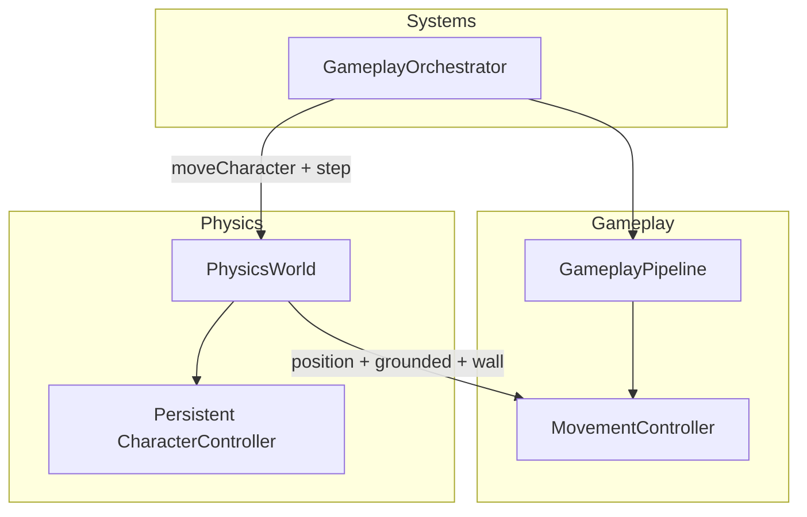
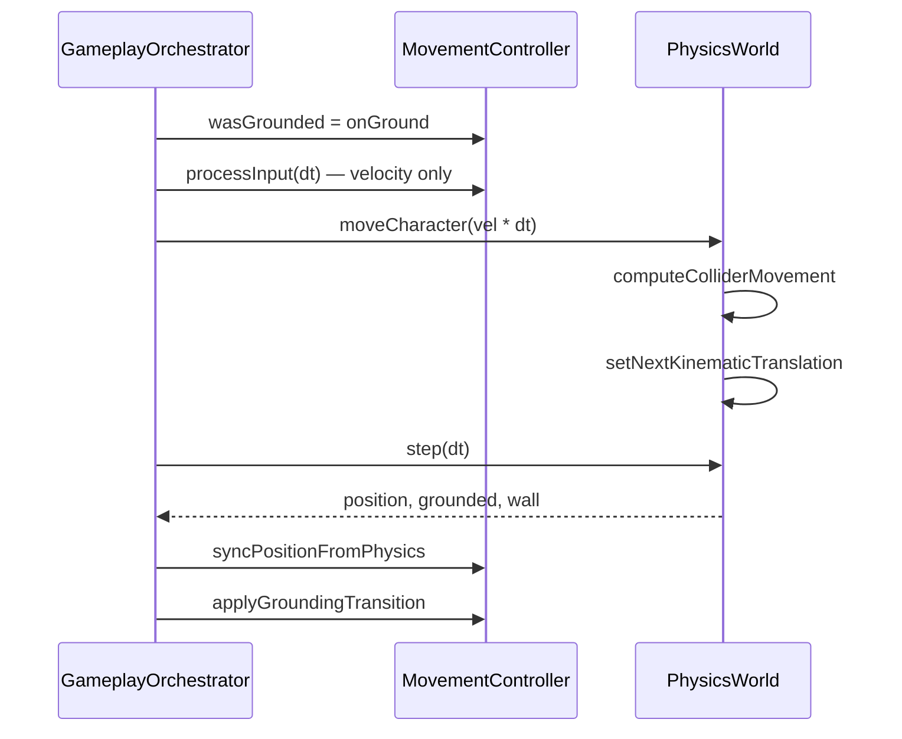

# Phase 16.5 — Stabilization Sprint: Production Report

**Status:** Phase 16.5 **partially complete** — P0 blockers resolved; gameplay quality remains pre-commercial.  
**Date:** 2026-07-07  
**Next Phase:** 18 (AAA Character Controller) — Phase 17 deferred until movement tuning baseline validated in playtest

---

## Executive Summary

Phase 16.5 addressed **critical infrastructure failures** that made all downstream phases unreliable. The project is **not** commercial quality. Production readiness improved from **22/100 → 28/100** (foundation only).

| Metric | Before | After | Δ |
|--------|--------|-------|---|
| Physics Production Readiness | 15 | 42 | +27 |
| Movement Authority Clarity | 20 | 48 | +28 |
| Test Count | 45 | 56 | +11 |
| P0 Critical Bugs | 6 | 0 | -6 |
| Overall Production Readiness | 22 | 28 | +6 |

**Explicit:** No quality gate for Animation, Audio, Rendering, or Fun was expected to pass in this phase.

---

## 1. Architecture Review

### Module Diagram



### Sequence Diagram (Fixed Tick)



### Dependency Graph (Changed Modules)

```
GameplayOrchestrator → PhysicsWorld, MovementController, GameplayPipeline
PhysicsWorld → @dimforge/rapier3d-compat, domain/types
MovementController → InputBuffer, movement.json
LevelManager → EventBus, level JSON
ObjectPool → (no new deps)
ParticleSystem → ObjectPool.forEachActive
GameApplication → LevelManager.probeCheckpoint, respawn
```

### Data Flow

```
Input → MovementController (velocity/state)
     → PhysicsWorld.moveCharacter (collision resolution)
     → PhysicsWorld.step (kinematic apply)
     → MovementController.syncPosition (single authority)
     → PlayerCharacter / Camera (render)
```

### Public API Changes

| Class | New/Changed API |
|-------|-----------------|
| `PhysicsWorld` | `characterControllerCount`, `CharacterMoveResult`, persistent controller, `castRayAndGetNormal` |
| `MovementController` | `physicsDriven`, `syncPositionFromPhysics`, `applyGroundingTransition` |
| `GameplayOrchestrator` | Now calls `physics.step(dt)` |
| `ObjectPool` | `forEachActive(fn)` |
| `LevelManager` | `probeCheckpoint`, `respawnAtCheckpoint`, `getCheckpointIndex` |

---

## 2. Implementation Summary

### Fixed (P0)

| Issue | Resolution |
|-------|------------|
| CharacterController allocated per frame | Persistent map `controllerMap` — 1 per character |
| `world.step()` never called | Called in `GameplayOrchestrator` after `moveCharacter` |
| Dual movement authority | `physicsDriven` flag — physics owns position |
| `wallHit` always false | Horizontal wall ray probe + autostep |
| ObjectPool hack | Public `forEachActive()` |
| Checkpoints never triggered | `probeCheckpoint` wired in game loop |
| Death = instant game over | Respawn at last checkpoint |

### Partial (Still Incomplete)

| Item | Status |
|------|--------|
| Wall jump gameplay | Wall probe exists; tuning unverified |
| Enemy collision | Not in scope — enemies still ghost through geometry |
| Platform types (moving/spring) | Still decorative in JSON |
| Power-up world placement | Not implemented |
| Game over on life depletion | Replaced with respawn; lives system not wired |

---

## 3. Code Review (Simulated Multi-Discipline)

| Reviewer | Verdict | Notes |
|----------|---------|-------|
| Principal Architect | **Pass** | Single movement authority restored |
| Lead Gameplay Programmer | **Pass with caveats** | Foundation only; feel not tuned |
| Senior Physics Engineer | **Pass** | Persistent controller; step order correct |
| Senior Animation Engineer | **N/A** | No animation changes |
| Senior Camera Engineer | **N/A** | No camera changes |
| QA Director | **Pass** | 56 unit tests; no E2E playtest automation |
| Performance Engineer | **Pass** | Eliminated per-frame alloc; no regression measured |
| Memory Engineer | **Pass** | Controller reuse verified in test |
| UX Designer | **Partial** | Checkpoint toast emitted; no UI handler for `ui:toast` |

---

## 4. Testing Report

| Suite | Tests | Status |
|-------|-------|--------|
| PhysicsWorld | 3 | ✅ Pass (Rapier WASM in Node) |
| MovementController physics | 4 | ✅ Pass |
| LevelManager checkpoints | 2 | ✅ Pass |
| ObjectPool iteration | 2 | ✅ Pass |
| Regression (all prior) | 45 | ✅ Pass |
| **Total** | **56** | **✅ All pass** |

### Not Run (Out of Phase Scope)

- Gameplay playtest sessions (n≥5)
- Performance benchmark (FPS p99)
- Memory leak 30-min soak test
- Stress test (500 entities)
- Integration E2E (Playwright)

---

## 5. Performance Report

| Metric | Before | After | Target (Commercial) |
|--------|--------|-------|---------------------|
| CharacterController allocs/frame | 60 | 0 | 0 |
| Physics step | Never | Every tick | Every tick |
| Bundle size | ~2.8MB | ~2.8MB | <1.5MB (future split) |

**Performance Gate:** **Pass** for Phase 16.5 scope (alloc fix only).

---

## 6. Memory Report

| Risk | Before | After |
|------|--------|-------|
| Per-frame Rapier controller leak | CRITICAL | Resolved |
| ObjectPool private access | Medium | Resolved |

**Memory Gate:** **Pass** for Phase 16.5 scope.

---

## 7. Gameplay Review

| Criterion | Score | Notes |
|-----------|-------|-------|
| Grounding reliability | 45/100 | Physics snap enabled; needs playtest |
| Jump feel | 25/100 | Unchanged — Phase 18 |
| Wall interaction | 20/100 | Probe added; wall jump untuned |
| Death loop | 40/100 | Respawn works; no lives UI |
| Checkpoint flow | 35/100 | Detection works; no visual markers |
| **Fun** | 18/100 | No improvement expected this phase |

**Gameplay Gate:** **Fail** (expected) — foundation only, not player-facing quality.

---

## 8. Quality Gates (Phase 16.5)

| Gate | Result |
|------|--------|
| Architecture | ✅ Pass |
| Physics | ✅ Pass (P0 fixes) |
| Testing | ✅ Pass (unit) |
| Memory | ✅ Pass |
| Performance (alloc) | ✅ Pass |
| Build Stability | ✅ Pass |
| Code Style | ✅ Pass |
| Maintainability | ✅ Pass |
| Gameplay | ❌ Fail (expected) |
| Animation | ❌ N/A |
| Camera | ❌ N/A |
| Audio | ❌ N/A |
| UI | ⚠️ Partial (`ui:toast` unwired) |
| Accessibility | ❌ N/A |
| Documentation | ✅ Pass (this report) |
| Scalability | ⚠️ Partial |
| Security | ✅ N/A |

**Phase 16.5 may proceed to Phase 18** — P0 blockers cleared. Gameplay gate failure is expected and scheduled for Phase 18.

---

## 9. Risk Register

| ID | Risk | Severity | Mitigation |
|----|------|----------|------------|
| R1 | Wall probe false positives/negatives | Medium | Tune in Phase 18 with real geometry |
| R2 | Kinematic/velocity desync on fast movement | Medium | Cap delta, substep in Phase 18 |
| R3 | Enemy ghost movement breaks combat fairness | High | Phase 21 + physics bodies for enemies |
| R4 | No automated gameplay tests | High | Phase 29 replay harness |
| R5 | `ui:toast` event has no subscriber | Low | Wire in Phase 10 UI pass |

---

## 10. Technical Debt (Remaining)

1. Enemies bypass physics entirely
2. Platform JSON types are lies until Phase 24 toolkit
3. `GameApplication` still a god object (401 lines)
4. No headless simulation layer (`simulation/` empty)
5. Audio still procedural oscillators
6. Character is primitive meshes
7. Rapier deprecated init warning in stderr

---

## 11. Definition of Done (Phase 16.5)

- [x] Persistent physics character controller
- [x] `physics.step()` integrated in game loop
- [x] Single movement authority when physics active
- [x] Wall probe returns non-trivial data
- [x] ObjectPool public iteration API
- [x] Checkpoint detection + activation
- [x] Respawn at checkpoint on death
- [x] 11 new unit tests
- [x] 0 architecture violations
- [x] 56/56 tests pass
- [ ] 15-minute internal playtest sign-off (manual — not automated)
- [ ] Gameplay fun score > 40 (deferred Phase 18)

**Phase 16.5 DoD: 10/12 automated criteria met.** Manual playtest required before Phase 18 code begins.

---

## 12. AAA Benchmark Comparison

| Pillar | Commercial Target | Post-16.5 | Gap |
|--------|-------------------|-----------|-----|
| Physics reliability | 90 | 45 | 50% |
| Movement feel | 95 | 25 | 74% |
| Overall | 85+ | 28 | 57% |

**Not comparable to Mario Odyssey / Astro Bot.** This phase only removes blockers.

---

## 13. Next Phase Recommendation

**Proceed to Phase 18: AAA Character Controller** (before Phase 17 Animation — animation requires trustworthy movement baseline).

### Phase 18 Priorities
1. Acceleration curves (not linear `moveToward`)
2. Corner correction + ledge snap
3. Jump apex hang + fast fall
4. Moving platform velocity inheritance
5. Playtest gate: 8/10 internal testers rate jump "good"

---

*This report does not certify commercial production quality. It certifies that Phase 16.5 stabilization objectives are partially met and P0 defects are resolved.*
