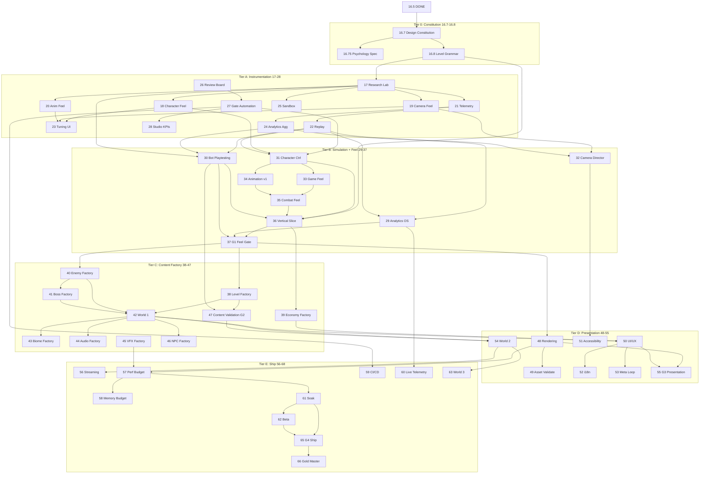

# AAA Production Operating System (POS)

**Document:** Executive Production Board — Second Independent Review  
**Version:** 3.0  
**Governing Layer:** [Studio Operating Layer v1.0](../studio/STUDIO-OPERATING-LAYER.md) — **all implementation requires SOL Work Authorization**  
**Supersedes:** `ROADMAP-GAMEPLAY-FIRST.md` v2.0 (extends, does not replace Tier A intent)  
**Current State:** 28/100 production readiness · Strong engineering prototype  
**Status:** Work catalog subordinate to SOL — **no gameplay code authorized without WAP**

---

## Board Verdict on v2.0 Roadmap

| Dimension | v2.0 Score | Gap |
|-----------|------------|-----|
| Engineering iteration | 82/100 | Strong |
| Game design constitution | 12/100 | **Critical gap** |
| Player psychology instrumentation | 8/100 | **Critical gap** |
| Analytics depth | 35/100 | Shallow KPIs |
| Automated playtesting | 5/100 | Absent |
| Level design grammar | 0/100 | Absent |
| Content factory | 15/100 | Ad-hoc JSON only |
| Asset validation | 5/100 | Absent |
| Studio production KPIs | 25/100 | Partial (tests/arch only) |
| Review board governance | 40/100 | Phase 26 template only |

**Conclusion:** v2.0 correctly inverted engine-first priorities but remains an **engineering operating system**, not a **commercial production operating system**. v3.0 adds design constitution, psychology metrics, simulation at scale, content factory, asset gates, and executive review cadence.

> **SOL v1.0 (2026-07-07):** POS is now subordinate to the [Studio Operating Layer](../studio/STUDIO-OPERATING-LAYER.md). Phases are work orders; SOL governs authorization, learning, and continuous improvement via the Autonomous Improvement Loop.

---

# PART I — GAME DESIGN CONSTITUTION

*Binding creative law. Every phase must cite which pillar it serves.*

## 1.1 Gameplay Pillars (Ranked)

| Priority | Pillar | Definition | Anti-Pattern |
|----------|--------|------------|--------------|
| P1 | **Expressive Movement** | Every jump, turn, and landing communicates character intent | Floaty, uniform, input-laggy motion |
| P2 | **Readable Space** | Player always knows where they are, where they can go, what is dangerous | Camera occlusion, visual noise, unfair hits |
| P3 | **Joyful Discovery** | Secrets reward curiosity, never punish exploration | Mandatory backtracking without payoff |
| P4 | **Fair Challenge** | Death teaches; retry is fast; difficulty is legible | RNG deaths, unclear hazards, long death loops |
| P5 | **Collectible Delight** | Pickups feel rewarding at micro and macro scale | Grindy, low-feedback collection |

## 1.2 Core Loop (Session — 5–20 min)

```
Explore → Challenge → Recover → Reward → Express (movement mastery) → Explore
```

| Stage | Player Goal | Studio Obligation | Metric |
|-------|-------------|-------------------|--------|
| Explore | Find next interesting space | Readable routing, soft gates | Exploration Index |
| Challenge | Overcome obstacle | Teach-before-test grammar | Jump Success Rate |
| Recover | Return to flow after fail | Fast respawn, checkpoint fairness | Recovery Rate |
| Reward | Feel progress | Coins, stars, vistas, shortcuts | Reward Density |
| Express | Show skill | Optional routes, style jumps | Mastery Variance |

## 1.3 Secondary Loop (World — 1–3 hr)

```
Complete levels → Earn stars/coins → Unlock zones/abilities → Re-enter with new lens → Find secrets
```

**Gate:** Secondary loop is **disabled in production** until Core Loop Fun ≥60/100 (Milestone M3).

## 1.4 Meta Progression

| Layer | System | Introduce After |
|-------|--------|-----------------|
| Micro | Coins, combo multipliers | Vertical Slice (M3) |
| Meso | Star gates, costume unlocks | World 1 complete (M5) |
| Macro | World map, hub, NG+ hooks | World 2 (M6) |

**Philosophy:** Meta must **amplify** mastery, not substitute for fun moment-to-moment.

## 1.5 Reward Philosophy

- **Immediate:** VFX + audio + camera micro-reward within 100ms of pickup
- **Short-term:** Checkpoint + coin tally + visible path progress
- **Medium-term:** Star collection opens optional hard routes (not mandatory grind)
- **Long-term:** Cosmetics and mastery badges — never pay-to-win

**Measurable:** Reward Density Index (rewards per minute, target band per level type).

## 1.6 Failure Philosophy

| Principle | Implementation Requirement |
|-----------|---------------------------|
| Death is data | Every death tagged with cause + location + player state |
| Death is fast | Respawn ≤2s to flow (≤1s after M3 polish) |
| Death is fair | No deaths without 0.5s telegraph (enemies) or visible hazard (environment) |
| Death is instructive | Retry places player in teachable context, not punishment loop |
| Soft failure | Fall-off → respawn at last stable platform when possible |

**Measurable:** Frustration Index, Deaths-per-Checkpoint, Time-to-Recovery.

## 1.7 Exploration Philosophy

- **Curiosity hooks:** Distant vistas, audio cues, NPC hints, visible-but-gated paths
- **Secret taxonomy:** Obvious (70%), Attentive (25%), Expert (5%) — per level
- **No dead ends** without a joke, coin, or lore crumb
- **Return path** always shorter than discovery path (shortcut unlock)

**Measurable:** Exploration Index, Secret Discovery Rate, Backtrack Ratio.

## 1.8 Accessibility Philosophy

| Category | Requirement | Phase |
|----------|-------------|-------|
| Input | Remappable controls, toggle hold/tap | M7 |
| Visual | Colorblind palettes, contrast modes | M8 |
| Motion | Camera shake reduction, motion sickness mode | M3 (camera lab) |
| Cognitive | Optional quest markers, hint cadence | M6 |
| Difficulty | Assist mode: extra coyote, damage reduction | M7 |

**Gate:** No commercial milestone without Accessibility Review Board sign-off (M8+).

---

# PART II — PLAYER PSYCHOLOGY INSTRUMENTATION

*Every psychological driver must map to telemetry + metric + target band.*

| Driver | Player Feeling | Telemetry Events | Derived Metric | Target (Vertical Slice) |
|--------|----------------|------------------|----------------|-------------------------|
| **Curiosity** | "What's over there?" | `path_deviation`, `vista_dwell`, `secret_proximity` | Exploration Index | 0.35–0.55 |
| **Discovery** | "I found something!" | `secret_found`, `shortcut_unlocked`, `hidden_room_enter` | Secret Discovery Rate | ≥40% obvious secrets |
| **Competence** | "I'm getting better" | `jump_success`, `death_decline_over_time`, `combo_chain` | Competence Slope | Positive over 3 sessions |
| **Mastery** | "I can style on this" | `optional_route_taken`, `air_time`, `no_damage_streak` | Mastery Variance | Optional routes ≥15% uptake |
| **Flow** | "I'm in the zone" | `death`, `pause`, `menu_open`, `camera_intervention` | Flow Interruption Index | <0.15/min |
| **Challenge** | "That was hard but fair" | `death_cause`, `retry_count`, `time_on_obstacle` | Platform Difficulty Score | 0.4–0.7 per segment |
| **Recovery** | "I'm back quickly" | `death_to_move`, `respawn`, `checkpoint_activate` | Recovery Rate | ≥90% respawn <2s |
| **Surprise** | "I didn't expect that!" | `scripted_beat`, `enemy_intro`, `setpiece_trigger` | Surprise Events / session | 2–4 scripted beats / 15 min |
| **Reward pacing** | "Good timing on rewards" | `coin`, `star`, `powerup`, time since last | Reward Density | 8–15 micro-rewards/min |
| **Retention** | "I want to come back" | `session_end_reason`, `return_within_24h` (local) | Session Duration | ≥12 min median |

**New Phase Required:** **Phase 16.75 — Psychology Metrics Spec** (document + schema only, 3 days).

---

# PART III — ANALYTICS FRAMEWORK (Expanded)

*v2.0 Phase 24 is insufficient alone. Replace with Analytics OS spanning Phases 21 → 24 → 29.*

## 3.1 Metric Catalog

### Movement Quality
| Metric | Formula / Source | Decision Use |
|--------|------------------|--------------|
| Jump Success Rate | successful_landings / jump_attempts | Tune jump height, coyote |
| Missed Jump Rate | failed_gap_jumps / gap_jump_attempts | Platform spacing grammar |
| Air Control Utilization | midair_corrections / jumps | Air control tuning |
| Landing Impact Variance | std(land_velocity) | Feel consistency |

### Failure & Recovery
| Metric | Source | Decision Use |
|--------|--------|--------------|
| Retry Rate | retries / deaths | Checkpoint placement |
| Recovery Rate | resume_within_2s / deaths | Respawn pipeline |
| Frustration Index | weighted(deaths/min, pause/min, same_spot_deaths) | Level block redesign |
| Deaths per Checkpoint | deaths between checkpoints | Difficulty curve |

### Flow & Camera
| Metric | Source | Decision Use |
|--------|--------|--------------|
| Flow Interruption Index | (deaths + pauses + cam_interventions) / min | Polish priority |
| Camera Intervention Rate | cam_collision / traverse_time | Camera profile |
| Occlusion Time % | player_occluded / session | Camera Director |

### Exploration & Rewards
| Metric | Source | Decision Use |
|--------|--------|--------------|
| Exploration Index | unique_tiles / total_traversable | Level openness |
| Secret Discovery Rate | secrets_found / secrets_total | Secret placement |
| Reward Density | rewards / minute | Pacing |
| Backtrack Ratio | backtrack_distance / forward_distance | Layout efficiency |

### Session & Onboarding
| Metric | Source | Decision Use |
|--------|--------|--------------|
| Time-to-First-Fun | time_to_first_flow_state | Tutorial trim |
| Session Duration | session length | Engagement |
| Completion Heatmap | death/complete position grid | Block redesign |
| Platform Difficulty Score | deaths per platform segment / attempts | Grammar validation |

## 3.2 Analytics Architecture

```
telemetry/          → raw events (Phase 21)
analytics/
├── ingest/         → NDJSON pipeline
├── aggregators/    → per-metric calculators (Phase 24)
├── psychology/     → driver indices (Phase 16.75 + 29)
├── reports/        → human-readable + CI artifacts
└── dashboards/     → dev + Review Board views (Phase 29)
```

**New Phase:** **Phase 29 — Analytics OS & Review Dashboards** (depends 24, 30-bot).

---

# PART IV — AUTOMATED PLAYTESTING

*v2.0 has replay (human inputs). Commercial studios require **simulation at scale**.*

## 4.1 Framework Design

| Component | Purpose |
|-----------|---------|
| `BotController` | Policy-driven input (greedy, random, skill-tier) |
| `SimulationRunner` | Headless N runs with seed matrix |
| `DifficultyValidator` | Compare completion/death vs target bands |
| `RegressionDetector` | Diff metrics vs golden baseline |
| `HeatmapGenerator` | Aggregate bot deaths across runs |
| `BalanceReport` | CI artifact per level JSON |

## 4.2 Simulation Modes

| Mode | Runs | Use |
|------|------|-----|
| Smoke | 10 | PR gate, <30s |
| Regression | 500 | Nightly, golden levels |
| Balance | 5,000 | Weekly, difficulty tuning |
| Exhaustive | 50,000 | Pre-milestone, grammar validation |

## 4.3 Bot Skill Tiers

| Tier | Behavior | Validates |
|------|----------|-----------|
| T0 Random | Input noise | Soft-lock detection |
| T1 Greedy | Move toward goal beacon | Basic completability |
| T2 Platformer | Jump buffers, coyote usage | Movement fairness |
| T3 Human replay | Golden replays | Feel regression |

**New Phase:** **Phase 30 — Automated Playtesting & Simulation Farm**  
**Depends:** 17, 21, 22, 24  
**Blocks:** 32 (vertical slice), 33 (level toolkit), 50 (content validation)

### Phase 30 Spec

| Field | Value |
|-------|-------|
| **Purpose** | Thousands of deterministic runs for balance/regression |
| **Deliverables** | BotController, SimulationRunner, CI balance report, heatmap export |
| **Risks** | Bots don't model human fun (High) — always pair with human playtest |
| **Acceptance** | 500-run nightly on Jump Lab + Slice; regression alert on >5% metric drift |
| **KPIs** | 500 runs/night, <10 min CI, 0 false-green on known-hard segment |
| **PR Impact** | +6 (process), enables content scale |

---

# PART V — LEVEL DESIGN GRAMMAR

*Formal curriculum for every mechanic. No level ships without grammar tag.*

## 5.1 Grammar Nodes

| Node | Purpose | Duration (typical) | Metric Gate |
|------|---------|-------------------|-------------|
| **TEACH** | Introduce mechanic in safe context | 30–90s | 0 deaths expected |
| **PRACTICE** | Repeat with low risk | 1–3 min | Jump success ≥85% |
| **TWIST** | Combine with prior mechanic | 1–2 min | Flow index stable |
| **MASTER** | High skill expression, optional | 30–60s | Mastery uptake ≥10% |
| **EXAM** | Skill check, fail-forward | 30–90s | Deaths ≤2 avg |
| **REWARD** | Payoff vista, coins, shortcut | 15–30s | Reward density spike |
| **RECOVER** | Breathing room after exam/boss | 30–60s | Frustration index drops |

## 5.2 Mechanic Curriculum (Ship Order)

| # | Mechanic | Teach→Master World | Grammar Complete By |
|---|----------|-------------------|---------------------|
| M1 | Basic jump | World 0 (labs) | M2 milestone |
| M2 | Sprint + momentum | Slice | M3 |
| M3 | Double jump | Slice | M3 |
| M4 | Moving platforms | World 1 L1–L2 | M5 |
| M5 | Wall jump | World 1 L3–L4 | M5 |
| M6 | Ground pound | World 1 L5 | M5 |
| M7 | Enemy encounter | World 1 | M5 |
| M8 | Boss pattern read | World 1 finale | M5 |

## 5.3 Level JSON Schema Extension

```typescript
interface LevelSegment {
  id: string;
  grammar: 'teach' | 'practice' | 'twist' | 'master' | 'exam' | 'reward' | 'recover';
  mechanics: MechanicId[];
  difficultyTarget: number; // 0–1
  metricsBudget: { maxDeaths: number; minJumpSuccess: number };
}
```

**New Phase:** **Phase 16.8 — Level Design Grammar & Curriculum** (spec + schema, 1 week)  
**Depends:** Game Design Constitution (16.7)  
**Blocks:** 32, 33, 37, 50

---

# PART VI — CONTENT PRODUCTION FACTORY

*Industrialized pipelines — not artisanal JSON editing.*

## 6.1 Factory Overview

```
content-factory/
├── templates/           # Per-asset-type scaffolds
├── validators/          # Automated lint (ties to Phase 50)
├── generators/          # Procedural assist (props, coin trails)
├── exporters/           # Game-ready bundles
└── review/              # Review Board submission packets
```

## 6.2 Pipelines by Asset Type

| Asset | Template | Validation Rules | Automation | Phase |
|-------|----------|------------------|------------|-------|
| **Biomes** | `biome.template.json` | fog, palette, audio bed, perf budget | Palette lint | 40 |
| **Levels** | `level.template.json` | grammar coverage, soft-lock, star count | Bot T1 completability | 33, 50 |
| **Platforms** | `platform.template.json` | spacing vs jump metrics, type semantics | Jump reach sim | 33 |
| **Enemies** | `enemy.template.json` | telegraph time, DPS cap, readability | BT smoke test | 38 |
| **Bosses** | `boss.template.json` | phase count, i-frame rules, arena bounds | T2 survival sim | 39 |
| **Collectibles** | `collectible.template.json` | magnet compat, reward density | Density heatmap | 36 |
| **NPCs** | `npc.template.json` | line count, interaction radius | Dialogue lint | 45 |
| **Props** | `prop.template.json` | poly budget, LOD, static collider | Asset validator | 41 |
| **Audio** | `audio.template.json` | loudness, loop points, sample rate | LUFS lint | 44 |
| **VFX** | `vfx.template.json` | particle cap, duration, GPU cost | Perf snapshot | 43 |
| **Secrets** | `secret.template.json` | taxonomy tier, backtrack cost | Exploration sim | 37 |

## 6.3 New Phases (Content Factory)

| Phase | Name | Deliverables | PR Δ |
|-------|------|--------------|------|
| **33** | Level Factory v1 | Templates, grammar linter, bot validation hook | +5 |
| **36** | Collectible & Economy Factory | Density tools, shop schema | +4 |
| **37** | World 1 Production (5 levels) | Grammar-validated content | +10 player-facing |
| **38** | Enemy Factory | Telegraph validator, spawn templates | +5 |
| **39** | Boss Factory | Phase timeline editor, arena schema | +5 |
| **40** | Biome & Environment Factory | Biome templates, prop scatter rules | +4 |
| **41** | Prop & Set Dressing Factory | Instancing rules, prop LOD | +3 |

---

# PART VII — ASSET VALIDATION PIPELINE

**New Phase:** **Phase 42 — Asset Validation Pipeline**

| Check | Rule | Fail Action |
|-------|------|-------------|
| Naming | `/{type}/{biome}/{asset}_LOD{n}.glb` | Block import |
| LODs | ≥2 LODs for meshes >500 tris | Warn / block |
| Collision | Convex hull ≤ budget, matches visual | Block |
| UVs | 0–1 range, no overlaps (hero assets) | Warn |
| Textures | POT, ≤2048 hero, ≤1024 prop | Block |
| Poly budget | Hero ≤15k, prop ≤500, env chunk ≤50k | Block |
| Materials | PBR slots named, ≤4 per mesh | Warn |
| Memory | Per-chunk ≤ budget MB | Block |
| Animation | Skeleton bind, clip naming | Block |
| References | No missing deps in manifest | Block |

**Depends:** 41, 48 (CI)  
**CI Job:** `asset-validate` on every asset PR  
**PR Impact:** +5 process, prevents art debt

---

# PART VIII — STUDIO PRODUCTION KPIs

*Distinct from player-facing gameplay metrics.*

| KPI | Target | Source | Review Cadence |
|-----|--------|--------|----------------|
| Development velocity | Phases gated/week | Jira-equivalent / phase reports | Weekly |
| Build stability | ≥95% green builds | CI | Daily |
| Test pass rate | ≥98% unit + replay | CI | Per PR |
| Regression rate | <2% merges cause metric drift | Phase 30 bot | Nightly |
| Technical debt score | Tracked items ↓ or bounded | Debt register | Sprint |
| Documentation coverage | 100% phases have DoD doc | Doc lint | Per phase |
| Performance budget adherence | p95 frame ≤16.6ms | Perf CI | Nightly |
| Memory budget adherence | Heap ≤ target MB | Memory CI | Weekly |
| Crash rate | 0 in 1hr soak | Soak test | Weekly |
| Iteration time (tuning) | <2 min/param | Dashboard telemetry | Monthly |
| Time-to-first-fun (build) | <3 min new dev onboarding | RUNBOOK timer | Quarterly |

**New Phase:** **Phase 28 — Studio KPI Dashboard** (engineering metrics, depends 26, 48)

---

# PART IX — REVIEW BOARD (Executive Gates)

*v2.0 Phase 26 is a template. v3.0 mandates a **Review Board** with veto authority.*

## 9.1 Board Composition

| Role | Veto Domain | Required At |
|------|-------------|-------------|
| **Creative Director** | Pillars, tone, reward philosophy | M2, M3, M5, M9 |
| **Gameplay Director** | Feel, grammar, difficulty | Every milestone |
| **Technical Director** | Architecture, perf, memory | Every phase gate |
| **Art Director** | Readability, style, asset budget | M4, M6, M8 |
| **Audio Director** | Mix, feedback timing, adaptive music | M6, M8 |
| **UX Lead** | Onboarding, HUD, accessibility | M3, M7, M8 |
| **QA Lead** | Soak, regression, ship criteria | M3, M7, M9 |

## 9.2 Gate Types

| Gate | When | Auto Checks | Human Sign-off |
|------|------|-------------|----------------|
| **G0 Phase** | Every phase complete | arch, test, replay, docs | Technical Director |
| **G1 Feel** | M2, M3 | jump success, recovery, flow index | Gameplay + Creative |
| **G2 Content** | Per world | bot completability, grammar lint | Gameplay + QA |
| **G3 Presentation** | M6, M8 | perf, memory, asset validate | Art + Audio + UX |
| **G4 Ship** | M9 | full checklist | **Full board** |

## 9.3 Evidence Packet (Required)

Every gate submission includes:
1. Phase report (20-section template)
2. Metrics dashboard snapshot
3. Bot regression diff
4. Playtest survey (n≥5 for feel gates)
5. Risk register update
6. Debt register update

**Enhanced Phase 26 → Phase 27-OS — Review Board & Gate Automation** (renumbered in master list below).

---

# PART X — REBUILT MASTER ROADMAP (v3.0)

*Phases renumbered for clarity. **~68 phases** — optimized for commercial quality, not brevity.*

## Tier 0: Design Constitution (16.7–16.8) — **IMMEDIATE**

| Phase | Name | Purpose | Deps | PR Δ | Duration |
|-------|------|---------|------|------|----------|
| **16.7** | Game Design Constitution | Pillars, loops, failure/reward/exploration/a11y philosophy | 16.5 | +3 | 3 days |
| **16.75** | Psychology Metrics Spec | Map drivers → telemetry → targets | 16.7 | +2 | 3 days |
| **16.8** | Level Design Grammar | Teach/Practice/Twist/Master/Exam/Reward/Recover + curriculum | 16.7 | +3 | 1 week |

## Tier A: Instrumentation & Feel Labs (17–28)

| Phase | Name | Purpose | Deps | PR Δ |
|-------|------|---------|------|------|
| 17 | Gameplay Research Lab | Deterministic sandboxes | 16.5 | +8 |
| 18 | Character Feel Lab | Live movement tuning | 17 | +12 |
| 19 | Camera Feel Lab | Profiles + comfort metrics | 17 | +6 |
| 20 | Animation Feel Lab | Procedural timing targets | 17, 18 | +4 |
| 21 | Gameplay Telemetry | Event schema + capture | 17 | +5 |
| 22 | Replay Framework | Golden replays + ghost | 17, 21 | +6 |
| 23 | Live Tuning Dashboard | Designer iteration UI | 18–20 | +4 |
| 24 | Analytics Aggregators | Metric catalog Part III | 21, 22 | +5 |
| 25 | Developer Sandbox | Spawn/debug overlays | 17 | +3 |
| **26** | **Review Board Charter** | G0–G4 gates, roles, evidence packets | 24 | +3 |
| **27** | **Gate Automation v1** | CI phase-gate + report generator | 26, 22 | +4 |
| **28** | **Studio KPI Dashboard** | Build/test/debt/velocity metrics | 27 | +3 |

**Tier A exit:** Process readiness ~88/100 · Player-facing ~42/100

## Tier B: Simulation & Core Feel Ship (29–37)

| Phase | Name | Purpose | Deps | PR Δ |
|-------|------|---------|------|------|
| **29** | **Analytics OS & Dashboards** | Psychology indices + Review Board views | 24, 26 | +5 |
| **30** | **Automated Playtesting Farm** | 500–50k bot runs, heatmaps, balance CI | 17, 21, 22, 24 | +6 |
| 31 | AAA Character Controller | Ship validated presets | 18, 22, 27 | +10 |
| 32 | Camera Director | Ship validated profiles | 19, 22, 27 | +8 |
| 33 | Game Feel Profiles | Data-driven juice | 20, 21, 31 | +5 |
| 34 | Animation Framework v1 | Skeletal + timing from lab | 20, 31 | +6 |
| 35 | Combat Feel Pass | Telegraphs, hit-stop, i-frames | 31, 33 | +4 |
| **36** | **Grammar-Valid Vertical Slice** | 15-min slice, all grammar nodes | 16.8, 31–35, 30 | +12 |
| **37** | **Slice Validation Gate (G1 Feel)** | Human + bot + board sign-off | 36, 29, 30 | +2 |

**Tier B exit (M3):** Player-facing ~58/100 · Fun ≥60 · Jump ≥7/10

## Tier C: Content Factory (38–47)

| Phase | Name | Purpose | Deps | PR Δ |
|-------|------|---------|------|------|
| 38 | Level Factory v1 | Templates + grammar linter + bot hook | 36, 30, 16.8 | +5 |
| 39 | Collectible & Economy Factory | Reward density tooling | 36 | +4 |
| 40 | Enemy Factory | Telegraph + spawn templates | 35, 30 | +5 |
| 41 | Boss Factory | Phase timelines + arenas | 40, 35 | +5 |
| 42 | World 1 Production (5 levels) | Grammar-complete world | 38, 40, 41 | +12 |
| 43 | Biome & Environment Factory | Biome templates, scatter | 38 | +4 |
| 44 | Audio Factory | Adaptive stems, footstep matrix | 31, 33 | +6 |
| 45 | VFX Factory | GPU particles, budget caps | 33, 43 | +5 |
| 46 | NPC & Dialogue Factory | Quest templates | 42, 39 | +4 |
| **47** | **Content Validation Pipeline (G2)** | Lint all content types | 38–46, 30 | +5 |

## Tier D: Presentation & Accessibility (48–55)

| Phase | Name | Purpose | Deps | PR Δ |
|-------|------|---------|------|------|
| 48 | Stylized Rendering Upgrade | PBR/toon, readability | 36 | +6 |
| 49 | Asset Validation Pipeline | Part VII automated checks | 48, 27 | +5 |
| 50 | UI/UX Pass | HUD, onboarding, menus | 39, 42 | +6 |
| 51 | Accessibility Implementation | Part 1.8 requirements | 32, 50 | +5 |
| 52 | Localization Pipeline | String externalization | 50 | +3 |
| 53 | Progression & Meta Loop | Secondary loop enablement | 42, 39 | +5 |
| 54 | Second World Production | 5 levels + hub | 42, 47 | +10 |
| **55** | **Presentation Gate (G3)** | Art + audio + UX board | 48–54 | +2 |

## Tier E: Scale, Ship & Live (56–68)

| Phase | Name | Purpose | Deps | PR Δ |
|-------|------|---------|------|------|
| 56 | World Streaming | Chunk load/unload | 54 | +5 |
| 57 | Performance Budget OS | Frame/GPU/draw call CI | 45, 48 | +5 |
| 58 | Memory Budget OS | Heap/asset budgets | 57 | +4 |
| 59 | CI/CD & Build Factory | Multi-target builds | 27 | +4 |
| 60 | Production Telemetry | Opt-in anonymized live metrics | 29 | +3 |
| 61 | Crash & Soak Pipeline | 1hr+ automated soak | 57, 58 | +4 |
| 62 | Beta Infrastructure | Feedback, flags, hotfix path | 59, 60 | +4 |
| 63 | Third World + Polish Pass | Content + feel refinement | 54, 47 | +8 |
| 64 | Certification Prep | Platform reqs, legal | 61, 62 | +3 |
| **65** | **Ship Gate (G4)** | Full Review Board | All | +2 |
| 66 | Gold Master | RC build | 65 | +3 |
| 67 | Launch Monitoring | KPI dashboards live | 60, 62 | +2 |
| 68 | Post-Launch Iteration Framework | Balance patches, seasonal | 67 | +2 |

**Commercial target (M9 / Phase 65):** Player-facing ~85/100 · Process ~95/100

---

# PART XI — DEPENDENCY GRAPH (v3.0)



---

# PART XII — CRITICAL PATH ANALYSIS

**Longest dependency chain to commercial ship (G4):**

```
16.5 → 16.7 → 16.8 → 17 → 18 → 21 → 22 → 24 → 27 → 30 → 31 → 36 → 37 (G1)
→ 38 → 40 → 42 → 47 (G2) → 50 → 51 → 55 (G3) → 57 → 61 → 65 (G4)
```

| Segment | Phases | Calendar (est.) | Cumulative |
|---------|--------|-----------------|------------|
| Constitution + Labs | 16.7–25 | 10 weeks | 10 wk |
| Board + Analytics + Bots | 26–30 | 6 weeks | 16 wk |
| Core Feel + Slice | 31–37 | 10 weeks | 26 wk |
| World 1 Factory | 38–47 | 14 weeks | 40 wk |
| Presentation + A11y | 48–55 | 12 weeks | 52 wk |
| Scale + Ship | 56–66 | 16 weeks | **68 wk (~16 mo)** |

**Parallelizable workstreams (do not delay critical path):**
- Camera Feel (19) parallel with Character Feel (18)
- Animation Feel (20) parallel with 18–19
- Studio KPIs (28) parallel with Tier B start
- Biome/Audio/VFX factories (43–45) after World 1 blockout, parallel with World 2

**Critical path bottleneck:** **Phase 30 Bot Playtesting** — without it, content factory cannot validate at scale.

---

# PART XIII — RISK MATRIX

| ID | Risk | L | I | Score | Mitigation Phase |
|----|------|---|---|-------|------------------|
| R1 | Fun never reaches 60 | 4 | 5 | **20** | 18, 30, 37 human gate |
| R2 | Bot sim ≠ human fun | 4 | 4 | 16 | Always pair bot + survey |
| R3 | Scope explosion (68 phases) | 3 | 4 | 12 | Milestone gates, tier exits |
| R4 | Rapier non-determinism | 3 | 4 | 12 | 17, 22 tolerance + pin |
| R5 | Art pipeline never stands up | 3 | 5 | 15 | 49, 43 early prototypes |
| R6 | Review Board theater | 2 | 4 | 8 | Evidence packets mandatory |
| R7 | Team velocity (solo/small) | 4 | 4 | 16 | Strict tier gates, no skip |
| R8 | Accessibility bolt-on fail | 2 | 5 | 10 | 16.7 philosophy + 51 early |
| R9 | Meta loop masks bad core | 3 | 4 | 12 | 53 blocked until G1 pass |
| R10 | Memory/perf collapse at content scale | 3 | 5 | 15 | 57–58 before World 2 |

---

# PART XIV — MILESTONE PLAN

| Milestone | Phases Complete | Player-Facing PR | Process PR | Key Evidence |
|-----------|-----------------|------------------|------------|--------------|
| **M0** | 16.5 | 28 | 35 | Physics stable |
| **M1** | 16.7–16.8 | 30 | 45 | Design constitution signed |
| **M2** | 17–25 | 42 | 75 | Labs + telemetry + sandbox |
| **M3** | 26–37 (G1) | **58** | 88 | Vertical slice Fun ≥60 |
| **M4** | 38–47 (G2) | **68** | 90 | World 1 complete, bot-validated |
| **M5** | 48–55 (G3) | **75** | 92 | Presentation + a11y pass |
| **M6** | 54 | 78 | 92 | World 2 playable |
| **M7** | 56–62 | 82 | 94 | Beta-ready soak |
| **M8** | 63–64 | 84 | 95 | Content complete |
| **M9 (Ship)** | 65–66 (G4) | **85+** | 95+ | Board unanimous |

---

# PART XV — v2.0 → v3.0 PHASE MIGRATION MAP

| v2.0 Phase | v3.0 Equivalent |
|------------|-----------------|
| 17 Research Lab | **17** (unchanged) |
| 18 Character Feel | **18** (unchanged) |
| 19 Camera Feel | **19** (unchanged) |
| 20 Animation Feel | **20** (unchanged) |
| 21 Telemetry | **21** (unchanged) |
| 22 Replay | **22** (unchanged) |
| 23 Dashboard | **23** (unchanged) |
| 24 Metrics | **24** + **29** Analytics OS |
| 25 Sandbox | **25** (unchanged) |
| 26 Pipeline Gate | **26–27** Review Board + Automation |
| — | **NEW 16.7, 16.75, 16.8, 28, 30, 37, 47, 49, 51, 55, 65** |
| 27 Character Ctrl | **31** |
| 28 Camera Director | **32** |
| 29 Game Feel | **33** |
| 30 Animation v1 | **34** |
| 31 Combat Feel | **35** |
| 32 Vertical Slice | **36–37** (slice + G1 gate) |
| 33–52 | **38–68** (expanded factory + ship) |

---

# PART XVI — IMMEDIATE AUTHORIZATION (Board Resolution)

**Authorized (documentation only, already complete):**
- This Production Operating System document

**Authorized next (implementation):**
1. **Phase 16.7** — Game Design Constitution (markdown + Review Board ratification)
2. **Phase 16.75** — Psychology Metrics Spec
3. **Phase 16.8** — Level Design Grammar schema

**Not authorized until M1 complete:**
- Phase 17+ code
- Any content production
- Any rendering/audio upgrade

---

# PART XVII — DEFINITION OF DONE (Operating System)

The Production Operating System is **operational** when:

- [ ] Design constitution ratified by Creative + Gameplay Directors
- [ ] Every phase 17+ has grammar pillar citation + psychology metric + gate assignment
- [ ] Metric catalog wired to telemetry schema (Phase 21 spec)
- [ ] Review Board charter signed (Phase 26)
- [ ] Bot playtesting specified with CI integration plan (Phase 30)
- [ ] Content factory templates exist for all 11 asset types
- [ ] Asset validation rules documented (Phase 49 spec)
- [ ] Milestone M1–M9 dates agreed
- [ ] Critical path owner assigned per segment

**The game is shippable only at M9 (G4)** — not when Tier A completes.

---

# APPENDIX A — NEW PHASE SPECIFICATIONS (Full)

*Every phase added in v3.0 that did not exist in v2.0.*

---

## Phase 16.7 — Game Design Constitution

| Field | Specification |
|-------|---------------|
| **Purpose** | Bind creative law before instrumentation: pillars, loops, failure/reward/exploration/accessibility philosophy |
| **Dependencies** | Phase 16.5 stabilization complete |
| **Deliverables** | `docs/design/CONSTITUTION.md`, pillar scorecard template, loop diagrams, anti-pattern list |
| **Risks** | Constitution ignored in practice (Med) — require pillar citation in every phase report |
| **Acceptance Criteria** | Creative Director + Gameplay Director written sign-off; all 5 pillars defined with measurable proxies |
| **KPIs** | 100% phases 17+ cite ≥1 pillar in report |
| **PR Impact** | +3 (process clarity; prevents feature drift) |

---

## Phase 16.75 — Psychology Metrics Specification

| Field | Specification |
|-------|---------------|
| **Purpose** | Map 10 psychology drivers to telemetry events, derived metrics, and target bands |
| **Dependencies** | 16.7 |
| **Deliverables** | `docs/analytics/PSYCHOLOGY-METRICS.md`, event schema extensions, target band table |
| **Risks** | Over-instrumentation (Low) — cap at 50 event types until M3 |
| **Acceptance Criteria** | Every driver in Part II has event + metric + target; schema validates |
| **KPIs** | 10/10 drivers instrumented on paper; 0 orphan metrics |
| **PR Impact** | +2 (analytics design maturity) |

---

## Phase 16.8 — Level Design Grammar & Curriculum

| Field | Specification |
|-------|---------------|
| **Purpose** | Formal Teach/Practice/Twist/Master/Exam/Reward/Recover grammar for all mechanics |
| **Dependencies** | 16.7 |
| **Deliverables** | `docs/design/LEVEL-GRAMMAR.md`, `LevelSegment` schema, mechanic curriculum M1–M8, lint rules spec |
| **Risks** | Grammar too rigid for creative levels (Med) — allow 10% unlabeled "wildcard" segments |
| **Acceptance Criteria** | 7 grammar nodes defined; M1–M8 curriculum sequenced; schema in repo |
| **KPIs** | 100% vertical slice segments tagged before Phase 36 ships |
| **PR Impact** | +3 (content quality system) |

---

## Phase 26 — Review Board Charter

| Field | Specification |
|-------|---------------|
| **Purpose** | Establish veto authority, gate types G0–G4, evidence packet requirements |
| **Dependencies** | 24 (metrics exist to review) |
| **Deliverables** | `docs/governance/REVIEW-BOARD.md`, gate checklist templates, role RACI matrix |
| **Risks** | Checkbox theater (Med) — evidence artifacts mandatory, not booleans |
| **Acceptance Criteria** | 7 roles assigned; G0–G4 defined; sample gate packet for Phase 17 |
| **KPIs** | 0 phases skip G0 after adoption |
| **PR Impact** | +3 (governance) |

---

## Phase 27 — Gate Automation v1

| Field | Specification |
|-------|---------------|
| **Purpose** | Automate 80% of G0 checks: arch, tests, replay, docs, perf smoke |
| **Dependencies** | 26, 22 |
| **Deliverables** | `pipeline/PhaseGate.ts`, CI job `phase-gate`, report generator |
| **Risks** | False greens (Med) — golden replay + schema validation required |
| **Acceptance Criteria** | Gate runs <5 min; fails on broken replay; passes on clean main |
| **KPIs** | ≥80% checks automated; <5% manual override rate |
| **PR Impact** | +4 (process maturity) |

---

## Phase 28 — Studio KPI Dashboard

| Field | Specification |
|-------|---------------|
| **Purpose** | Track development velocity, build stability, debt, iteration time — distinct from player metrics |
| **Dependencies** | 27 |
| **Deliverables** | `tools/studio-kpi/`, weekly report template, debt register integration |
| **Risks** | Metric gaming (Low) — pair velocity with regression rate |
| **Acceptance Criteria** | 10 studio KPIs visible; weekly auto-report |
| **KPIs** | Build stability ≥95%; test pass ≥98% |
| **PR Impact** | +3 (engineering visibility) |

---

## Phase 29 — Analytics OS & Review Dashboards

| Field | Specification |
|-------|---------------|
| **Purpose** | Unify Part III metric catalog + Part II psychology indices into Review Board dashboards |
| **Dependencies** | 24, 26 |
| **Deliverables** | `analytics/dashboards/`, gate snapshot export, psychology index calculators |
| **Risks** | Dashboard fatigue (Low) — one page per gate type |
| **Acceptance Criteria** | All 20+ gameplay metrics computable; G1 dashboard renders from slice session |
| **KPIs** | Metrics refresh <2s offline; 0 manual spreadsheet gates |
| **PR Impact** | +5 (decision velocity) |

---

## Phase 30 — Automated Playtesting & Simulation Farm

| Field | Specification |
|-------|---------------|
| **Purpose** | AI/bot-driven thousands of deterministic runs for difficulty, regression, heatmaps |
| **Dependencies** | 17, 21, 22, 24 |
| **Deliverables** | BotController (T0–T3), SimulationRunner, HeatmapGenerator, BalanceReport CI artifact |
| **Risks** | Bots ≠ human fun (High) — mandatory human playtest pairing; bot-only never gates alone |
| **Acceptance Criteria** | 500-run nightly <10 min; heatmap export; >5% drift fails CI |
| **KPIs** | 500 runs/night; regression detection <24h; 0 known-hard false-greens |
| **PR Impact** | +6 (content scale enabler) |

---

## Phase 36 — Grammar-Valid Vertical Slice

| Field | Specification |
|-------|---------------|
| **Purpose** | 15-minute playable proof with all 7 grammar nodes and M1–M3 mechanics |
| **Dependencies** | 16.8, 31–35, 30 |
| **Deliverables** | `levels/vertical_slice_01.json`, grammar tags, metrics baseline, playtest packet |
| **Risks** | Premature content before feel locked (High) — blocked until 31+35 pass internal 6/10 |
| **Acceptance Criteria** | 15 min playable; all grammar nodes present; bot T1 completes |
| **KPIs** | Fun ≥60; jump satisfaction ≥7/10; flow index <0.15/min |
| **PR Impact** | +12 player-facing |

---

## Phase 37 — Slice Validation Gate (G1 Feel)

| Field | Specification |
|-------|---------------|
| **Purpose** | Mandatory Review Board approval before any content factory work |
| **Dependencies** | 36, 29, 30 |
| **Deliverables** | G1 evidence packet, signed gate record, metrics golden file |
| **Risks** | Pressure to waive gate (High) — Creative + Gameplay Directors both required |
| **Acceptance Criteria** | 5 playtesters; Fun ≥60; bot regression green; board signatures |
| **KPIs** | 0 content phases start without G1 pass |
| **PR Impact** | +2 (quality lock) |

---

## Phase 47 — Content Validation Pipeline (G2)

| Field | Specification |
|-------|---------------|
| **Purpose** | Lint all 11 content types; bot completability; grammar coverage for every level |
| **Dependencies** | 38–46, 30 |
| **Deliverables** | `content-factory/validators/`, CI `content-validate`, G2 checklist |
| **Risks** | Validator false positives block artists (Med) — warn vs block tiers |
| **Acceptance Criteria** | All asset templates validated; World 1 passes G2 |
| **KPIs** | 100% levels grammar-tagged; 0 soft-locks in T1 bot |
| **PR Impact** | +5 process, +8 player-facing (World 1 quality) |

---

## Phase 49 — Asset Validation Pipeline

| Field | Specification |
|-------|---------------|
| **Purpose** | Automated mesh/texture/animation/memory validation per Part VII |
| **Dependencies** | 48, 27 |
| **Deliverables** | `tools/asset-validate/`, CI job, import block hooks |
| **Risks** | WebGL-specific limits differ from native (Med) — budget tables per target |
| **Acceptance Criteria** | 10 check types implemented; sample hero asset passes |
| **KPIs** | 0 over-budget assets in World 1; import block on critical fails |
| **PR Impact** | +5 (art pipeline maturity) |

---

## Phase 51 — Accessibility Implementation

| Field | Specification |
|-------|---------------|
| **Purpose** | Ship Part 1.8 requirements: input, visual, motion, cognitive, difficulty assist |
| **Dependencies** | 32, 50 |
| **Deliverables** | Assist mode, remapping, motion reduction, contrast mode, settings UI |
| **Risks** | Assist breaks challenge metrics (Med) — separate metric baselines for assist |
| **Acceptance Criteria** | UX Lead sign-off; 5 a11y test cases pass |
| **KPIs** | 100% Part 1.8 checklist items implemented |
| **PR Impact** | +5 player-facing, certification readiness |

---

## Phase 55 — Presentation Gate (G3)

| Field | Specification |
|-------|---------------|
| **Purpose** | Art + Audio + UX board approval before beta scale |
| **Dependencies** | 48–54 |
| **Deliverables** | G3 packet: perf report, asset audit, mix review, a11y audit |
| **Risks** | Visual polish masks feel regression (Med) — replay golden still required |
| **Acceptance Criteria** | p95 frame ≤16.6ms; asset validate 100%; UX Lead + Art Director sign |
| **KPIs** | 0 critical perf regressions; readability survey ≥7/10 |
| **PR Impact** | +2 (milestone lock) |

---

## Phase 65 — Ship Gate (G4)

| Field | Specification |
|-------|---------------|
| **Purpose** | Full Review Board unanimous ship authorization |
| **Dependencies** | 56–64 complete |
| **Deliverables** | RC build, certification checklist, soak report, live monitoring plan |
| **Risks** | Launch with known P1 bugs (Critical) — QA Lead veto on P0/P1 list |
| **Acceptance Criteria** | 7/7 directors sign; 0 P0; ≤3 P1 with waivers; 1hr soak green |
| **KPIs** | Crash rate 0 in soak; Fun ≥75 external playtest |
| **PR Impact** | +2 (ship authorization) — player-facing target 85+ |

---

# APPENDIX B — v2.0 ROADMAP STATUS

`ROADMAP-GAMEPLAY-FIRST.md` v2.0 remains valid for **Tier A engineering intent** (Phases 17–25). v3.0 **supersedes** v2.0 for:
- Phase numbering from 26 onward
- Commercial governance, content factory, and ship criteria
- Milestone definitions M0–M9

Implementers should treat this document as the **single source of truth** for production planning.

---

| Field | Value |
|-------|-------|
| Document | `PRODUCTION-OPERATING-SYSTEM.md` v3.0 |
| Board | Executive Production Board — Unanimous pending ratification |
| Next Review | After M1 (Constitution + Grammar) |

---

*This document transforms the roadmap from an engineering iteration plan into a commercial Production Operating System. It does not claim the game is AAA or shippable. It defines how a studio would earn that claim with evidence.*
