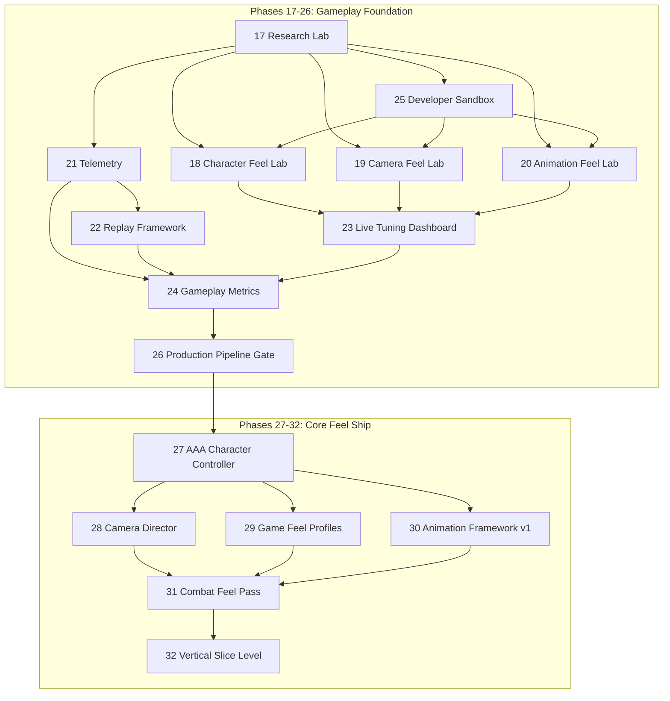
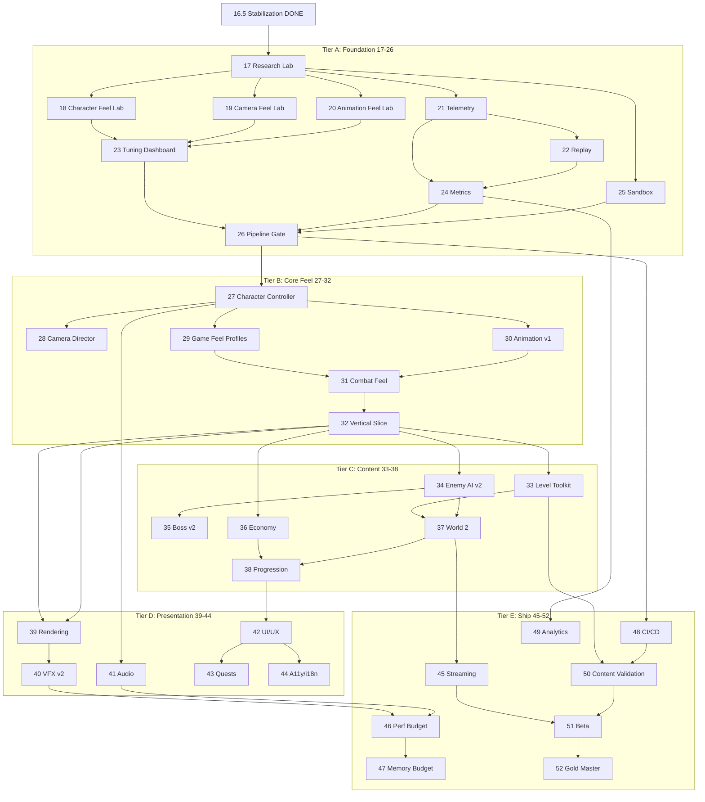

# Production Roadmap Review — Gameplay-First Redesign

**Version:** 2.0 (superseded for commercial planning)  
**Date:** 2026-07-07  
**Current Production Readiness:** 28/100 (post Phase 16.5)  
**Philosophy Shift:** Engine-First → **Gameplay-First**  
**Status:** Superseded by `PRODUCTION-OPERATING-SYSTEM.md` v3.0 — Tier A (17–25) intent preserved

> **Executive Board Review (v3.0):** See [`PRODUCTION-OPERATING-SYSTEM.md`](./PRODUCTION-OPERATING-SYSTEM.md) for the complete AAA Production Operating System: design constitution, psychology metrics, bot playtesting, content factory, asset validation, Review Board gates, and 68-phase milestone plan.

---

## 1. Executive Decision

Phase 16.5 correctly fixed P0 physics blockers. Jumping directly into "Phase 18 AAA Character Controller" would **repeat the original mistake**: building features without instruments to measure whether they feel good.

**Studio mandate:** The next 10 phases are **observability, iteration, and feel laboratories** — not content, not rendering upgrades, not AI rewrites.

> A platformer is won or lost on jump, camera, and feedback loops — not on folder count.

---

## 2. Review of Prior Roadmap (Phases 17–50)

### Scoring Legend

| Symbol | Meaning |
|--------|---------|
| PX | Direct player experience impact |
| UB | Unblocks later work |
| PO | Position optimal (in old order) |
| SI | Splittable into iterations |

### Old Phase Evaluation

| Old Phase | Why It Existed | PX | UB | Old PO | SI | Verdict |
|-----------|----------------|----|----|--------|-----|---------|
| **17 Animation Framework** | Skeletal clips, blend trees | Medium (delayed) | High | **Too early** | Yes (3 iter) | **Defer** — needs feel labs + metrics first |
| **18 AAA Character Controller** | Commercial movement | **Critical** | High | Right intent, **wrong timing** | Yes (4 iter) | **Defer** — needs Character Feel Lab |
| **19 Camera Director** | Context cameras | **Critical** | Medium | **Too early** | Yes | **Defer** — needs Camera Feel Lab |
| **20 Game Feel System** | Juice profiles | High | Medium | Before 18/19 was **wrong order** | Yes | **Merge into labs** then formalize |
| **21 Enemy AI (BT)** | Fair, readable enemies | High | Medium | **Far too early** | Yes | Defer until movement validated |
| **22 Boss Framework** | Climax encounters | High | Low | Too early | Yes | Defer until combat loop fun |
| **23 World Streaming** | Scale content | Low (now) | High (later) | **Way too early** | Yes | Defer until 5+ fun levels |
| **24 Level Design Toolkit** | Content velocity | Medium | High | Before feel = **wasted levels** | Yes | Defer until metrics prove fun |
| **25 Rendering Upgrade** | Visual identity | Medium | Low | Too early for gameplay | Yes | Defer until core loop fun |
| **26 VFX** | Feedback richness | High | Medium | Partially early | Yes | Light prototypes in Animation Feel Lab |
| **27 Audio (real assets)** | Immersion | High | Medium | Too early | Yes | Defer until movement cadence locked |
| **28 Progression** | Retention | Medium | Medium | Too early | Yes | Defer until 20-min session fun |
| **29 Dev Tools** | Observability | **Critical for team** | **Critical** | Should have been **Phase 17** | Yes | **Promote to foundational** |
| **30 Save Framework** | Persistence | Low (now) | Medium | OK position but not urgent | Yes | Defer |
| **31–40 Production infra** | Ship readiness | Low (now) | High (later) | Parallel track, not blocking feel | Yes | Parallel after Phase 40+ |
| **41–50 Live features** | Retention/UGC | Low (now) | Low | Far future | Yes | Defer |

### Root Cause of Old Roadmap Failure

```
Engine layers built → Features declared "complete" → No measurement → No iteration → Low Fun score
```

### Gameplay-First Correction

```
Measure → Tune → Validate → Ship feature slice → Measure again
```

---

## 3. New Foundational Stack (Phases 17–26)

Ten phases that **do not add player-facing content** but multiply the value of every future phase.



---

## Phase 17 — Gameplay Research Lab

### Why It Exists
Isolated, deterministic environments to answer "does this physics/movement configuration behave predictably?" without loading a full game.

### Player Experience Impact
**Indirect but critical** — eliminates guesswork that produces floaty jumps and broken ledges in real levels.

### Unblocks
Character Feel Lab, Camera Feel Lab, Replay determinism validation, automated regression.

### Splittable Iterations
1. Deterministic sandbox boot + fixed seed  
2. Physics isolation scene (flat, stairs, gaps)  
3. Jump laboratory (variable height platforms)  
4. Platform laboratory (moving/spring stubs)  
5. Enemy interaction laboratory (single dummy enemy)

### Position Optimal?
**Yes — must be Phase 17.** Nothing else should proceed without a controlled test harness.

### Measurable Success Criteria
- Sandbox loads in &lt;2s separate from main game
- Same input sequence + seed → position delta &lt; 0.01m over 10s replay
- 5 lab scenes reachable from dev menu

### Objectives
- Headless-capable simulation scene
- Zero dependency on `GameApplication` god object
- Export lab results as JSON for CI

### Architecture
```
research/
├── ResearchLab.ts          # Scene router, seed management
├── scenes/
│   ├── PhysicsIsolationScene.ts
│   ├── JumpLaboratoryScene.ts
│   ├── PlatformLaboratoryScene.ts
│   └── EnemyInteractionScene.ts
├── DeterministicClock.ts   # Fixed dt, no wall clock
└── LabReport.ts            # Metrics export
```

### Dependencies
- `PhysicsWorld`, `MovementController`, `GameplayOrchestrator` (Phase 16.5)
- No UI polish, no audio assets

### Public Interfaces
```typescript
interface IResearchLab {
  loadScene(id: LabSceneId): void;
  setSeed(seed: number): void;
  step(dt: number): LabFrame;
  exportReport(): LabReport;
}
```

### Data Model
```typescript
interface LabFrame {
  tick: number;
  position: Vec3;
  velocity: Vec3;
  grounded: boolean;
  state: MovementState;
}
interface LabReport {
  sceneId: string;
  seed: number;
  frames: LabFrame[];
  duration: number;
}
```

### Runtime Cost
- +1 scene loader path (~negligible when inactive)
- Labs run at fixed 60Hz — same as production

### Memory Impact
- ~2–5 MB per lab scene (minimal geometry)
- Reports capped at 60s / 3600 frames in memory

### Risks
| Risk | Severity | Mitigation |
|------|----------|------------|
| Rapier non-determinism across browsers | High | Record tolerance thresholds; WASM pinned version |
| Lab diverges from main game wiring | Medium | Shared `GameplayOrchestrator` only |

### Testing Strategy
- Determinism test: same seed → hash of positions matches
- Scene load smoke tests
- CI runs Jump Lab headless for 5s

### Acceptance Criteria
- [ ] 4 lab scenes functional
- [ ] Determinism test passes on Chrome + Firefox
- [ ] Lab boot does not require full level load
- [ ] Report export JSON schema validated

### Definition of Done
All acceptance criteria met + documented in `docs/research/LABS.md` + architecture validation pass.

### Production Readiness Contribution
**+8 points** (28 → 36) — enables evidence-based tuning

---

## Phase 18 — Character Feel Lab

### Why It Exists
Movement parameters cannot be tuned via JSON reload. Commercial platformers tune **live** with immediate feedback.

### Player Experience Impact
**Direct — highest ROI phase for Fun score.**

### Unblocks
AAA Character Controller (Phase 27), Gameplay Metrics jump success rate, Replay comparison.

### Splittable Iterations
1. Runtime parameter binding (movement.json → live)  
2. Curve editor (acceleration/gravity arrays)  
3. Apex hang + fast fall toggles  
4. Moving platform stub + velocity inheritance test  
5. Preset save/load (local)

### Position Optimal?
Immediately after Research Lab — **yes**.

### Measurable Success Criteria
- Parameter change applies in &lt;16ms (1 frame)
- 20+ parameters tunable without restart
- Internal playtest: jump satisfaction ≥6/10 (baseline ~3/10)

### Objectives
- Live tuning of: acceleration, deceleration, jump force, gravity, coyote, buffer, apex hang, fast fall multiplier, landing recovery lockout, air control, slope limit, step height
- Side-by-side A/B preset comparison via replay

### Architecture
```
feel/
├── character/
│   ├── CharacterFeelLab.ts
│   ├── MovementParameterStore.ts   # Observable store
│   ├── CurveLibrary.ts             # Hermite/bezier samples
│   └── PlatformVelocityProbe.ts    # Moving platform test
└── presets/
    └── *.feel.json
```

### Dependencies
- Phase 17 Research Lab (Jump + Platform scenes)
- Phase 21 Telemetry (jump/land events) — soft dependency, can stub initially

### Public Interfaces
```typescript
interface IMovementParameterStore {
  get<K extends keyof MovementConfig>(key: K): MovementConfig[K];
  set<K extends keyof MovementConfig>(key: K, value: MovementConfig[K]): void;
  loadPreset(id: string): void;
  savePreset(id: string): void;
  onChange(handler): () => void;
}
```

### Data Model
```typescript
interface FeelPreset {
  id: string;
  name: string;
  movement: Partial<MovementConfig>;
  curves: { acceleration?: CurveSample[]; gravity?: CurveSample[] };
  createdAt: number;
}
```

### Runtime Cost
- Parameter store observers: O(listeners) per change — cap at 32 listeners
- Curve evaluation: O(1) per axis per frame

### Memory Impact
- Presets: ~50KB for 20 presets
- Curve data: ~10KB

### Risks
| Risk | Severity | Mitigation |
|------|----------|------------|
| Tuning in lab doesn't transfer to real level | Medium | Same orchestrator path enforced |
| Parameter combinatorial explosion | Low | Named presets only, not free-form chaos |

### Testing Strategy
- Unit: preset round-trip save/load
- Integration: change jump force → next jump height changes within 1 frame
- Playtest: 5 testers, survey jump feel 1–10

### Acceptance Criteria
- [ ] All listed parameters live-tunable
- [ ] Preset save/load works
- [ ] Jump lab scene uses same code path as game
- [ ] Playtest survey ≥6/10 average

### Definition of Done
Playtest gate passed + preset library with 3 vetted baselines (tight, floaty, Odyssey-like target).

### Production Readiness Contribution
**+12 points** (36 → 48) — Fun score driver

---

## Phase 19 — Camera Feel Lab

### Why It Exists
Camera is co-equal with jump in platformer quality. Tuning camera without metrics = subjective arguments.

### Player Experience Impact
**Direct** — reduces nausea, improves readability, increases confidence in jumps.

### Unblocks
Camera Director (Phase 28), comfort certification, boss encounters.

### Splittable Iterations
1. Profile system (explore/tight/wide)  
2. Live distance/pitch/smoothing/FOV tuning  
3. Occlusion statistic collector  
4. Comfort metric (angular velocity cap)  
5. Camera replay from recorded player path

### Position Optimal?
Parallel with Phase 18 after Phase 17 — **yes**.

### Measurable Success Criteria
- Camera collision interventions &lt;3/sec during normal traverse
- Comfort score: angular velocity p95 &lt; threshold (TBD in lab)
- 3 profiles compared in blind test, winner identified

### Objectives
- Multiple camera profiles with live editing
- Automated comparison run (same replay, 3 profiles)
- Occlusion %, collision push count, FOV change rate logged

### Architecture
```
feel/
├── camera/
│   ├── CameraFeelLab.ts
│   ├── CameraProfile.ts
│   ├── CameraProfileStore.ts
│   ├── OcclusionStats.ts
│   └── ComfortAnalyzer.ts
```

### Dependencies
- Phase 17 (isolation scenes for repeatable paths)
- Phase 22 Replay (for comparison runs) — iteration 5

### Public Interfaces
```typescript
interface ICameraProfile {
  id: string;
  distance: number;
  pitch: number;
  smoothing: number;
  fov: number;
  shoulderOffset: number;
  collisionPadding: number;
}
interface IComfortReport {
  angularVelocityP95: number;
  collisionInterventions: number;
  occlusionPercent: number;
}
```

### Runtime Cost
- Comfort analyzer: ~0.1ms/frame
- Occlusion ray samples: configurable, default 1 ray/frame

### Memory Impact
- Profile store: &lt;20KB
- Replay comparison buffers: ~100KB

### Risks
| Risk | Severity | Mitigation |
|------|----------|------------|
| Over-tuning for lab scenes not real levels | Medium | Validate on vertical slice level (Phase 32) |
| Comfort metrics subjective | Medium | Combine objective angular velocity + survey |

### Testing Strategy
- Replay 3 profiles on identical input → diff report
- Unit: comfort analyzer on synthetic camera path

### Acceptance Criteria
- [ ] ≥3 profiles tunable live
- [ ] Comparison report generated automatically
- [ ] Comfort metrics exported to telemetry

### Definition of Done
Winning profile selected + documented rationale in `docs/feel/CAMERA.md`.

### Production Readiness Contribution
**+6 points** (48 → 54)

---

## Phase 20 — Animation Feel Lab

### Why It Exists
Full skeletal animation (old Phase 17) is expensive. **Timing and anticipation** can be prototyped procedurally first — matching Astro Bot's iterative approach.

### Player Experience Impact
**Direct** — landing anticipation, squash/stretch timing, idle life.

### Unblocks
Animation Framework v1 (Phase 30) with validated timing targets.

### Splittable Iterations
1. Procedural squash/stretch curves  
2. Landing anticipation delay  
3. Walk cycle phase sync to speed  
4. Secondary motion (hat bob)  
5. Timing analysis export (ms to peak squash)

### Position Optimal?
Before full Animation Framework — **yes**.

### Measurable Success Criteria
- Landing anticipation felt in blind test ≥70% detection
- Squash peak within 2 frames of ground contact
- Walk cycle desync rate &lt;5% at constant speed

### Objectives
- Procedural animation experiments without glTF pipeline
- Frame-accurate timing analysis
- Export timing targets for future skeletal clips

### Architecture
```
feel/
├── animation/
│   ├── AnimationFeelLab.ts
│   ├── ProceduralRig.ts          # Extends PlayerCharacter
│   ├── TimingAnalyzer.ts
│   └── SecondaryMotionChain.ts
```

### Dependencies
- Phase 18 (landing events, movement states)
- Phase 21 Telemetry (land event timestamps)

### Public Interfaces
```typescript
interface IProceduralAnimConfig {
  squashCurve: CurveSample[];
  anticipationMs: number;
  walkPhaseSpeed: number;
  secondaryMotionAmplitude: number;
}
interface ITimingReport {
  landToSquashPeakMs: number;
  squashToRecoverMs: number;
}
```

### Runtime Cost
- Procedural rig: &lt;0.2ms/frame
- Timing analyzer: post-event, async

### Memory Impact
- Negligible (&lt;10KB config)

### Risks
| Risk | Severity | Mitigation |
|------|----------|------------|
| Procedural ≠ final skeletal feel | Medium | Use as timing spec, not final art |
| Over-animation hurts responsiveness | Medium | Max anticipation 80ms cap in lab |

### Testing Strategy
- Frame snapshot tests on land event
- Survey: "did landing feel impactful?" 

### Acceptance Criteria
- [ ] Timing report auto-generated on each landing
- [ ] 3 procedural presets compared
- [ ] Documented timing targets for Phase 30

### Definition of Done
Timing spec approved by Creative Director + Lead Animator role review.

### Production Readiness Contribution
**+4 points** (54 → 58)

---

## Phase 21 — Gameplay Telemetry

### Why It Exists
You cannot improve what you do not measure. Every future tuning decision needs event evidence.

### Player Experience Impact
**Indirect** — enables all direct improvements.

### Unblocks
Metrics (24), Replay (22), heatmaps, automated regression on fun proxies.

### Splittable Iterations
1. Event schema + ring buffer  
2. Core events (jump, land, death, checkpoint)  
3. Camera + enemy + collectible events  
4. Session timing + input latency  
5. Export to JSON/NDJSON

### Position Optimal?
**Phase 21** — early, parallel with feel labs once Research Lab exists.

### Measurable Success Criteria
- 100% of listed events captured with &lt;0.05ms amortized cost
- Zero dropped events in 10-min session
- Export file parseable by metrics pipeline

### Objectives
Record: jump, landing, death, retry, checkpoint, camera collision, enemy hit, collectible, session time, input-to-action latency.

### Architecture
```
telemetry/
├── TelemetryCollector.ts
├── TelemetryEvent.ts
├── TelemetryBuffer.ts      # Ring buffer, fixed size
├── TelemetryExporter.ts
└── schemas/
    └── telemetry-event.schema.json
```

### Dependencies
- EventBus (hook emit-side or subscribe-all)
- Phase 17 for deterministic event counts in CI

### Public Interfaces
```typescript
interface ITelemetryCollector {
  record(event: TelemetryEvent): void;
  flush(): TelemetryBatch;
  subscribe(handler: (e: TelemetryEvent) => void): () => void;
}
type TelemetryEvent =
  | { type: 'jump'; tick: number; position: Vec3; coyoteUsed: boolean }
  | { type: 'land'; tick: number; velocity: number; state: string }
  | { type: 'death'; tick: number; cause: string }
  | { type: 'checkpoint'; index: number }
  | { type: 'camera_collision'; pushDistance: number }
  | { type: 'input_latency'; action: string; ms: number }
  // ...
```

### Data Model
- Ring buffer: 10,000 events (~500KB)
- Batch export every 60s or on demand

### Runtime Cost
- **&lt;0.05ms** per event (target)
- Flush: async, non-blocking

### Memory Impact
- Fixed 500KB ring buffer (configurable)
- No unbounded growth

### Risks
| Risk | Severity | Mitigation |
|------|----------|------------|
| PII in telemetry | Low | No user data, local only initially |
| Event spam from camera | Medium | Throttle camera_collision to 10/sec |

### Testing Strategy
- Unit: buffer overflow drops oldest
- Integration: jump in game → event count +1
- Schema validation on export

### Acceptance Criteria
- [ ] All 10 event types implemented
- [ ] Export NDJSON valid
- [ ] Performance budget met

### Definition of Done
Telemetry running in main game + all labs + CI ingest script.

### Production Readiness Contribution
**+5 points** (58 → 63)

---

## Phase 22 — Replay Framework

### Why It Exists
Subjective "feels better" must be backed by identical-input comparisons.

### Player Experience Impact
**Indirect** — prevents feel regressions that destroy player trust.

### Unblocks
Camera comparison, metrics heatmaps, ghost replay, CI gameplay regression.

### Splittable Iterations
1. Input recording (per tick)  
2. Deterministic playback  
3. Ghost overlay render  
4. Debug step-through  
5. CI replay regression suite

### Position Optimal?
After Telemetry (21), before Metrics (24) — **yes**.

### Measurable Success Criteria
- Replay divergence &lt;1% position error over 60s
- Record overhead &lt;0.1ms/frame
- 5 golden replays pass in CI

### Objectives
- Input recording at fixed tick
- Playback through same pipeline as live game
- Ghost replay for speedrun-style comparison

### Architecture
```
replay/
├── InputRecorder.ts
├── ReplayPlayer.ts
├── ReplayGhost.ts
├── ReplayStore.ts
└── golden/
    └── *.replay.json
```

### Dependencies
- Phase 17 deterministic clock
- Phase 21 telemetry (optional enrichment)

### Public Interfaces
```typescript
interface IReplayRecorder {
  start(seed: number): void;
  recordInput(input: InputSnapshot): void;
  stop(): ReplayFile;
}
interface IReplayPlayer {
  load(file: ReplayFile): void;
  step(): boolean; // false when done
  getGhostState(): MovementSnapshot;
}
```

### Data Model
```typescript
interface ReplayFile {
  version: number;
  seed: number;
  fixedDt: number;
  frames: InputSnapshot[];
}
```

### Runtime Cost
- Record: ~0.08ms/frame
- Playback: same as live game

### Memory Impact
- ~60KB per minute of input recording
- Ghost mesh: shared, ~0 extra

### Risks
| Risk | Severity | Mitigation |
|------|----------|------------|
| Non-deterministic playback | Critical | Fixed seed + pinned Rapier + no Date.now in sim |
| Replay format breaking changes | Medium | Version field + migration |

### Testing Strategy
- Record 10s → playback → position hash match
- Golden replay CI on every PR

### Acceptance Criteria
- [ ] Record/playback/ghost functional
- [ ] 5 golden replays committed
- [ ] CI regression job green

### Definition of Done
Golden replays gate merges to `main` for gameplay files.

### Production Readiness Contribution
**+6 points** (63 → 69)

---

## Phase 23 — Live Tuning Dashboard

### Why It Exists
Unifies Character/Camera/Animation feel labs into one runtime UI for designers.

### Player Experience Impact
**Indirect** — iteration velocity directly affects final feel quality.

### Unblocks
Designer autonomy without programmer bottleneck.

### Splittable Iterations
1. Debug overlay shell  
2. Parameter panels (movement, camera)  
3. Preset manager  
4. A/B compare mode  
5. Rollback history (undo stack)

### Position Optimal?
After Feel Labs (18–20) have parameter stores — **yes**.

### Measurable Success Criteria
- Designer can tune jump without code change in &lt;5 min session
- Rollback to prior preset in &lt;1s
- Zero main-thread stalls &gt;16ms from UI

### Objectives
- Runtime editing of all feel parameters
- Save/load/compare presets
- Undo/redo for tuning sessions

### Architecture
```
tools/
├── dashboard/
│   ├── TuningDashboard.ts
│   ├── PanelRegistry.ts
│   ├── PresetManager.ts
│   └── RollbackStack.ts
└── panels/
    ├── MovementPanel.ts
    ├── CameraPanel.ts
    └── AnimationPanel.ts
```

### Dependencies
- Phases 18, 19, 20 parameter stores
- Phase 25 Sandbox (optional embed)

### Public Interfaces
```typescript
interface ITuningDashboard {
  show(): void;
  hide(): void;
  registerPanel(panel: ITuningPanel): void;
  loadPreset(id: string): void;
  undo(): void;
}
```

### Runtime Cost
- UI render only when visible
- Parameter changes: same as feel labs

### Memory Impact
- Rollback stack: 50 states × ~20KB = 1MB max

### Risks
| Risk | Severity | Mitigation |
|------|----------|------------|
| Shipping debug UI to production | Medium | `import.meta.env.DEV` gate + build strip |
| Accidental preset overwrite | Low | Confirm dialog + gitignored local presets |

### Testing Strategy
- E2E: change param via dashboard → movement changes
- Undo restores previous value

### Acceptance Criteria
- [ ] 3 panels functional
- [ ] Preset compare A/B with replay
- [ ] Production build excludes dashboard

### Definition of Done
Designer workflow documented; 3 vetted presets ship in repo.

### Production Readiness Contribution
**+4 points** (69 → 73)

---

## Phase 24 — Gameplay Metrics

### Why It Exists
Transforms raw telemetry into actionable heatmaps and rates.

### Player Experience Impact
**Indirect** — identifies frustration before players quit.

### Unblocks
Level design validation, difficulty tuning, camera profile selection.

### Splittable Iterations
1. Jump success rate  
2. Death position heatmap  
3. Retry frequency  
4. Camera intervention rate  
5. Session duration + completion time

### Position Optimal?
After Telemetry (21) + Replay (22) — **yes**.

### Measurable Success Criteria
- Metrics dashboard renders from 10-min session export
- Death heatmap identifies top 3 hazard zones correctly (manual verify)
- Jump success rate correlates with playtest survey (r &gt; 0.6)

### Objectives
Auto-calculate: jump success %, death heatmaps, retry frequency, camera intervention rate, platform fail rate, session duration, completion time, secret discovery rate.

### Architecture
```
metrics/
├── MetricsEngine.ts
├── aggregators/
│   ├── JumpSuccessAggregator.ts
│   ├── DeathHeatmapAggregator.ts
│   ├── CameraInterventionAggregator.ts
│   └── SessionAggregator.ts
└── exporters/
    └── metrics-report.json
```

### Dependencies
- Phase 21 Telemetry batches
- Phase 22 replays for replay-linked metrics

### Public Interfaces
```typescript
interface IMetricsEngine {
  ingest(batch: TelemetryBatch): void;
  compute(): MetricsReport;
  exportHeatmap(): HeatmapGrid;
}
```

### Data Model
```typescript
interface MetricsReport {
  jumpSuccessRate: number;
  deathHeatmap: { x: number; z: number; count: number }[];
  retryFrequency: number;
  cameraInterventionRate: number;
  avgSessionDuration: number;
}
```

### Runtime Cost
- Online aggregation: &lt;0.1ms/event
- Offline heatmap: post-session, &lt;500ms

### Memory Impact
- Heatmap grid: 64×64 × 4 bytes = 16KB

### Risks
| Risk | Severity | Mitigation |
|------|----------|------------|
| Misleading metrics from small sample | Medium | Min 10-min / 3 playtests before decisions |
| Heatmap false precision | Low | 1m grid cells minimum |

### Testing Strategy
- Synthetic telemetry → known metrics output
- Golden metrics file comparison

### Acceptance Criteria
- [ ] All 8 metrics computed
- [ ] Heatmap visual export
- [ ] Correlation study with 5 playtesters

### Definition of Done
Metrics report template used in Phase 26 gate review.

### Production Readiness Contribution
**+5 points** (73 → 78) — observability maturity

---

## Phase 25 — Developer Sandbox

### Why It Exists
Rapid hypothesis testing without editing JSON or rebuilding levels.

### Player Experience Impact
**Indirect** — faster iteration → better final experience.

### Unblocks
All feel labs, QA reproduction, content prototyping.

### Splittable Iterations
1. Entity spawn commands  
2. Platform spawn + type toggle  
3. Gravity/time scale toggles  
4. Free camera + debug draw  
5. Collision visualization

### Position Optimal?
After Research Lab (17), parallel with Feel Labs — **yes**.

### Measurable Success Criteria
- Spawn enemy/coin/platform in &lt;2s via command
- Collision debug overlay accurate to Rapier shapes
- Sandbox accessible via `?sandbox=1` or dev key

### Objectives
- Spawn any entity/platform
- Toggle gravity, slow-mo, free cam
- Debug overlays for collision, velocity, state

### Architecture
```
sandbox/
├── DeveloperSandbox.ts
├── CommandConsole.ts
├── EntitySpawner.ts
├── DebugDraw.ts
└── commands/
    ├── spawn.ts
    ├── gravity.ts
    └── timescale.ts
```

### Dependencies
- Phase 17 lab infrastructure
- Phase 23 dashboard (optional UI)

### Public Interfaces
```typescript
interface ISandbox {
  execute(command: string): SandboxResult;
  spawnEntity(def: EntitySpawnDef): EntityId;
  setDebugFlag(flag: DebugFlag, enabled: boolean): void;
}
```

### Runtime Cost
- Debug draw: 1–3ms when enabled (dev only)
- Spawner: one-time alloc per entity

### Memory Impact
- Debug geometry: ~1MB when all overlays on

### Risks
| Risk | Severity | Mitigation |
|------|----------|------------|
| Sandbox code in production bundle | Medium | Tree-shake + env gate |
| Spawn abuse crashes session | Low | Entity cap 100 |

### Testing Strategy
- Command parser unit tests
- Spawn 50 entities → FPS &gt; 30

### Acceptance Criteria
- [ ] 10 console commands work
- [ ] Collision viz matches physics
- [ ] Not in production bundle

### Definition of Done
`docs/tools/SANDBOX.md` command reference complete.

### Production Readiness Contribution
**+3 points** (78 → 81) — dev velocity

---

## Phase 26 — Production Pipeline Gate

### Why It Exists
Prevents repeating "declare complete without evidence" failure mode.

### Player Experience Impact
**Indirect** — quality gate protects players from regressions.

### Unblocks
Safe progression to Character Controller (27) and beyond.

### Splittable Iterations
1. Gate checklist template  
2. Automated checks (test, arch, replay)  
3. Manual playtest sign-off workflow  
4. Phase report generator  
5. CI gate enforcement

### Position Optimal?
**Mandatory gate before Phase 27** — yes.

### Measurable Success Criteria
- 100% of Phase 27+ PRs include completed gate checklist
- Automated gate runs in &lt;5 min CI
- Zero phases skip gate in project history

### Objectives
Before every future phase: architecture, gameplay, performance, memory, test, docs, regression reviews — automated where possible.

### Architecture
```
pipeline/
├── PhaseGate.ts
├── checks/
│   ├── ArchitectureCheck.ts
│   ├── ReplayRegressionCheck.ts
│   ├── TestCoverageCheck.ts
│   ├── PerformanceBudgetCheck.ts
│   └── PlaytestSignoffCheck.ts
└── templates/
    └── PHASE-REPORT-TEMPLATE.md
```

### Dependencies
- Phases 21–25 outputs integrated into CI

### Public Interfaces
```typescript
interface IPhaseGate {
  run(phaseId: string): GateResult;
}
interface GateResult {
  passed: boolean;
  checks: { name: string; passed: boolean; evidence: string }[];
}
```

### Runtime Cost
- CI only — no runtime game cost

### Memory Impact
- None in game

### Risks
| Risk | Severity | Mitigation |
|------|----------|------------|
| Gate fatigue / checkbox theater | Medium | Require evidence artifacts, not just booleans |
| Blocks velocity | Low | Automate 80% of checks |

### Testing Strategy
- Gate fails when replay regression broken
- Gate passes on clean main

### Acceptance Criteria
- [ ] All 7 review types documented
- [ ] CI job `phase-gate` runs on PR
- [ ] Phase 17–25 retroactively gated

### Definition of Done
Phase 27 cannot start until Phase 26 gate passes with evidence.

### Production Readiness Contribution
**+4 points** (81 → 85) — process maturity (not player-facing)

---

## 4. Regenerated Roadmap — Phase 17 Onward

### Tier A: Gameplay Foundation (17–26) — **CURRENT PRIORITY**
*No commercial content. Maximum iteration velocity.*

| Phase | Name | PR Δ | Duration Est. |
|-------|------|------|---------------|
| 17 | Gameplay Research Lab | +8 | 2 weeks |
| 18 | Character Feel Lab | +12 | 2–3 weeks |
| 19 | Camera Feel Lab | +6 | 2 weeks |
| 20 | Animation Feel Lab | +4 | 1–2 weeks |
| 21 | Gameplay Telemetry | +5 | 1–2 weeks |
| 22 | Replay Framework | +6 | 2 weeks |
| 23 | Live Tuning Dashboard | +4 | 2 weeks |
| 24 | Gameplay Metrics | +5 | 1–2 weeks |
| 25 | Developer Sandbox | +3 | 1–2 weeks |
| 26 | Production Pipeline Gate | +4 | 1 week |

**Cumulative after Tier A: ~85/100 process readiness, ~45/100 player-facing quality** (explicit gap).

---

### Tier B: Core Feel Ship (27–32)
*Ship validated feel into production game path.*

| Phase | Name | Why Now | PR Δ | Depends On |
|-------|------|---------|------|------------|
| 27 | AAA Character Controller | Presets proven in lab | +10 | 18, 22, 26 |
| 28 | Camera Director | Profiles proven in lab | +8 | 19, 22, 26 |
| 29 | Game Feel Profiles | Juice data-driven | +5 | 20, 21, 27 |
| 30 | Animation Framework v1 | Timing spec from lab | +6 | 20, 27 |
| 31 | Combat Feel Pass | Readable hits, not AI rewrite | +4 | 27, 29 |
| 32 | Vertical Slice Level | 15-min fun proof | +8 | 27–31, 24 |

**Gate:** Phase 32 requires playtest Fun ≥60/100, jump satisfaction ≥7/10.

---

### Tier C: World & Content (33–38)

| Phase | Name | PX | Depends On |
|-------|------|----|------------|
| 33 | Level Design Toolkit | Medium | 32, 25 |
| 34 | Enemy AI v2 (BT + perception) | High | 31, 32 |
| 35 | Boss Framework v2 | High | 31, 34 |
| 36 | Collectibles & Economy Loop | Medium | 32 |
| 37 | Second World (5 levels) | High | 33, 34 |
| 38 | Progression & Save v2 | Medium | 36, 37 |

---

### Tier D: Presentation (39–44)

| Phase | Name | PX | Depends On |
|-------|------|----|------------|
| 39 | Rendering Upgrade (stylized PBR) | Medium | 32 |
| 40 | VFX System v2 (GPU particles) | High | 29, 39 |
| 41 | Audio System (real assets + adaptive) | High | 27, 29 |
| 42 | UI/UX Pass | High | 36, 38 |
| 43 | NPC & Quest Framework | Medium | 38, 42 |
| 44 | Accessibility & Localization | Medium | 42 |

---

### Tier E: Scale & Ship (45–52)

| Phase | Name | Depends On |
|-------|------|------------|
| 45 | World Streaming | 37 |
| 46 | Performance Budget System | 40, 41 |
| 47 | Memory Budget System | 46 |
| 48 | CI/CD + Build Automation | 26 |
| 49 | Telemetry & Analytics (production) | 21, 24 |
| 50 | Content Validation Pipeline | 33, 48 |
| 51 | Beta Harding & Certification | 45–50 |
| 52 | Gold Master Polish | 51 |

---

## 5. Master Dependency Graph



---

## 6. What We Explicitly Deprioritize (And Why)

| Deferred Item | Reason |
|---------------|--------|
| Full Behavior Tree AI | Unfair enemies mask bad movement; fix movement first |
| World streaming | No content worth streaming yet |
| Stylized rendering | Pretty graphics on bad feel = bad game |
| Real audio assets | Footstep timing unknown until movement locked |
| Progression/shop | No 20-minute fun loop to retain |
| Multiplayer | Non-goal until single-player Fun ≥70 |

---

## 7. Success Metrics for Roadmap Itself

| KPI | Target After Tier A | Target After Tier B |
|-----|---------------------|---------------------|
| Jump satisfaction (1–10) | ≥6 | ≥7.5 |
| Fun score (internal) | ≥40 | ≥60 |
| Replay regression tests | ≥5 golden | ≥20 golden |
| Death heatmap coverage | 1 lab level | Vertical slice |
| Tuning iteration time | &lt;5 min/param | &lt;2 min/param |
| Production readiness | ~85 (process) | ~55 (player-facing) |

**Note:** Process readiness (85) can exceed player-facing quality (55) — this is intentional and honest.

---

## 8. Immediate Next Action

**Authorize Phase 17 implementation** — Gameplay Research Lab only.

**Do NOT authorize:**
- Phase 27 Character Controller
- Any content expansion
- Rendering/audio upgrades

**First deliverable when implementation begins:**
- `research/` module with Physics Isolation + Jump Laboratory scenes
- Determinism test in CI
- Phase 17 report through Production Pipeline Gate (Phase 26 template preview)

---

## 9. Document Control

| Field | Value |
|-------|-------|
| Author | AAA Studio Production Review |
| Supersedes | Linear Phase 17–50 engine-first roadmap |
| Related | `PHASE-16.5-REPORT.md`, `ADR-001` |
| Next Review | After Phase 26 gate |

---

*This roadmap optimizes for player experience through measurement and iteration — not feature count. Implementation code is explicitly out of scope for this document.*
