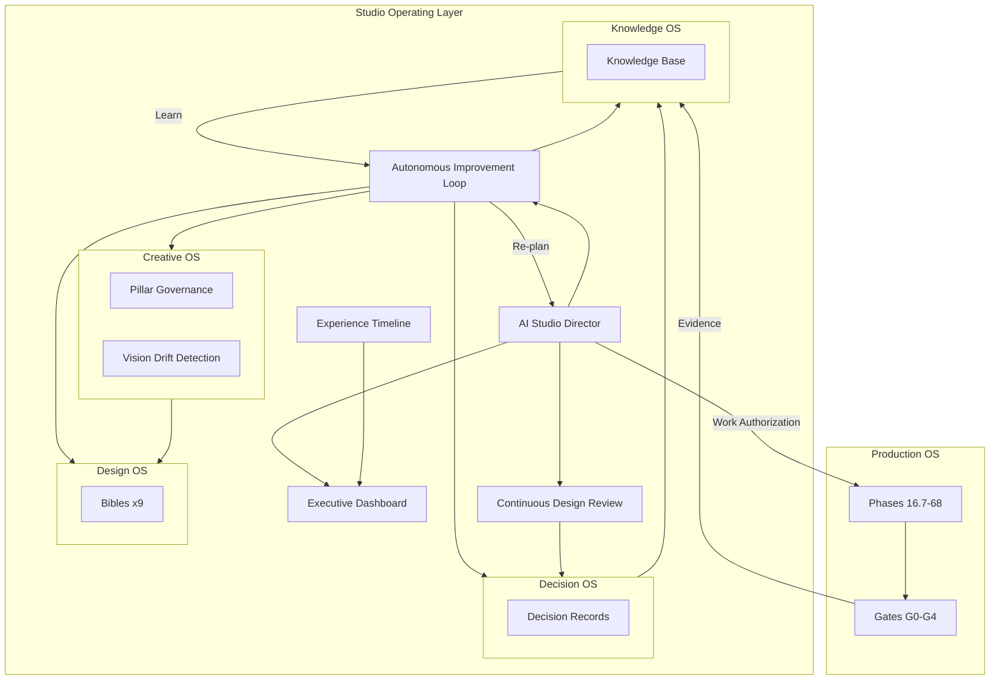
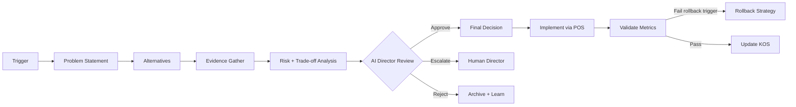
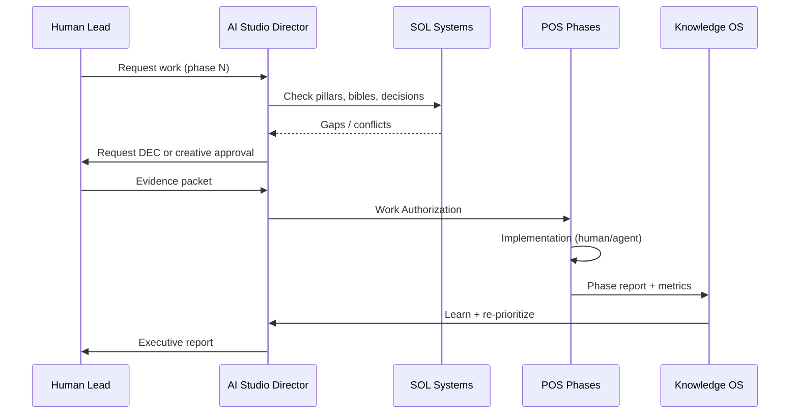

# Studio Operating Layer (SOL) v1.0

**Authority:** Governing layer above [Production Operating System v3.0](../phases/PRODUCTION-OPERATING-SYSTEM.md)  
**Model:** Autonomous Virtual AAA Game Studio  
**Status:** Ratified planning baseline — **no gameplay implementation authorized**  
**Current snapshot:** 28/100 production readiness · M0 (post Phase 16.5)

---

## Executive Summary

The Production Operating System (POS) defines **what to build and when**. The Studio Operating Layer (SOL) defines **how a studio thinks, decides, learns, and self-corrects**. The Game Design Intelligence Layer (GDIL) defines **why the game will be fun**.

POS phases are **work orders**. SOL is the **studio that executes them**. GDIL is the **design intelligence that validates them**.

```
┌─────────────────────────────────────────────────────────────────┐
│         GAME DESIGN INTELLIGENCE LAYER (GDIL) v1.0              │
│  Fun · Mechanics · Emotion · Simulation · DNA · AI Design Dir   │
├─────────────────────────────────────────────────────────────────┤
│                  STUDIO OPERATING LAYER (SOL)                   │
│  Observe → Measure → Analyze → Prioritize → Authorize → Learn    │
├─────────────────────────────────────────────────────────────────┤
│  AI Studio Director │ Executive Dashboard │ Continuous Review  │
│  Creative OS │ Design OS │ Decision OS │ Knowledge OS            │
├─────────────────────────────────────────────────────────────────┤
│           PRODUCTION OPERATING SYSTEM (POS) v3.0                │
│  Phases · Gates · Factories · Metrics · Milestones M0–M9        │
├─────────────────────────────────────────────────────────────────┤
│                    GAME PRODUCT (3dmario)                       │
└─────────────────────────────────────────────────────────────────┘
```

**Governing rule:** No POS phase implementation begins without SOL **Work Authorization**. Player-facing work additionally requires GDIL **Design Authorization** (see [GDIL v1.0](../gdil/GAME-DESIGN-INTELLIGENCE-LAYER.md)).

---

# 1. STUDIO ARCHITECTURE

## 1.1 Virtual Studio Org Chart

| Virtual Role | SOL System | Responsibility |
|--------------|------------|----------------|
| **AI Studio Director** | Orchestration agent | Prioritize, detect drift, authorize work, report |
| Creative Director | Creative OS | Pillars, vision, narrative tone |
| Gameplay Director | Design OS + Reviews | Feel, grammar, economy, enemies |
| Technical Director | Knowledge OS + Dashboard | Architecture, perf, debt |
| Art Director | Design OS (Art Bible) | Readability, style, budgets |
| Audio Director | Design OS (Audio Bible) | Feedback timing, mix |
| UX Lead | Design OS (A11y Bible) | Onboarding, accessibility |
| QA Lead | Reviews + KOS | Regression, soak, playtest |

*In a solo/small team, one human wears multiple hats; SOL preserves role separation in process.*

## 1.1 System Map



## 1.2 Operating Model vs Project Plan

| Software Project | Virtual AAA Studio (SOL) |
|------------------|--------------------------|
| Sprint backlog | **Prioritized creative + technical backlog** tied to pillars |
| Story points | **Player experience impact** + **risk reduction** |
| Definition of done | **Evidence packet** + **Review Board** + **metric delta** |
| Roadmap phase | **Authorized work order** with rollback strategy |
| Retrospective | **Autonomous Improvement Loop** iteration |
| Documentation | **Knowledge OS** — searchable, tagged, permanent |

---

# 2. CREATIVE OPERATING SYSTEM (COS)

## 2.1 Gameplay Pillars Governance

Pillars (from POS Part I) are **constitutional law**. COS enforces:

| Mechanism | Frequency | Output |
|-----------|-----------|--------|
| Pillar citation audit | Per work authorization | Every task cites P1–P5 |
| Pillar health score | Weekly | Dashboard widget (0–100 per pillar) |
| Anti-pattern scan | Per PR / phase | AI Director flags violations |
| Pillar conflict resolution | On detection | Decision Record required |

**Pillar health formula (example):**

```
P1 score = weighted_mean(jump_satisfaction, movement_survey, air_control_metric)
```

Each pillar maps to ≥3 measurable proxies (see Experience Timeline §8).

## 2.2 Creative Review Workflow

```
Intent Proposal → Bible Alignment Check → Peer Review → Pillar Check → Approval / Revise
```

| Stage | Owner | Input | Output |
|-------|-------|-------|--------|
| Intent | Discipline lead | One-page creative intent | `CRE-YYYY-MM-DD` brief |
| Bible alignment | AI Studio Director | Intent + relevant bible | Pass / Gap list |
| Peer review | Cross-discipline | Intent + gaps | Comments |
| Pillar check | Creative Director | Intent + metrics | Pillar citation |
| Approval | Creative Director | Full packet | Work Authorization token |

**SLA:** Creative review ≤3 business days for standard intents; same-day for hotfix regressions.

## 2.3 Design Approval Lifecycle

| State | Meaning | Who Advances |
|-------|---------|--------------|
| `DRAFT` | Idea captured | Author |
| `IN_REVIEW` | Creative workflow active | Author |
| `APPROVED` | May proceed to POS authorization | Creative Director |
| `IN_PRODUCTION` | POS phase active | Technical Director |
| `IN_VALIDATION` | Metrics + playtest | QA Lead |
| `SHIPPED` | In milestone build | AI Studio Director |
| `RETIRED` | Superseded / cut | Decision Record |

## 2.4 Vision Drift Detection

AI Studio Director compares **weekly snapshots**:

| Signal | Drift Indicator | Threshold |
|--------|-----------------|-----------|
| Pillar health divergence | Any pillar ↓10 pts in 2 weeks | Alert |
| Bible deviation | Implementation without bible ref | Block |
| Feature creep | Work without pillar citation | Block |
| Metric regression | Fun ↓5 pts with feature add | Investigate |
| Tone mismatch | Narrative/art audit fail | Creative review |

**Drift response:** Freeze new work authorizations → root cause Decision Record → corrective re-prioritization.

---

# 3. DESIGN OPERATING SYSTEM (DOS)

Nine **Bibles** — living discipline constitutions. Registry: [`bibles/INDEX.md`](./bibles/INDEX.md).

## 3.1 Bible Summary

| Bible | Governs | Key Standards (examples) |
|-------|---------|---------------------------|
| **Game Design** | Core loop, failure, reward | Core loop stages, meta gating rules |
| **Art** | Style, readability, budgets | Poly/texture budgets, silhouette rules |
| **Audio** | Feedback, mix, adaptive | 100ms reward SFX, LUFS targets |
| **Narrative** | Tone, characters, lore density | Light touch platformer tone |
| **Level Design** | Grammar, pacing, secrets | Teach→Exam→Recover sequence |
| **Enemy Design** | Telegraph, fairness, readability | ≥0.5s telegraph, DPS caps |
| **Boss Design** | Phases, arena, recovery windows | 3-phase max World 1, recover segments |
| **Economy** | Coins, stars, sinks, inflation | Reward density bands |
| **Accessibility** | Input, visual, motion, cognitive | Assist mode spec, WCAG targets |

## 3.2 Bible ↔ POS Integration

| POS Artifact | Bible |
|--------------|-------|
| Level JSON segments | Level Design Bible |
| Enemy templates | Enemy Design Bible |
| `movement.feel.json` | Game Design Bible |
| Asset manifest | Art Bible |
| Audio event map | Audio Bible |

**Rule:** POS factory validators (Phases 38–49) lint against bible standards — SOL owns the standards, POS owns the automation.

## 3.3 Bible Review Cadence

| Bible | Review Cycle | Chair |
|-------|--------------|-------|
| Game Design | Bi-weekly | Gameplay Director |
| Level Design | Per level blockout | Gameplay Director |
| Art | Monthly | Art Director |
| Audio | Per milestone | Audio Director |
| Accessibility | Monthly + pre-G3 | UX Lead |
| Economy | Per world | Creative Director |
| Enemy/Boss | Per encounter set | Gameplay Director |
| Narrative | Per world | Creative Director |

---

# 4. DECISION OPERATING SYSTEM (DECOS)

Every major decision is a **Decision Record** — no oral tradition.

## 4.1 Decision Classes

| Class | Examples | Record Required |
|-------|----------|-----------------|
| **Strategic** | Pillar change, scope cut, milestone shift | Yes + Board |
| **Tactical** | Preset choice, grammar exception, budget waiver | Yes |
| **Operational** | Bug fix path, refactor scope | Yes if >1 day effort |
| **Emergency** | P0 regression hotfix | Retroactive record within 48h |

## 4.2 Mandatory Sections

Template: [`decisions/TEMPLATE.md`](./decisions/TEMPLATE.md)

1. Problem statement  
2. Alternatives considered (≥2 + do nothing)  
3. Evidence (metrics, playtests, simulations)  
4. Risks  
5. Trade-offs  
6. Expected impact  
7. Final decision  
8. Rollback strategy  

## 4.3 Decision Flow



## 4.4 Decision Index

Stored in `docs/studio/decisions/` with sequential IDs: `DEC-2026-07-07-example.md`

AI Studio Director maintains `decisions/INDEX.md` — searchable table of all decisions and status.

---

# 5. KNOWLEDGE OPERATING SYSTEM (KOS)

Structure: [`knowledge/INDEX.md`](./knowledge/INDEX.md)

## 5.1 Purpose

Transform project memory from scattered docs into **searchable institutional knowledge**.

## 5.2 Knowledge Lifecycle

```
Create → Tag → Link → Review → Deprecate → Archive
```

| Action | Trigger |
|--------|---------|
| Create | Any experiment, playtest, phase completion |
| Tag | Mandatory pillar + milestone tags |
| Link | Cross-ref decisions, bugs, debt |
| Review | Quarterly stale-doc audit |
| Deprecate | Superseded by new decision |
| Archive | Retained but marked non-authoritative |

## 5.3 Feeds into SOL

| KOS Content | Consumer |
|-------------|----------|
| Tuning history | Character Feel Lab decisions |
| Playtest reports | Executive Dashboard Fun score |
| Simulation summaries | Bot regression + heatmaps |
| Debt register | Prioritization backlog |
| Lessons learned | AI Director re-planning |
| ADRs | Technical Director gate |

---

# 6. EXECUTIVE DASHBOARD

Live studio health — **not** a code deliverable in this document; specification for future `tools/studio-dashboard/`.

## 6.1 Dashboard Panels

| Panel | Primary Metrics | Source | Refresh |
|-------|-----------------|--------|---------|
| **Production Readiness** | PR score, tier progress | Phase reports | Per phase |
| **Gameplay Quality** | Jump success, recovery, flow index | Telemetry + Analytics OS | Session |
| **Fun Score** | Internal 1–100, survey 1–10 | Playtests | Per playtest |
| **Milestone Status** | M0–M9, gate status | POS + SOL auth | Daily |
| **Risks** | Risk matrix top 10 | SOL risk register | Weekly |
| **Critical Path** | Blocking phases, slack | POS Part XII | Weekly |
| **Build Health** | Green %, last failure | CI | Hourly |
| **Test Health** | Pass rate, replay goldens | CI | Per build |
| **Team Velocity** | Authorized / completed work orders | SOL | Weekly |
| **Content Velocity** | Levels/enemies/bosses validated | Content factory | Weekly |
| **Technical Debt** | Open DEBT items, trend | KOS | Weekly |
| **Documentation Health** | KOS coverage %, bible currency | KOS audit | Weekly |

## 6.2 Dashboard Views

| Audience | View |
|----------|------|
| AI Studio Director | Full panel + alerts |
| Human lead | Discipline-filtered |
| Review Board | Gate snapshot (G0–G4) |
| Executive summary | 1-page weekly PDF/Markdown |

## 6.3 Alert Thresholds

| Alert | Condition | Action |
|-------|-----------|--------|
| RED | Fun ↓5 pts, build red 2×, P0 bug | Freeze authorizations |
| AMBER | Metric drift >5%, debt +3 | Prioritize remediation |
| GREEN | All gates nominal | Normal operations |

## 6.4 Weekly Executive Report (Auto-generated)

AI Studio Director produces `knowledge/executive/WEEK-YYYY-MM-DD.md`:

1. Snapshot scores (12 dashboard panels)  
2. Completed work orders  
3. Decisions made  
4. Drift alerts  
5. Top 3 risks  
6. Critical path status  
7. Recommendations for next week  

---

# 7. CONTINUOUS DESIGN REVIEW (CDR)

Recurring discipline reviews — **not** phase gates. Gates validate ship criteria; CDR drives continuous improvement.

## 7.1 Review Schedule

| Review | Cadence | Chair | Participants |
|--------|---------|-------|--------------|
| Gameplay | Weekly | Gameplay Director | Creative, QA |
| Camera | Bi-weekly | Gameplay Director | UX |
| Animation | Bi-weekly | Gameplay Director | Art |
| Audio | Monthly | Audio Director | Gameplay |
| UX | Monthly | UX Lead | Creative, Gameplay |
| Art | Monthly | Art Director | Technical |
| Performance | Weekly | Technical Director | Gameplay |
| Accessibility | Monthly | UX Lead | All |

## 7.2 Review Protocol

```
Prepare evidence → Conduct review → Record findings → Spawn decisions → Track actions → Verify next cycle
```

| Output | Template | Stored |
|--------|----------|--------|
| Findings | `REV-{discipline}-date.md` | `knowledge/reviews/` |
| Recommendations | Numbered, prioritized P0–P2 | In review doc |
| Decisions spawned | Link to DEC- records | Cross-linked |
| Action tracker | Open until verified | Dashboard |

## 7.3 Review Acceptance

A review is **complete** when:
- ≥1 actionable recommendation documented  
- Each P0 recommendation has Decision Record or Work Authorization  
- Previous review P0 items verified or escalated  

---

# 8. AI STUDIO DIRECTOR

Autonomous orchestration agent — **specification only**. May be human-executed until automation exists.

## 8.1 Charter

The AI Studio Director is the **single entry point** for SOL → POS authorization. It does not write gameplay code; it **governs, observes, and reports**.

## 8.2 Responsibilities

| Function | Input | Output |
|----------|-------|--------|
| Review completed work | Phase report, CI, metrics | Accept / reject / request evidence |
| Detect regressions | Replay CI, bot sim, metric delta | Alert + freeze recommendation |
| Re-prioritize backlog | Dashboard, risks, critical path | Ordered work queue |
| Prevent scope creep | Pillar audit, bible alignment | Block unauthorized work |
| Update milestones | Gate evidence, Fun score | M0–M9 status update |
| Generate executive reports | All SOL systems | Weekly executive summary |
| Authorize POS work | DEC + Creative approval + capacity | Work Authorization token |

## 8.3 Interaction Model



## 8.4 Authorization Rules

| Check | Block if |
|-------|----------|
| Pillar citation | Missing |
| Bible alignment | Standard violated without DEC waiver |
| Prior gate | G1–G4 not passed for tier |
| Decision record | Strategic/tactical change without DEC |
| Regression | Golden replay red |
| Drift | Vision drift alert active |
| Capacity | Critical path item starved |

## 8.5 Escalation to Human

AI Director **must escalate** when:
- Fun score disagreement (bot green, humans red)  
- Pillar conflict unresolvable  
- Ship gate waiver requested  
- Emergency rollback of constitutional pillar  

---

# 9. EXPERIENCE TIMELINE

Models the **player journey** as studio-managed milestones — each with telemetry events and KPI targets.

## 9.1 Timeline Map

| Stage | Player Moment | Studio Obligation | Telemetry Events | KPI Targets (M3 slice) |
|-------|---------------|-------------------|------------------|------------------------|
| **T0: Boot** | Title → control | Input latency <50ms | `session_start`, `input_latency` | TTFF control <10s |
| **T1: First minute** | First movement joy | Movement responsive, camera stable | `move`, `jump`, `camera_intervention` | Jump success ≥70%, cam int <2/min |
| **T2: First reward** | First coin/star | Reward within 60s | `coin`, `reward_density` | First reward <60s, density spike |
| **T3: First teach** | Grammar TEACH node | Zero-death intro | `death`, `grammar_segment` | 0 deaths in TEACH |
| **T4: First failure** | First death | Fair, fast recovery | `death`, `respawn`, `recovery_time` | Recovery ≥90% <2s |
| **T5: First mastery** | Optional hard route | Mastery route available | `optional_route`, `air_time` | ≥10% uptake |
| **T6: First boss** | Boss encounter | Telegraph, phases, recover | `boss_phase`, `boss_damage` | ≤3 deaths avg, recover segment |
| **T7: Mid-game** | World 1 complete | Secondary loop opens | `star`, `zone_unlock` | Fun ≥65, session ≥15min |
| **T8: Endgame** | Final world / credits | Payoff, mastery expression | `completion`, `mastery_variance` | Completion ≥60% playtesters |

## 9.2 Experience Timeline ↔ POS

| POS Milestone | Timeline Stages Proven |
|---------------|------------------------|
| M2 (labs) | T0–T1 instrumentation |
| M3 (G1 slice) | T0–T6 |
| M4 (World 1) | T0–T7 |
| M9 (ship) | T0–T8 |

## 9.3 Experience Health Score

```
Experience Health = mean(stage KPI attainment) × 100
```

Displayed on Executive Dashboard. AI Director blocks content scale if T0–T4 below 70% attainment.

---

# 10. AUTONOMOUS IMPROVEMENT LOOP (AIL)

The **governing mechanism** for all future work. Replaces "complete phase → next phase" with perpetual studio cognition.

## 10.1 Loop Stages

```
┌──────────┐    ┌──────────┐    ┌──────────┐    ┌────────────┐
│ OBSERVE  │───▶│ MEASURE  │───▶│ ANALYZE  │───▶│ PRIORITIZE │
└──────────┘    └──────────┘    └──────────┘    └────────────┘
      ▲                                                    │
      │                                                    ▼
┌──────────┐    ┌──────────┐    ┌──────────┐    ┌────────────┐
│ RE-PLAN  │◀───│  LEARN   │◀───│  REVIEW  │◀───│ IMPLEMENT  │
└──────────┘    └──────────┘    └──────────┘    └────────────┘
                      ▲              │
                      │              ▼
                ┌──────────┐    ┌──────────┐
                │ UPDATE   │◀───│   TEST   │
                │   KOS    │    └──────────┘
                └──────────┘
```

| Stage | Owner | Activities |
|-------|-------|------------|
| **Observe** | AI Director | CI, telemetry, playtests, drift scans |
| **Measure** | Analytics OS | Compute KPIs, experience timeline |
| **Analyze** | Discipline leads | CDR findings, RCA, correlation |
| **Prioritize** | AI Director | Rank by pillar impact × risk reduction |
| **Implement** | POS phases | Authorized work only |
| **Test** | QA + bots | Unit, replay, simulation, playtest |
| **Review** | CDR + Gates | G0–G4 as applicable |
| **Learn** | All | Lessons, debt, tuning history |
| **Update KOS** | AI Director | Ingest all artifacts |
| **Re-plan** | AI Director | Adjust backlog, milestones, risks |

## 10.2 Loop Cadence

| Loop | Frequency |
|------|-----------|
| Observe → Measure | Continuous (CI) + per session |
| Analyze → Prioritize | Weekly |
| Implement → Test | Per work authorization |
| Review → Learn | Per completion + scheduled CDR |
| Update KOS → Re-plan | Weekly executive cycle |

## 10.3 Loop Health Metrics

| Metric | Target |
|--------|--------|
| Loop completion rate | 100% work orders pass full loop |
| Time observe → decide | <72h for tactical items |
| KOS ingestion rate | 100% completions documented |
| Re-plan accuracy | Priority queue matches critical path ≥90% |

---

# 11. GOVERNANCE — SOL ⊃ POS

## 11.1 Work Authorization Protocol

**No POS phase implementation may begin without a WAP.** Player-facing work additionally requires a valid [GDIL Design Authorization Packet (DAP)](../gdil/governance/DESIGN-AUTHORIZATION-PACKET.md).

```
┌─────────────────────────────────────────────────────────────┐
│ WORK AUTHORIZATION PACKET (WAP)                             │
├─────────────────────────────────────────────────────────────┤
│ 0. GDIL DAP token         (required if player-facing)       │
│ 1. Work Order ID          (POS phase + iteration)           │
│ 2. Pillar citation        (P1–P5)                           │
│ 3. Bible alignment proof  (relevant bible section)          │
│ 4. Decision Record        (if strategic/tactical)           │
│ 5. Creative approval      (CRE brief, if player-facing)     │
│ 6. Prior gate status        (G0–G4 as required)               │
│ 7. Rollback strategy      (from DEC or phase spec)          │
│ 8. AI Studio Director sign-off                              │
└─────────────────────────────────────────────────────────────┘
```

## 11.2 POS Phase Lifecycle (Revised)

```
GDIL DAP (if player-facing) → SOL WAP Issued → POS Implementation → G0 Gate → KOS Ingest → AIL Re-plan
```

| POS Gate | SOL Prerequisite |
|----------|------------------|
| G0 (phase complete) | WAP valid, evidence in KOS |
| G1 (feel) | Experience T0–T6 targets met |
| G2 (content) | Bibles + bot validation |
| G3 (presentation) | CDR Art/Audio/UX current |
| G4 (ship) | Full board + AI Director + human unanimous |

## 11.3 Freeze Conditions

SOL issues **studio freeze** (no new WAPs) when:
- RED dashboard alert  
- Vision drift unresolved >7 days  
- Fun score drops below milestone floor  
- P0 regression unmitigated  

## 11.4 POS Document Relationship

| Document | Role under SOL |
|----------|----------------|
| `PRODUCTION-OPERATING-SYSTEM.md` | Work catalog + gates — **subordinate to SOL** |
| `ROADMAP-GAMEPLAY-FIRST.md` | Historical — Tier A intent preserved |
| Phase reports | Evidence → KOS |
| Bibles | Standards source for validators |

---

# 12. FAILURE HANDLING

## 12.1 Failure Classes

| Class | Example | Response |
|-------|---------|----------|
| **F1 Metric regression** | Jump success ↓10% | Rollback per DEC; freeze related WAPs |
| **F2 Gate failure** | G1 Fun <60 | No tier advance; CDR gameplay weekly |
| **F3 Drift** | Feature without pillar | Block + creative review |
| **F4 Build/test** | CI red 48h | Technical Director priority override |
| **F5 Knowledge gap** | Phase without KOS entry | WAP denied for next phase |

## 12.2 Post-Failure Protocol

```
Detect → Classify → Root Cause (KOS bug/lesson) → Decision Record → Rollback or Fix → Verify → Learn → Re-plan
```

Aligns with user ROOT CAUSE FIRST rule.

## 12.3 Rollback Authority

| Scope | Authority |
|-------|-----------|
| Tuning preset | Gameplay Director |
| Phase feature | Decision Record owner |
| Milestone | Creative + Gameplay Directors |
| Constitutional pillar | Full Review Board |

---

# 13. SUCCESS METRICS (SOL-Level)

| Metric | M1 Target | M3 Target | M9 Target |
|--------|-----------|-----------|-----------|
| WAP compliance | 100% | 100% | 100% |
| KOS coverage | 80% | 95% | 99% |
| CDR completion rate | 90% | 95% | 98% |
| Decision records / month | ≥4 | ≥8 | ≥12 |
| Vision drift incidents | ≤2 | ≤1 | 0 unresolved |
| Experience timeline attainment | T0–T2 | T0–T6 | T0–T8 |
| AIL loop completion | 80% | 95% | 99% |
| Executive report cadence | Weekly | Weekly | Weekly |

---

# 14. IMMEDIATE STUDIO ACTIONS

| Priority | Action | System | Owner |
|----------|--------|--------|-------|
| P0 | Ratify SOL v1.0 | Governance | Executive Board |
| P0 | Seed Game Design + Level + A11y bibles from POS Part I | DOS | Gameplay Director |
| P1 | Create first Decision Record (SOL adoption) | DECOS | AI Studio Director |
| P1 | Initialize risk register in KOS | KOS | AI Studio Director |
| P1 | Schedule CDR calendar | CDR | AI Studio Director |
| P2 | First weekly executive report template run | Dashboard | AI Studio Director |

**Not authorized:** POS Phase 17+ implementation until first WAP issued for 16.7/16.75/16.8 documentation work.

---

# 15. DOCUMENT CONTROL

| Field | Value |
|-------|-------|
| Version | SOL 1.0 |
| Supersedes | Direct POS-only governance |
| Subordinates | `PRODUCTION-OPERATING-SYSTEM.md` v3.0 |
| Location | `docs/studio/STUDIO-OPERATING-LAYER.md` |
| Next review | After M1 or first WAP cycle |

---

*SOL transforms 3dmario from a phased software project into an autonomous virtual AAA studio. POS tells the studio what to build. SOL ensures the studio knows why, how to decide, when to stop, and what it learned.*
