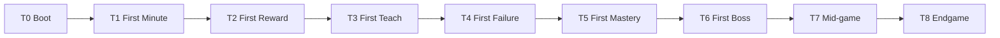

# Experience Timeline — Player Journey Model

**System:** SOL §9  
**Purpose:** Studio-managed player milestones with telemetry and KPI targets

---

## Timeline Overview



## Stage Definitions

### T0: Boot (Title → Control)

| Field | Value |
|-------|-------|
| **Player moment** | Gains control, understands they can move |
| **Studio obligation** | Input responsive; loading <10s; no tutorial wall |
| **Events** | `session_start`, `first_input`, `input_latency` |
| **KPI** | Time-to-first-control <10s; input latency p95 <50ms |
| **POS proof** | M2 (labs instrumented) |

### T1: First Minute

| Field | Value |
|-------|-------|
| **Player moment** | First jumps, camera follows, space readable |
| **Studio obligation** | Movement joy; stable camera; no immediate death |
| **Events** | `move`, `jump`, `land`, `camera_intervention` |
| **KPI** | Jump success ≥70%; cam interventions <2/min |
| **POS proof** | M2 |

### T2: First Reward

| Field | Value |
|-------|-------|
| **Player moment** | First coin/star with satisfying feedback |
| **Studio obligation** | Reward within 60s; VFX+audio <100ms |
| **Events** | `coin`, `collectible`, `reward_density` |
| **KPI** | Time-to-first-reward <60s |
| **POS proof** | M3 slice |

### T3: First Teach

| Field | Value |
|-------|-------|
| **Player moment** | Grammar TEACH introduces mechanic safely |
| **Studio obligation** | Zero-death intro; readable hazard |
| **Events** | `grammar_segment:teach`, `death` |
| **KPI** | 0 deaths in first TEACH segment |
| **POS proof** | M3 |

### T4: First Failure

| Field | Value |
|-------|-------|
| **Player moment** | First death; understands why; retries fast |
| **Studio obligation** | Fair cause; respawn ≤2s |
| **Events** | `death`, `respawn`, `recovery_time`, `death_cause` |
| **KPI** | Recovery rate ≥90% <2s; player cites cause in survey |
| **POS proof** | M3 |

### T5: First Mastery

| Field | Value |
|-------|-------|
| **Player moment** | Optional hard route; style expression |
| **Studio obligation** | MASTER grammar node available |
| **Events** | `optional_route`, `air_time`, `mastery_streak` |
| **KPI** | Optional route uptake ≥10% |
| **POS proof** | M3 |

### T6: First Boss

| Field | Value |
|-------|-------|
| **Player moment** | Reads patterns; survives phases |
| **Studio obligation** | Telegraph ≥0.5s; RECOVER after |
| **Events** | `boss_start`, `boss_phase`, `boss_damage`, `death` |
| **KPI** | ≤3 deaths avg; recover segment present |
| **POS proof** | M3 (slice) / M4 (World 1) |

### T7: Mid-game (World Complete)

| Field | Value |
|-------|-------|
| **Player moment** | World 1 done; secondary loop engages |
| **Studio obligation** | Meta unlock; re-enter with new ability |
| **Events** | `world_complete`, `star`, `zone_unlock`, `session_end` |
| **KPI** | Fun ≥65; median session ≥15min |
| **POS proof** | M4 |

### T8: Endgame

| Field | Value |
|-------|-------|
| **Player moment** | Final challenge; credits; mastery payoff |
| **Studio obligation** | Climax + expression; no grind wall |
| **Events** | `final_boss`, `credits`, `completion`, `mastery_variance` |
| **KPI** | Completion ≥60% playtesters; Fun ≥75 |
| **POS proof** | M9 |

## Experience Health Score

```
Experience Health = (Σ stage_attainment) / 9 × 100

stage_attainment = clamp(actual_KPI / target_KPI, 0, 1)
```

**Block rule:** AI Studio Director blocks content-scale WAPs if T0–T4 attainment <70%.

## Milestone Mapping

| Milestone | Required stages |
|-----------|-----------------|
| M2 | T0–T1 instrumented |
| M3 (G1) | T0–T6 passing |
| M4 | T0–T7 |
| M9 | T0–T8 |
